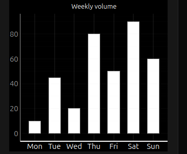
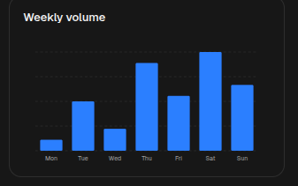
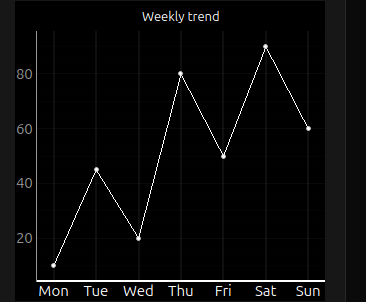
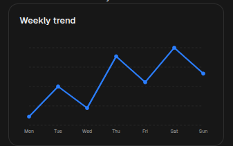
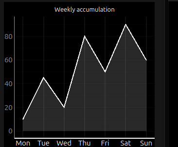
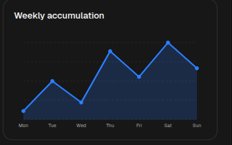

# Chart

[<- Back to Charts Components](./index.md)

`Chart` renders a small inline chart from one numeric series. Use it for compact dashboards, weekly summaries, trend previews, and similar single-series visualizations.

## Python Contract

```python
sdk.ui.Chart(
    id: str,
    chart_type: str = "Line",
    data: list[Any] | None = None,
    labels: list[str] | None = None,
    title: str | None = None,
)
```

The constructor writes these properties:

- `chartType`
- `data` when a non-empty list is provided
- `labels` when a non-empty list is provided
- `title` when provided

Common layout and visibility properties such as `style`, `show_if`, `hide_if`, and `required_permissions` still apply through the base component contract.

## Supported Properties

| Property | Type | Required | Python | YAML | Desktop | Web | Notes |
|---|---|---|---|---|---|---|---|
| `id` | `str` | yes | yes | yes | yes | yes | Stable component id |
| `chart_type` / `chartType` | `str` | no | yes | yes | yes | yes | Supported variants are `bar`, `line`, `area` |
| `data` | `list[number]` | no | yes | yes | yes | yes | Single numeric series |
| `labels` | `list[str]` | no | yes | yes | yes | yes | One label per data point |
| `title` | `str` | no | yes | yes | yes | yes | Optional title above the chart |
| `max_height` | `int` | no | via `set_property` | yes | yes | responsive container sizing | Use it to keep compact chart previews consistent |
| `max_width` | `int` | no | via `set_property` | yes | yes | responsive container sizing | Useful when the chart sits in a constrained dashboard area |
| `style` | `str` | no | yes | yes | yes | yes | Prefer applying layout styling on the surrounding card or column |
| `show_if` | rule | no | yes | yes | yes | yes | Generic visibility contract |
| `hide_if` | rule | no | yes | yes | yes | yes | Generic visibility contract |
| `required_permissions` | `list[str]` | no | yes | yes | yes | yes | Generic visibility contract |

## Variants

Use `chart_type` to choose the visual form of the same single-series dataset.

- `bar`: category comparison
- `line`: trend reading across ordered points
- `area`: trend with filled volume emphasis

## Renderer Behavior

Desktop:

- Uses `pyqtgraph`.
- Renders nothing useful if `data` is missing or empty.
- Accepts `chartType` and also tolerates `chart_type` during render.
- Uses `max_height` and `max_width` directly on the widget.
- Draws the title inside the plotting widget.

Web:

- Renders an SVG chart inside a card.
- Returns an empty-state card when `data` is missing or empty.
- Supports `bar`, `line`, and `area`.
- Uses a fixed internal SVG view box and scales responsively in the card.
- Ignores `max_height` and `max_width` in the current renderer.

`Chart` is best used for one ordered numeric series with its labels and optional title.

## Bar Example

<div class="docs-code-group" data-code-group>
  <div class="docs-code-group__tabs" role="tablist" aria-label="Chart bar example">
    <button class="docs-code-group__tab" type="button" role="tab" data-code-group-tab data-target="chart-bar-python" data-active="true" aria-selected="true">Python</button>
    <button class="docs-code-group__tab" type="button" role="tab" data-code-group-tab data-target="chart-bar-yaml" aria-selected="false">YAML</button>
  </div>
  <div class="docs-code-group__panel" id="chart-bar-python" data-code-group-panel data-active="true">
    <div class="language-python highlight"><pre><code>chart = sdk.ui.Chart(
    "weekly_volume",
    chart_type="bar",
    data=[10, 45, 20, 80, 50, 90, 60],
    labels=["Mon", "Tue", "Wed", "Thu", "Fri", "Sat", "Sun"],
    title="Weekly volume",
)
chart.set_property("max_height", 300)</code></pre></div>
  </div>
  <div class="docs-code-group__panel" id="chart-bar-yaml" data-code-group-panel hidden>
    <div class="language-yaml highlight"><pre><code>- kind: Chart
  id: weekly_volume
  chart_type: "bar"
  data: [10, 45, 20, 80, 50, 90, 60]
  labels: ["Mon", "Tue", "Wed", "Thu", "Fri", "Sat", "Sun"]
  title: "Weekly volume"
  max_height: 300</code></pre></div>
  </div>
</div>

Desktop rendering:



Web rendering:



## Line Example

<div class="docs-code-group" data-code-group>
  <div class="docs-code-group__tabs" role="tablist" aria-label="Chart line example">
    <button class="docs-code-group__tab" type="button" role="tab" data-code-group-tab data-target="chart-line-python" data-active="true" aria-selected="true">Python</button>
    <button class="docs-code-group__tab" type="button" role="tab" data-code-group-tab data-target="chart-line-yaml" aria-selected="false">YAML</button>
  </div>
  <div class="docs-code-group__panel" id="chart-line-python" data-code-group-panel data-active="true">
    <div class="language-python highlight"><pre><code>chart = sdk.ui.Chart(
    "weekly_trend",
    chart_type="line",
    data=[10, 45, 20, 80, 50, 90, 60],
    labels=["Mon", "Tue", "Wed", "Thu", "Fri", "Sat", "Sun"],
    title="Weekly trend",
)
chart.set_property("max_height", 300)</code></pre></div>
  </div>
  <div class="docs-code-group__panel" id="chart-line-yaml" data-code-group-panel hidden>
    <div class="language-yaml highlight"><pre><code>- kind: Chart
  id: weekly_trend
  chart_type: "line"
  data: [10, 45, 20, 80, 50, 90, 60]
  labels: ["Mon", "Tue", "Wed", "Thu", "Fri", "Sat", "Sun"]
  title: "Weekly trend"
  max_height: 300</code></pre></div>
  </div>
</div>

Desktop rendering:



Web rendering:



## Area Example

<div class="docs-code-group" data-code-group>
  <div class="docs-code-group__tabs" role="tablist" aria-label="Chart area example">
    <button class="docs-code-group__tab" type="button" role="tab" data-code-group-tab data-target="chart-area-python" data-active="true" aria-selected="true">Python</button>
    <button class="docs-code-group__tab" type="button" role="tab" data-code-group-tab data-target="chart-area-yaml" aria-selected="false">YAML</button>
  </div>
  <div class="docs-code-group__panel" id="chart-area-python" data-code-group-panel data-active="true">
    <div class="language-python highlight"><pre><code>chart = sdk.ui.Chart(
    "weekly_accumulation",
    chart_type="area",
    data=[10, 45, 20, 80, 50, 90, 60],
    labels=["Mon", "Tue", "Wed", "Thu", "Fri", "Sat", "Sun"],
    title="Weekly accumulation",
)
chart.set_property("max_height", 300)</code></pre></div>
  </div>
  <div class="docs-code-group__panel" id="chart-area-yaml" data-code-group-panel hidden>
    <div class="language-yaml highlight"><pre><code>- kind: Chart
  id: weekly_accumulation
  chart_type: "area"
  data: [10, 45, 20, 80, 50, 90, 60]
  labels: ["Mon", "Tue", "Wed", "Thu", "Fri", "Sat", "Sun"]
  title: "Weekly accumulation"
  max_height: 300</code></pre></div>
  </div>
</div>

Desktop rendering:



Web rendering:



## Store Binding Example

Bind chart properties to the page store when actions need to change the visible series without rebuilding the page. Use the same store paths from the action that updates chart state.

<div class="docs-code-group" data-code-group>
  <div class="docs-code-group__tabs" role="tablist" aria-label="Chart store binding example">
    <button class="docs-code-group__tab" type="button" role="tab" data-code-group-tab data-target="chart-store-python" data-active="true" aria-selected="true">Python</button>
    <button class="docs-code-group__tab" type="button" role="tab" data-code-group-tab data-target="chart-store-yaml" aria-selected="false">YAML</button>
  </div>
  <div class="docs-code-group__panel" id="chart-store-python" data-code-group-panel data-active="true">
    <div class="language-python highlight"><pre><code>from democrai.sdk.ui import bound

chart = sdk.ui.Chart(
    "components_test_chart_bound",
    chart_type=bound.store(
        "/components_test/chart/chart_type",
        scope="page",
        default="bar",
    ),
    data=bound.store(
        "/components_test/chart/data",
        scope="page",
        default=[10, 45, 20, 80, 50, 90, 60],
    ),
    labels=bound.store(
        "/components_test/chart/labels",
        scope="page",
        default=["Mon", "Tue", "Wed", "Thu", "Fri", "Sat", "Sun"],
    ),
    title=bound.store(
        "/components_test/chart/title",
        scope="page",
        default="Weekly volume",
    ),
)
chart.set_property("max_height", 300)</code></pre></div>
  </div>
  <div class="docs-code-group__panel" id="chart-store-yaml" data-code-group-panel hidden>
    <div class="language-yaml highlight"><pre><code>- kind: Chart
  id: components_test_chart_yaml_bound
  chart_type:
    type: store
    scope: page
    path: /components_test/chart/chart_type
    default: bar
  data:
    type: store
    scope: page
    path: /components_test/chart/data
    default: [10, 45, 20, 80, 50, 90, 60]
  labels:
    type: store
    scope: page
    path: /components_test/chart/labels
    default: ["Mon", "Tue", "Wed", "Thu", "Fri", "Sat", "Sun"]
  title:
    type: store
    scope: page
    path: /components_test/chart/title
    default: "Weekly volume"
  max_height: 300</code></pre></div>
  </div>
</div>

## Data Model Binding Example

Bind chart properties to the surface data model when the chart should follow data loaded or updated for the current surface. Actions can refresh the same model path with a `dataModelUpdate`.

<div class="docs-code-group" data-code-group>
  <div class="docs-code-group__tabs" role="tablist" aria-label="Chart data model binding example">
    <button class="docs-code-group__tab" type="button" role="tab" data-code-group-tab data-target="chart-data-model-python" data-active="true" aria-selected="true">Python</button>
    <button class="docs-code-group__tab" type="button" role="tab" data-code-group-tab data-target="chart-data-model-yaml" aria-selected="false">YAML</button>
  </div>
  <div class="docs-code-group__panel" id="chart-data-model-python" data-code-group-panel data-active="true">
    <div class="language-python highlight"><pre><code>from democrai.sdk.ui import bound

chart = sdk.ui.Chart(
    "components_test_chart_data_bound",
    chart_type=bound.data(
        "/components_test/chart_model/chart_type",
        default="bar",
    ),
    data=bound.data(
        "/components_test/chart_model/data",
        default=[10, 45, 20, 80, 50, 90, 60],
    ),
    labels=bound.data(
        "/components_test/chart_model/labels",
        default=["Mon", "Tue", "Wed", "Thu", "Fri", "Sat", "Sun"],
    ),
    title=bound.data(
        "/components_test/chart_model/title",
        default="Weekly volume",
    ),
)
chart.set_property("max_height", 300)</code></pre></div>
  </div>
  <div class="docs-code-group__panel" id="chart-data-model-yaml" data-code-group-panel hidden>
    <div class="language-yaml highlight"><pre><code>- kind: Chart
  id: components_test_chart_yaml_data_bound
  chart_type: "@data/components_test/chart_model/chart_type"
  data: "@data/components_test/chart_model/data"
  labels: "@data/components_test/chart_model/labels"
  title: "@data/components_test/chart_model/title"
  max_height: 300</code></pre></div>
  </div>
</div>

## Visibility And Permissions Example

`show_if` and `hide_if` can use store bindings so actions can toggle chart visibility. `required_permissions` gates the chart on the current user permissions; it is client-side UI gating and does not replace backend authorization.

<div class="docs-code-group" data-code-group>
  <div class="docs-code-group__tabs" role="tablist" aria-label="Chart visibility and permissions example">
    <button class="docs-code-group__tab" type="button" role="tab" data-code-group-tab data-target="chart-visibility-python" data-active="true" aria-selected="true">Python</button>
    <button class="docs-code-group__tab" type="button" role="tab" data-code-group-tab data-target="chart-visibility-yaml" aria-selected="false">YAML</button>
  </div>
  <div class="docs-code-group__panel" id="chart-visibility-python" data-code-group-panel data-active="true">
    <div class="language-python highlight"><pre><code>from democrai.sdk.ui import bound

show_if_chart = sdk.ui.Chart(
    "components_test_chart_show_if",
    chart_type="bar",
    data=[18, 42, 65, 38],
    labels=["Q1", "Q2", "Q3", "Q4"],
    title="show_if visible",
).set_property("max_height", 300).set_show_if(
    {
        "conditions": [
            {
                "left": bound.store(
                    "/components_test/visibility/show_chart",
                    scope="page",
                    default=True,
                ),
                "op": "==",
                "right": True,
            }
        ]
    }
)

hide_if_chart = sdk.ui.Chart(
    "components_test_chart_hide_if",
    chart_type="line",
    data=[12, 24, 20, 36],
    labels=["Q1", "Q2", "Q3", "Q4"],
    title="hide_if not hidden",
).set_property("max_height", 300).set_hide_if(
    {
        "conditions": [
            {
                "left": bound.store(
                    "/components_test/visibility/hide_chart",
                    scope="page",
                    default=False,
                ),
                "op": "==",
                "right": True,
            }
        ]
    }
)

permission_chart = sdk.ui.Chart(
    "components_test_chart_required_permissions",
    chart_type="area",
    data=[8, 28, 46, 52],
    labels=["Q1", "Q2", "Q3", "Q4"],
    title="required_permissions gate",
).set_property("max_height", 300).set_required_permissions(
    ["components.chart.visibility"]
)</code></pre></div>
  </div>
  <div class="docs-code-group__panel" id="chart-visibility-yaml" data-code-group-panel hidden>
    <div class="language-yaml highlight"><pre><code>- kind: Chart
  id: components_test_chart_yaml_show_if
  chart_type: "bar"
  data: [18, 42, 65, 38]
  labels: ["Q1", "Q2", "Q3", "Q4"]
  title: "show_if visible"
  max_height: 300
  show_if:
    conditions:
      - left:
          type: store
          scope: page
          path: /components_test/visibility/show_chart
          default: true
        op: "=="
        right: true

- kind: Chart
  id: components_test_chart_yaml_hide_if
  chart_type: "line"
  data: [12, 24, 20, 36]
  labels: ["Q1", "Q2", "Q3", "Q4"]
  title: "hide_if not hidden"
  max_height: 300
  hide_if:
    conditions:
      - left:
          type: store
          scope: page
          path: /components_test/visibility/hide_chart
          default: false
        op: "=="
        right: true

- kind: Chart
  id: components_test_chart_yaml_required_permissions
  chart_type: "area"
  data: [8, 28, 46, 52]
  labels: ["Q1", "Q2", "Q3", "Q4"]
  title: "required_permissions gate"
  max_height: 300
  required_permissions:
    - components.chart.visibility</code></pre></div>
  </div>
</div>

## Usage Guidance

- Use `Chart` when one compact series is enough.
- Keep `data` and `labels` aligned by index.
- Prefer `bar` for category comparison, `line` for trend reading, and `area` for cumulative or volume-like emphasis.
- For runtime changes, prefer store bindings or targeted property updates over rebuilding the full page.
