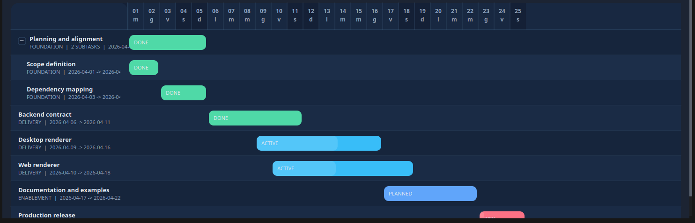
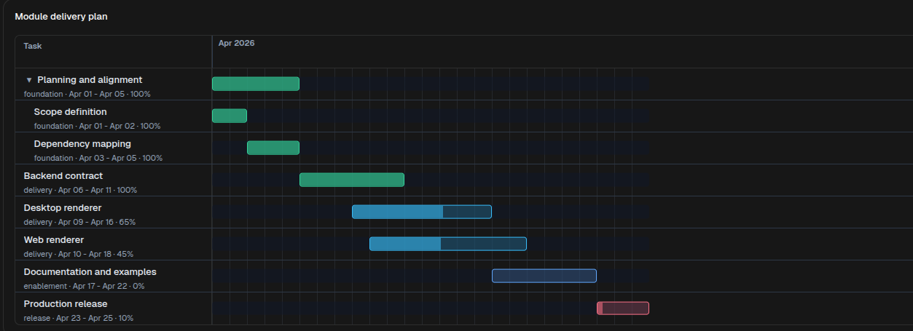

# Gantt

[<- Back to Charts Components](./index.md)

`Gantt` renders scheduled work on a timeline. Use it for delivery plans, implementation roadmaps, release windows, and any task list that needs dates, progress, grouping, and optional parent-child expansion.

## Python Contract

```python
sdk.ui.Gantt(
    id: str,
    *,
    items: list[dict[str, Any]] | None = None,
    mermaid: str = "",
    title: str = "",
    height: int = 360,
    start: str = "",
    end: str = "",
    scale: str = "1d",
)
```

`height` is normalized to at least `220`. `scale` defaults to the daily scale (`1d`).

## Supported Properties

| Property | Type | Required | Python | YAML | Desktop | Web | Notes |
|---|---|---|---|---|---|---|---|
| `id` | `str` | yes | yes | yes | yes | yes | Stable component id |
| `items` | `list[object]` | no | yes | yes | yes | yes | Structured Gantt rows |
| `mermaid` | `str` | no | yes | yes | yes | yes | Mermaid `gantt` definition |
| `title` | `str` | no | yes | yes | yes | yes | Optional heading above the timeline |
| `height` | `int` | no | yes | yes | yes | yes | Minimum visible height |
| `start` | `str` | no | yes | yes | yes | yes | Explicit timeline start date or datetime |
| `end` | `str` | no | yes | yes | yes | yes | Explicit timeline end date or datetime |
| `scale` | `str` | no | yes | yes | yes | yes | Timeline scale. Defaults to `1d` |
| `style` | `str` | no | yes | yes | yes | yes | Apply layout styling on the surrounding container when possible |
| `show_if` | rule | no | yes | yes | yes | yes | Generic visibility contract |
| `hide_if` | rule | no | yes | yes | yes | yes | Generic visibility contract |
| `required_permissions` | `list[str]` | no | yes | yes | yes | yes | Generic visibility contract |

## Task Shape

Each `items` entry can provide:

- `id`: stable task identifier
- `label`: visible task label
- `name`: accepted as a label alias
- `start`: start date or datetime
- `end`: end date or datetime
- `group`: lane or section label shown with the task
- `status`: task state used for bar styling
- `status_label`: optional label shown inside the task bar; defaults to `status`
- `progress`: completion percentage from `0` to `100`
- `expanded`: initial expanded state for parent tasks
- `subtasks`: nested child tasks
- `children`: accepted as an alias for `subtasks`

Parent tasks can omit `start` and `end` when those dates should be derived from their child tasks.

## Timeline Scale

`scale` controls the timeline unit for every client. When omitted, the component uses the daily scale (`1d`) and keeps the historical date-only behavior.

Supported values:

- `1d`, `1h`, `1m`, `1s`, `1ms`
- Multiples such as `7d`, `6h`, `15m`, `5s`, `100ms`
- Aliases: `day`, `hour`, `minute`, `second`, `millisecond`

When `scale` is daily, renderers normalize dates to midnight. With sub-daily scales, `start` and `end` can use ISO datetime values, for example `2026-04-01T09:30:00.000`.

## Authoring Modes

`Gantt` supports two input modes.

- Structured mode with `items`
- Mermaid mode with a `gantt` definition in `mermaid`

When `items` is present and non-empty, the structured task list is rendered. When `items` is omitted or empty, the component reads the Mermaid definition.

## Structured Example

<div class="docs-code-group" data-code-group>
  <div class="docs-code-group__tabs" role="tablist" aria-label="Gantt structured example">
    <button class="docs-code-group__tab" type="button" role="tab" data-code-group-tab data-target="gantt-structured-python" data-active="true" aria-selected="true">Python</button>
    <button class="docs-code-group__tab" type="button" role="tab" data-code-group-tab data-target="gantt-structured-yaml" aria-selected="false">YAML</button>
  </div>
  <div class="docs-code-group__panel" id="gantt-structured-python" data-code-group-panel data-active="true">
    <div class="language-python highlight"><pre><code>timeline = sdk.ui.Gantt(
    "module_delivery_plan",
    title="Module delivery plan",
    items=[
        {
            "id": "plan",
            "label": "Planning and alignment",
            "group": "foundation",
            "start": "2026-04-01",
            "end": "2026-04-05",
            "status": "done",
            "progress": 100,
            "expanded": True,
            "subtasks": [
                {
                    "id": "scope",
                    "label": "Scope definition",
                    "group": "foundation",
                    "start": "2026-04-01",
                    "end": "2026-04-02",
                    "status": "done",
                    "progress": 100,
                },
                {
                    "id": "dependencies",
                    "label": "Dependency mapping",
                    "group": "foundation",
                    "start": "2026-04-03",
                    "end": "2026-04-05",
                    "status": "done",
                    "progress": 100,
                },
            ],
        },
        {
            "id": "api",
            "label": "Backend contract",
            "group": "delivery",
            "start": "2026-04-06",
            "end": "2026-04-11",
            "status": "done",
            "progress": 100,
        },
        {
            "id": "desktop",
            "label": "Desktop renderer",
            "group": "delivery",
            "start": "2026-04-09",
            "end": "2026-04-16",
            "status": "active",
            "progress": 65,
        },
        {
            "id": "web",
            "label": "Web renderer",
            "group": "delivery",
            "start": "2026-04-10",
            "end": "2026-04-18",
            "status": "active",
            "progress": 45,
        },
        {
            "id": "docs",
            "label": "Documentation and examples",
            "group": "enablement",
            "start": "2026-04-17",
            "end": "2026-04-22",
            "status": "planned",
            "progress": 0,
        },
        {
            "id": "launch",
            "label": "Production release",
            "group": "release",
            "start": "2026-04-23",
            "end": "2026-04-25",
            "status": "risk",
            "progress": 10,
        },
    ],
    start="2026-04-01",
    end="2026-04-25",
    scale="1d",
    height=480,
)</code></pre></div>
  </div>
  <div class="docs-code-group__panel" id="gantt-structured-yaml" data-code-group-panel hidden>
    <div class="language-yaml highlight"><pre><code>- kind: Gantt
  id: module_delivery_plan
  title: "Module delivery plan"
  start: "2026-04-01"
  end: "2026-04-25"
  scale: "1d"
  height: 480
  items:
    - id: plan
      label: "Planning and alignment"
      group: foundation
      start: "2026-04-01"
      end: "2026-04-05"
      status: done
      progress: 100
      expanded: true
      subtasks:
        - id: scope
          label: "Scope definition"
          group: foundation
          start: "2026-04-01"
          end: "2026-04-02"
          status: done
          progress: 100
        - id: dependencies
          label: "Dependency mapping"
          group: foundation
          start: "2026-04-03"
          end: "2026-04-05"
          status: done
          progress: 100
    - id: api
      label: "Backend contract"
      group: delivery
      start: "2026-04-06"
      end: "2026-04-11"
      status: done
      progress: 100
    - id: desktop
      label: "Desktop renderer"
      group: delivery
      start: "2026-04-09"
      end: "2026-04-16"
      status: active
      progress: 65
    - id: web
      label: "Web renderer"
      group: delivery
      start: "2026-04-10"
      end: "2026-04-18"
      status: active
      progress: 45
    - id: docs
      label: "Documentation and examples"
      group: enablement
      start: "2026-04-17"
      end: "2026-04-22"
      status: planned
      progress: 0
    - id: launch
      label: "Production release"
      group: release
      start: "2026-04-23"
      end: "2026-04-25"
      status: risk
      progress: 10</code></pre></div>
  </div>
</div>

Desktop rendering:



Web rendering:



## Mermaid Example

<div class="docs-code-group" data-code-group>
  <div class="docs-code-group__tabs" role="tablist" aria-label="Gantt mermaid example">
    <button class="docs-code-group__tab" type="button" role="tab" data-code-group-tab data-target="gantt-mermaid-python" data-active="true" aria-selected="true">Python</button>
    <button class="docs-code-group__tab" type="button" role="tab" data-code-group-tab data-target="gantt-mermaid-yaml" aria-selected="false">YAML</button>
  </div>
  <div class="docs-code-group__panel" id="gantt-mermaid-python" data-code-group-panel data-active="true">
    <div class="language-python highlight"><pre><code>timeline = sdk.ui.Gantt(
    "delivery_rollout_mermaid",
    mermaid=\"\"\"
gantt
    title Delivery rollout
    dateFormat YYYY-MM-DD
    section Foundation
    Planning and alignment :done, plan, 2026-04-01, 5d
    section Delivery
    Backend contract       :done, api, after plan, 6d
    Desktop renderer       :active, desktop, after api, 8d
    Web renderer           :active, web, 2026-04-10, 9d
    section Release
    Production release     :crit, launch, after web, 3d
\"\"\",
    height=420,
)</code></pre></div>
  </div>
  <div class="docs-code-group__panel" id="gantt-mermaid-yaml" data-code-group-panel hidden>
    <div class="language-yaml highlight"><pre><code>- kind: Gantt
  id: delivery_rollout_mermaid
  height: 420
  mermaid: |
    gantt
        title Delivery rollout
        dateFormat YYYY-MM-DD
        section Foundation
        Planning and alignment :done, plan, 2026-04-01, 5d
        section Delivery
        Backend contract       :done, api, after plan, 6d
        Desktop renderer       :active, desktop, after api, 8d
        Web renderer           :active, web, 2026-04-10, 9d
        section Release
        Production release     :crit, launch, after web, 3d</code></pre></div>
  </div>
</div>

## Binding And Runtime Updates

`items`, `title`, `start`, `end`, and `scale` can be bound to the page store or to the surface data model. Direct runtime updates should target the same properties with `propertyUpdate`.

<div class="docs-code-group" data-code-group>
  <div class="docs-code-group__tabs" role="tablist" aria-label="Gantt binding example">
    <button class="docs-code-group__tab" type="button" role="tab" data-code-group-tab data-target="gantt-binding-python" data-active="true" aria-selected="true">Python</button>
    <button class="docs-code-group__tab" type="button" role="tab" data-code-group-tab data-target="gantt-binding-yaml" aria-selected="false">YAML</button>
  </div>
  <div class="docs-code-group__panel" id="gantt-binding-python" data-code-group-panel data-active="true">
    <div class="language-python highlight"><pre><code>from democrai.sdk.ui import bound

timeline = sdk.ui.Gantt("components_test_gantt_store", height=320)
timeline.set_property(
    "title",
    bound.store("/components_test/gantt/title", scope="page", default="Delivery plan"),
)
timeline.set_property(
    "items",
    bound.store("/components_test/gantt/items", scope="page", default=[]),
)
timeline.set_property(
    "start",
    bound.store("/components_test/gantt/start", scope="page", default="2026-04-01"),
)
timeline.set_property(
    "end",
    bound.store("/components_test/gantt/end", scope="page", default="2026-04-16"),
)
timeline.set_property(
    "scale",
    bound.store("/components_test/gantt/scale", scope="page", default="1d"),
)

data_timeline = sdk.ui.Gantt("components_test_gantt_data", height=320)
data_timeline.set_property(
    "items",
    bound.data("/components_test/gantt_model/items", default=[]),
)

live_timeline = sdk.ui.Gantt(
    "components_test_gantt_live",
    title="Delivery plan",
    items=[],
    height=320,
).allow("title.set", "items.set", "start.set", "end.set")</code></pre></div>
  </div>
  <div class="docs-code-group__panel" id="gantt-binding-yaml" data-code-group-panel hidden>
    <div class="language-yaml highlight"><pre><code>- kind: Gantt
  id: components_test_gantt_yaml_store
  title:
    type: store
    scope: page
    path: /components_test/gantt/title
    default: "Delivery plan"
  items:
    type: store
    scope: page
    path: /components_test/gantt/items
    default: []
  start:
    type: store
    scope: page
    path: /components_test/gantt/start
    default: "2026-04-01"
  end:
    type: store
    scope: page
    path: /components_test/gantt/end
    default: "2026-04-16"
  scale:
    type: store
    scope: page
    path: /components_test/gantt/scale
    default: "1d"
  height: 320

- kind: Gantt
  id: components_test_gantt_yaml_data
  items:
    type: data
    path: components_test/gantt_model/items
    default: []
  height: 320

- kind: Gantt
  id: components_test_gantt_yaml_live
  title: "Delivery plan"
  items: []
  height: 320
  capabilities:
    - title.set
    - items.set
    - start.set
    - end.set</code></pre></div>
  </div>
</div>

## Visibility And Permissions

`show_if` and `hide_if` are evaluated at the first render and when their bound values change. Visibility rules use `mode: "AND"` by default; declare `mode: "OR"` when any condition can make the rule pass. `required_permissions` gates the component on the current user permissions; `super` and `admin` roles bypass the permission list.

<div class="docs-code-group" data-code-group>
  <div class="docs-code-group__tabs" role="tablist" aria-label="Gantt visibility example">
    <button class="docs-code-group__tab" type="button" role="tab" data-code-group-tab data-target="gantt-visibility-python" data-active="true" aria-selected="true">Python</button>
    <button class="docs-code-group__tab" type="button" role="tab" data-code-group-tab data-target="gantt-visibility-yaml" aria-selected="false">YAML</button>
  </div>
  <div class="docs-code-group__panel" id="gantt-visibility-python" data-code-group-panel data-active="true">
    <div class="language-python highlight"><pre><code>from democrai.sdk.ui import bound

timeline = sdk.ui.Gantt(
    "components_test_gantt_show_if",
    title="show_if visible",
    items=[],
    height=300,
).set_show_if({
    "mode": "AND",
    "conditions": [{
        "left": bound.store(
            "/components_test/visibility/gantt_show",
            scope="page",
            default=True,
        ),
        "op": "==",
        "right": True,
    }]
})

hidden_timeline = sdk.ui.Gantt(
    "components_test_gantt_hide_if",
    title="hide_if not hidden",
    items=[],
    height=300,
).set_hide_if({
    "mode": "AND",
    "conditions": [{
        "left": bound.store(
            "/components_test/visibility/gantt_hide",
            scope="page",
            default=False,
        ),
        "op": "==",
        "right": True,
    }]
})

permission_timeline = sdk.ui.Gantt(
    "components_test_gantt_required_permissions",
    title="required_permissions gate",
    items=[],
    height=300,
).set_required_permissions(["components.diagram.visibility"])</code></pre></div>
  </div>
  <div class="docs-code-group__panel" id="gantt-visibility-yaml" data-code-group-panel hidden>
    <div class="language-yaml highlight"><pre><code>- kind: Gantt
  id: components_test_gantt_yaml_show_if
  title: "show_if visible"
  items: []
  height: 300
  show_if:
    mode: AND
    conditions:
      - left:
          type: store
          scope: page
          path: /components_test/visibility/gantt_show
          default: true
        op: "=="
        right: true

- kind: Gantt
  id: components_test_gantt_yaml_hide_if
  title: "hide_if not hidden"
  items: []
  height: 300
  hide_if:
    mode: AND
    conditions:
      - left:
          type: store
          scope: page
          path: /components_test/visibility/gantt_hide
          default: false
        op: "=="
        right: true

- kind: Gantt
  id: components_test_gantt_yaml_required_permissions
  title: "required_permissions gate"
  items: []
  height: 300
  required_permissions:
    - components.diagram.visibility</code></pre></div>
  </div>
</div>

## Renderer Behavior

Desktop:

- Expands and collapses parent rows in place.
- Uses explicit `start` and `end` when provided, otherwise derives the visible range from task dates.
- Uses `scale` when provided, otherwise defaults to `1d`.
- Accepts `subtasks` and `children` for nested rows.
- Accepts `label` and `name` for task labels.
- Uses `status` to derive colors and also accepts an explicit task `color`.

Web:

- Expands and collapses parent rows in place.
- Uses explicit `start` and `end` when provided, otherwise derives the visible range from task dates.
- Uses `scale` when provided, otherwise defaults to `1d`.
- Accepts `subtasks` and `children` for nested rows.
- Accepts `label` and `name` for task labels.
- Styles bars from the status palette.

## Usage Guidance

- Use structured `items` when the module already owns tasks as data.
- Use Mermaid when the timeline is easier to maintain as a text definition.
- Keep task ids stable when Mermaid tasks use `after <task_id>` dependencies.
- Use parent rows with `expanded: true` when the first render should expose subtasks immediately.
- Set `start` and `end` when multiple timelines must stay visually aligned across cards or surfaces.
