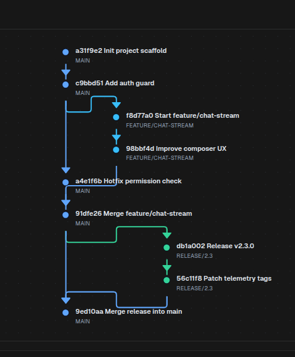

# GitGraph

[<- Back to Charts Components](./index.md)

`GitGraph` renders a commit history as lane-based nodes connected by branch and merge edges. Use it for release flows, feature branch lifecycles, back-merges, deployment provenance, and other commit-style timelines.

## Python Contract

```python
sdk.ui.GitGraph(
    id: str,
    *,
    commits: list[dict[str, Any]] | None = None,
    edges: list[dict[str, Any]] | None = None,
    title: str = "",
    height: int = 360,
    lane_width: int = 80,
    row_height: int = 56,
    show_labels: bool = True,
    show_branch_names: bool = True,
    action: str | ActionSpec = "",
    params: dict[str, Any] | None = None,
)
```

`height` is normalized to at least `220`. `lane_width` is normalized to at least `48`. `row_height` is normalized to at least `34`.

## Supported Properties

| Property | Type | Required | Python | YAML | Desktop | Web | Notes |
|---|---|---|---|---|---|---|---|
| `id` | `str` | yes | yes | yes | yes | yes | Stable component id |
| `commits` | `list[object]` | no | yes | yes | yes | yes | Commit nodes in visual order |
| `edges` | `list[object]` | no | yes | yes | yes | yes | Explicit branch and merge links |
| `title` | `str` | no | yes | yes | yes | yes | Optional heading above the graph |
| `height` | `int` | no | yes | yes | yes | yes | Minimum visible height |
| `lane_width` / `laneWidth` | `int` | no | yes | yes | yes | yes | Horizontal spacing between lanes |
| `row_height` / `rowHeight` | `int` | no | yes | yes | yes | yes | Vertical spacing between commits |
| `show_labels` / `showLabels` | `bool` | no | yes | yes | yes | yes | Shows commit labels next to nodes |
| `show_branch_names` / `showBranchNames` | `bool` | no | yes | yes | yes | yes | Shows lane names |
| `action` | `str` or `ActionSpec` | no | yes | yes | yes | yes | Action called when a commit node is clicked |
| `params` | `dict` | no | yes | yes | desktop merges into action payload | accepted by component payload | Use commit fields for cross-client click handling |
| `style` | `str` | no | yes | yes | yes | yes | Apply layout styling on the surrounding container when possible |
| `show_if` | rule | no | yes | yes | yes | yes | Generic visibility contract |
| `hide_if` | rule | no | yes | yes | yes | yes | Generic visibility contract |
| `required_permissions` | `list[str]` | no | yes | yes | yes | yes | Generic visibility contract |

## Commit Shape

Each `commits` entry can provide:

- `id`: stable commit identifier
- `label`: visible commit label
- `message`: accepted as a label alias
- `branch`: branch name used to derive a lane automatically
- `lane`: explicit numeric lane index
- `laneName`: visible lane label when lanes are assigned explicitly
- `color`: explicit node and edge color

When `lane` is omitted, the component derives lanes from `branch` order. When `lane` is present, that numeric lane is used directly.

## Edge Shape

Each `edges` entry can provide:

- `source`: source commit id
- `target`: target commit id
- `from`: accepted as an alias for `source`
- `to`: accepted as an alias for `target`

When `edges` is omitted or empty, both renderers fall back to linking each commit to the next commit in list order.

## Click Actions

When `action` is set, clicking a commit emits these commit fields:

- `commitId`
- `label`
- `branch`
- `lane`
- `source` with value `git_graph`

Desktop also merges `params` into the emitted payload. For cross-client handling, prefer using the commit fields above as the primary action input.

## Action Confirmation

Use `action.confirm` to ask for confirmation before dispatching a commit click action. Confirmation text should use translation keys.

<div class="docs-code-group" data-code-group>
  <div class="docs-code-group__tabs" role="tablist" aria-label="GitGraph confirm example">
    <button class="docs-code-group__tab" type="button" role="tab" data-code-group-tab data-target="gitgraph-confirm-python" data-active="true" aria-selected="true">Python</button>
    <button class="docs-code-group__tab" type="button" role="tab" data-code-group-tab data-target="gitgraph-confirm-yaml" aria-selected="false">YAML</button>
  </div>
  <div class="docs-code-group__panel" id="gitgraph-confirm-python" data-code-group-panel data-active="true">
    <div class="language-python highlight"><pre><code>graph = sdk.ui.GitGraph(
    "gitgraph_confirm",
    title="Confirmable GitGraph",
    commits=[
        {"id": "c1", "label": "c1 Init", "branch": "main"},
        {"id": "c2", "label": "c2 Feature", "branch": "feature"},
    ],
    action={
        "name": "components.gitgraph_confirm_action",
        "context": {"source": "python_gitgraph"},
        "confirm": {
            "text": sdk.i18n.t("components.gitgraph.confirm.prompt"),
            "confirm_text": sdk.i18n.t("components.gitgraph.confirm.accept"),
            "cancel_text": sdk.i18n.t("components.gitgraph.confirm.cancel"),
        },
    },
    params={"graph_id": "gitgraph_confirm"},
)</code></pre></div>
  </div>
  <div class="docs-code-group__panel" id="gitgraph-confirm-yaml" data-code-group-panel hidden>
    <div class="language-yaml highlight"><pre><code>- kind: GitGraph
  id: gitgraph_confirm
  title: Confirmable GitGraph
  commits:
    - id: c1
      label: c1 Init
      branch: main
    - id: c2
      label: c2 Feature
      branch: feature
  action:
    name: components.gitgraph_confirm_action
    context:
      source: yaml_gitgraph
    confirm:
      text: "@t/components.gitgraph.confirm.prompt"
      confirm_text: "@t/components.gitgraph.confirm.accept"
      cancel_text: "@t/components.gitgraph.confirm.cancel"
  params:
    graph_id: gitgraph_confirm</code></pre></div>
  </div>
</div>

## Branch-Based Example

<div class="docs-code-group" data-code-group>
  <div class="docs-code-group__tabs" role="tablist" aria-label="GitGraph branch-based example">
    <button class="docs-code-group__tab" type="button" role="tab" data-code-group-tab data-target="gitgraph-branch-python" data-active="true" aria-selected="true">Python</button>
    <button class="docs-code-group__tab" type="button" role="tab" data-code-group-tab data-target="gitgraph-branch-yaml" aria-selected="false">YAML</button>
  </div>
  <div class="docs-code-group__panel" id="gitgraph-branch-python" data-code-group-panel data-active="true">
    <div class="language-python highlight"><pre><code>graph = sdk.ui.GitGraph(
    "feature_branch_flow",
    title="Feature branch with merge and release branch",
    commits=[
        {"id": "c1", "label": "a31f9e2  Init project scaffold", "branch": "main"},
        {"id": "c2", "label": "c9bbd51  Add auth guard", "branch": "main"},
        {"id": "c3", "label": "f8d77a0  Start feature/chat-stream", "branch": "feature/chat-stream"},
        {"id": "c4", "label": "98bbf4d  Improve composer UX", "branch": "feature/chat-stream"},
        {"id": "c5", "label": "a4e1f6b  Hotfix permission check", "branch": "main"},
        {"id": "c6", "label": "91dfe26  Merge feature/chat-stream", "branch": "main"},
        {"id": "c7", "label": "db1a002  Release v2.3.0", "branch": "release/2.3"},
        {"id": "c8", "label": "56c11f8  Patch telemetry tags", "branch": "release/2.3"},
        {"id": "c9", "label": "9ed10aa  Merge release into main", "branch": "main"},
    ],
    edges=[
        {"source": "c1", "target": "c2"},
        {"source": "c2", "target": "c3"},
        {"source": "c3", "target": "c4"},
        {"source": "c2", "target": "c5"},
        {"source": "c4", "target": "c6"},
        {"source": "c5", "target": "c6"},
        {"source": "c6", "target": "c7"},
        {"source": "c7", "target": "c8"},
        {"source": "c8", "target": "c9"},
        {"source": "c6", "target": "c9"},
    ],
    height=520,
    lane_width=90,
    row_height=58,
    show_branch_names=True,
    action="git_graph_demo_click",
    params={"example": "branch_flow"},
)</code></pre></div>
  </div>
  <div class="docs-code-group__panel" id="gitgraph-branch-yaml" data-code-group-panel hidden>
    <div class="language-yaml highlight"><pre><code>- kind: GitGraph
  id: feature_branch_flow
  title: "Feature branch with merge and release branch"
  height: 520
  lane_width: 90
  row_height: 58
  show_branch_names: true
  action: "git_graph_demo_click"
  params:
    example: branch_flow
  commits:
    - id: c1
      label: "a31f9e2  Init project scaffold"
      branch: main
    - id: c2
      label: "c9bbd51  Add auth guard"
      branch: main
    - id: c3
      label: "f8d77a0  Start feature/chat-stream"
      branch: feature/chat-stream
    - id: c4
      label: "98bbf4d  Improve composer UX"
      branch: feature/chat-stream
    - id: c5
      label: "a4e1f6b  Hotfix permission check"
      branch: main
    - id: c6
      label: "91dfe26  Merge feature/chat-stream"
      branch: main
    - id: c7
      label: "db1a002  Release v2.3.0"
      branch: release/2.3
    - id: c8
      label: "56c11f8  Patch telemetry tags"
      branch: release/2.3
    - id: c9
      label: "9ed10aa  Merge release into main"
      branch: main
  edges:
    - source: c1
      target: c2
    - source: c2
      target: c3
    - source: c3
      target: c4
    - source: c2
      target: c5
    - source: c4
      target: c6
    - source: c5
      target: c6
    - source: c6
      target: c7
    - source: c7
      target: c8
    - source: c8
      target: c9
    - source: c6
      target: c9</code></pre></div>
  </div>
</div>

Desktop rendering:


Web rendering:



## Explicit-Lane Example

<div class="docs-code-group" data-code-group>
  <div class="docs-code-group__tabs" role="tablist" aria-label="GitGraph explicit-lane example">
    <button class="docs-code-group__tab" type="button" role="tab" data-code-group-tab data-target="gitgraph-lane-python" data-active="true" aria-selected="true">Python</button>
    <button class="docs-code-group__tab" type="button" role="tab" data-code-group-tab data-target="gitgraph-lane-yaml" aria-selected="false">YAML</button>
  </div>
  <div class="docs-code-group__panel" id="gitgraph-lane-python" data-code-group-panel data-active="true">
    <div class="language-python highlight"><pre><code>graph = sdk.ui.GitGraph(
    "release_stabilization_graph",
    title="Release stabilization graph",
    commits=[
        {"id": "r1", "label": "1f9c42b  Main baseline", "lane": 0, "laneName": "main"},
        {"id": "r2", "label": "4a2d55f  release/2.4 cut", "lane": 1, "laneName": "release/2.4"},
        {"id": "r3", "label": "60ae71d  QA fixes on release", "lane": 1, "laneName": "release/2.4"},
        {"id": "r4", "label": "99bf230  main receives hotfix", "lane": 0, "laneName": "main"},
        {"id": "r5", "label": "ab71502  Merge release -> main", "lane": 0, "laneName": "main"},
        {"id": "r6", "label": "d6e4410  Back-merge main -> develop", "lane": 2, "laneName": "develop"},
    ],
    edges=[
        {"source": "r1", "target": "r2"},
        {"source": "r2", "target": "r3"},
        {"source": "r1", "target": "r4"},
        {"source": "r3", "target": "r5"},
        {"source": "r4", "target": "r5"},
        {"source": "r5", "target": "r6"},
    ],
    height=380,
    lane_width=88,
    row_height=56,
    show_labels=True,
    show_branch_names=True,
    action="git_graph_demo_click",
    params={"example": "lane_flow"},
)</code></pre></div>
  </div>
  <div class="docs-code-group__panel" id="gitgraph-lane-yaml" data-code-group-panel hidden>
    <div class="language-yaml highlight"><pre><code>- kind: GitGraph
  id: release_stabilization_graph
  title: "Release stabilization graph"
  height: 380
  lane_width: 88
  row_height: 56
  show_labels: true
  show_branch_names: true
  action: "git_graph_demo_click"
  params:
    example: lane_flow
  commits:
    - id: r1
      label: "1f9c42b  Main baseline"
      lane: 0
      laneName: main
    - id: r2
      label: "4a2d55f  release/2.4 cut"
      lane: 1
      laneName: release/2.4
    - id: r3
      label: "60ae71d  QA fixes on release"
      lane: 1
      laneName: release/2.4
    - id: r4
      label: "99bf230  main receives hotfix"
      lane: 0
      laneName: main
    - id: r5
      label: "ab71502  Merge release -> main"
      lane: 0
      laneName: main
    - id: r6
      label: "d6e4410  Back-merge main -> develop"
      lane: 2
      laneName: develop
  edges:
    - source: r1
      target: r2
    - source: r2
      target: r3
    - source: r1
      target: r4
    - source: r3
      target: r5
    - source: r4
      target: r5
    - source: r5
      target: r6</code></pre></div>
  </div>
</div>

## Binding And Runtime Updates

`title`, `commits`, and `edges` can be bound to the page store or to the surface data model. Direct runtime updates should target the same properties with `propertyUpdate`.

<div class="docs-code-group" data-code-group>
  <div class="docs-code-group__tabs" role="tablist" aria-label="GitGraph binding example">
    <button class="docs-code-group__tab" type="button" role="tab" data-code-group-tab data-target="gitgraph-binding-python" data-active="true" aria-selected="true">Python</button>
    <button class="docs-code-group__tab" type="button" role="tab" data-code-group-tab data-target="gitgraph-binding-yaml" aria-selected="false">YAML</button>
  </div>
  <div class="docs-code-group__panel" id="gitgraph-binding-python" data-code-group-panel data-active="true">
    <div class="language-python highlight"><pre><code>from democrai.sdk.ui import bound

graph = sdk.ui.GitGraph("components_test_gitgraph_store", height=320)
graph.set_property(
    "title",
    bound.store("/components_test/gitgraph/title", scope="page", default="Feature branch flow"),
)
graph.set_property(
    "commits",
    bound.store("/components_test/gitgraph/commits", scope="page", default=[]),
)
graph.set_property(
    "edges",
    bound.store("/components_test/gitgraph/edges", scope="page", default=[]),
)

data_graph = sdk.ui.GitGraph("components_test_gitgraph_data", height=320)
data_graph.set_property(
    "commits",
    bound.data("/components_test/gitgraph_model/commits", default=[]),
)

live_graph = sdk.ui.GitGraph(
    "components_test_gitgraph_live",
    title="Feature branch flow",
    commits=[],
    edges=[],
    height=320,
).allow("title.set", "commits.set", "edges.set")</code></pre></div>
  </div>
  <div class="docs-code-group__panel" id="gitgraph-binding-yaml" data-code-group-panel hidden>
    <div class="language-yaml highlight"><pre><code>- kind: GitGraph
  id: components_test_gitgraph_yaml_store
  title:
    type: store
    scope: page
    path: /components_test/gitgraph/title
    default: "Feature branch flow"
  commits:
    type: store
    scope: page
    path: /components_test/gitgraph/commits
    default: []
  edges:
    type: store
    scope: page
    path: /components_test/gitgraph/edges
    default: []
  height: 320

- kind: GitGraph
  id: components_test_gitgraph_yaml_data
  commits:
    type: data
    path: components_test/gitgraph_model/commits
    default: []
  edges:
    type: data
    path: components_test/gitgraph_model/edges
    default: []
  height: 320

- kind: GitGraph
  id: components_test_gitgraph_yaml_live
  title: "Feature branch flow"
  commits: []
  edges: []
  height: 320
  capabilities:
    - title.set
    - commits.set
    - edges.set</code></pre></div>
  </div>
</div>

## Visibility And Permissions

`show_if` and `hide_if` are evaluated at the first render and when their bound values change. Visibility rules use `mode: "AND"` by default; declare `mode: "OR"` when any condition can make the rule pass. `required_permissions` gates the component on the current user permissions; `super` and `admin` roles bypass the permission list.

<div class="docs-code-group" data-code-group>
  <div class="docs-code-group__tabs" role="tablist" aria-label="GitGraph visibility example">
    <button class="docs-code-group__tab" type="button" role="tab" data-code-group-tab data-target="gitgraph-visibility-python" data-active="true" aria-selected="true">Python</button>
    <button class="docs-code-group__tab" type="button" role="tab" data-code-group-tab data-target="gitgraph-visibility-yaml" aria-selected="false">YAML</button>
  </div>
  <div class="docs-code-group__panel" id="gitgraph-visibility-python" data-code-group-panel data-active="true">
    <div class="language-python highlight"><pre><code>from democrai.sdk.ui import bound

graph = sdk.ui.GitGraph(
    "components_test_gitgraph_show_if",
    title="show_if visible",
    commits=[],
    edges=[],
    height=300,
).set_show_if({
    "mode": "AND",
    "conditions": [{
        "left": bound.store(
            "/components_test/visibility/gitgraph_show",
            scope="page",
            default=True,
        ),
        "op": "==",
        "right": True,
    }]
})

hidden_graph = sdk.ui.GitGraph(
    "components_test_gitgraph_hide_if",
    title="hide_if not hidden",
    commits=[],
    edges=[],
    height=300,
).set_hide_if({
    "mode": "AND",
    "conditions": [{
        "left": bound.store(
            "/components_test/visibility/gitgraph_hide",
            scope="page",
            default=False,
        ),
        "op": "==",
        "right": True,
    }]
})

permission_graph = sdk.ui.GitGraph(
    "components_test_gitgraph_required_permissions",
    title="required_permissions gate",
    commits=[],
    edges=[],
    height=300,
).set_required_permissions(["components.diagram.visibility"])</code></pre></div>
  </div>
  <div class="docs-code-group__panel" id="gitgraph-visibility-yaml" data-code-group-panel hidden>
    <div class="language-yaml highlight"><pre><code>- kind: GitGraph
  id: components_test_gitgraph_yaml_show_if
  title: "show_if visible"
  commits: []
  edges: []
  height: 300
  show_if:
    mode: AND
    conditions:
      - left:
          type: store
          scope: page
          path: /components_test/visibility/gitgraph_show
          default: true
        op: "=="
        right: true

- kind: GitGraph
  id: components_test_gitgraph_yaml_hide_if
  title: "hide_if not hidden"
  commits: []
  edges: []
  height: 300
  hide_if:
    mode: AND
    conditions:
      - left:
          type: store
          scope: page
          path: /components_test/visibility/gitgraph_hide
          default: false
        op: "=="
        right: true

- kind: GitGraph
  id: components_test_gitgraph_yaml_required_permissions
  title: "required_permissions gate"
  commits: []
  edges: []
  height: 300
  required_permissions:
    - components.diagram.visibility</code></pre></div>
  </div>
</div>

## Renderer Behavior

Desktop:

- Supports zoom and pan inside the graph viewport.
- Draws lane headers from `branch`-derived lanes or explicit `laneName` values.
- Merges `params` into the action payload on commit click.

Web:

- Renders the graph with React Flow and fits the full graph into the available viewport.
- Draws branch names inside each commit node rather than as a separate lane header row.
- Emits commit click actions without merging `params`.

## Usage Guidance

- Use `branch` when the graph can derive lanes directly from branch names in commit order.
- Use explicit `lane` and `laneName` when lane placement must stay stable across filtered or partial histories.
- Keep `commits` ordered from oldest to newest so fallback edges and row placement stay predictable.
- Use explicit `edges` for merges and branch jumps instead of relying on sequential fallback links.
- Attach an `action` when commit clicks should open details, navigate, or surface metadata for the selected commit.
