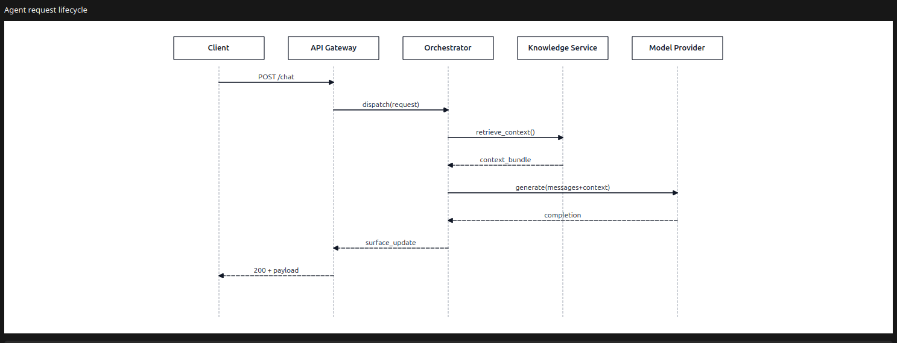
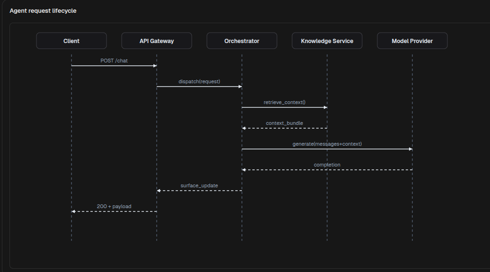

# SequenceDiagram

[<- Back to Charts Components](./index.md)

`SequenceDiagram` renders message exchanges between participants. Use it for request lifecycles, agent orchestration flows, service interactions, approval hand-offs, and other ordered communication timelines.

## Python Contract

```python
sdk.ui.SequenceDiagram(
    id: str,
    *,
    participants: list[dict[str, Any]] | None = None,
    messages: list[dict[str, Any]] | None = None,
    mermaid: str = "",
    title: str = "",
    height: int = 360,
)
```

## Supported Properties

| Property | Type | Required | Python | YAML | Desktop | Web | Notes |
|---|---|---|---|---|---|---|---|
| `id` | `str` | yes | yes | yes | yes | yes | Stable component id |
| `participants` | `list[object]` | no | yes | yes | yes | yes | Explicit participant list |
| `messages` | `list[object]` | no | yes | yes | yes | yes | Explicit message list |
| `mermaid` | `str` | no | yes | yes | yes | yes | SequenceDiagram Mermaid input |
| `title` | `str` | no | yes | yes | yes | yes | Optional title above the diagram |
| `height` | `int` | no | yes | yes | yes | yes | Minimum visual height |
| `style` | `str` | no | yes | yes | yes | yes | Apply container-level styling |
| `show_if` | rule | no | yes | yes | yes | yes | Generic visibility contract |
| `hide_if` | rule | no | yes | yes | yes | yes | Generic visibility contract |
| `required_permissions` | `list[str]` | no | yes | yes | yes | yes | Generic visibility contract |

## Participant Shape

Each participant entry can provide:

- `id`: stable participant identifier
- `label`: visible participant label

The renderer also tolerates `name` in participant objects, but for authoring use `id` and `label`.

## Message Shape

Each message entry can provide:

- `from`: source participant id
- `to`: target participant id
- `text`: visible message label
- `type`: `sync` or `reply`

The renderers also accept `source` and `target` as aliases for `from` and `to`.

## Input Modes

`SequenceDiagram` supports two authoring modes.

- Structured mode with `participants` and `messages`
- Mermaid mode with a `sequenceDiagram` definition in `mermaid`

When structured data is present, that data is rendered directly. When it is omitted, the component reads the Mermaid sequence definition.

## Structured Example

<div class="docs-code-group" data-code-group>
  <div class="docs-code-group__tabs" role="tablist" aria-label="SequenceDiagram structured example">
    <button class="docs-code-group__tab" type="button" role="tab" data-code-group-tab data-target="sequence-structured-python" data-active="true" aria-selected="true">Python</button>
    <button class="docs-code-group__tab" type="button" role="tab" data-code-group-tab data-target="sequence-structured-yaml" aria-selected="false">YAML</button>
  </div>
  <div class="docs-code-group__panel" id="sequence-structured-python" data-code-group-panel data-active="true">
    <div class="language-python highlight"><pre><code>diagram = sdk.ui.SequenceDiagram(
    "agent_request_lifecycle",
    title="Agent request lifecycle",
    participants=[
        {"id": "client", "label": "Client"},
        {"id": "gateway", "label": "API Gateway"},
        {"id": "orchestrator", "label": "Orchestrator"},
        {"id": "knowledge", "label": "Knowledge Service"},
        {"id": "llm", "label": "Model Provider"},
    ],
    messages=[
        {"from": "client", "to": "gateway", "text": "POST /chat", "type": "sync"},
        {"from": "gateway", "to": "orchestrator", "text": "dispatch(request)", "type": "sync"},
        {"from": "orchestrator", "to": "knowledge", "text": "retrieve_context()", "type": "sync"},
        {"from": "knowledge", "to": "orchestrator", "text": "context_bundle", "type": "reply"},
        {"from": "orchestrator", "to": "llm", "text": "generate(messages+context)", "type": "sync"},
        {"from": "llm", "to": "orchestrator", "text": "completion", "type": "reply"},
        {"from": "orchestrator", "to": "gateway", "text": "surface_update", "type": "reply"},
        {"from": "gateway", "to": "client", "text": "200 + payload", "type": "reply"},
    ],
    height=520,
)</code></pre></div>
  </div>
  <div class="docs-code-group__panel" id="sequence-structured-yaml" data-code-group-panel hidden>
    <div class="language-yaml highlight"><pre><code>- kind: SequenceDiagram
  id: agent_request_lifecycle
  title: "Agent request lifecycle"
  height: 520
  participants:
    - id: client
      label: "Client"
    - id: gateway
      label: "API Gateway"
    - id: orchestrator
      label: "Orchestrator"
    - id: knowledge
      label: "Knowledge Service"
    - id: llm
      label: "Model Provider"
  messages:
    - from: client
      to: gateway
      text: "POST /chat"
      type: sync
    - from: gateway
      to: orchestrator
      text: "dispatch(request)"
      type: sync
    - from: orchestrator
      to: knowledge
      text: "retrieve_context()"
      type: sync
    - from: knowledge
      to: orchestrator
      text: "context_bundle"
      type: reply
    - from: orchestrator
      to: llm
      text: "generate(messages+context)"
      type: sync
    - from: llm
      to: orchestrator
      text: "completion"
      type: reply
    - from: orchestrator
      to: gateway
      text: "surface_update"
      type: reply
    - from: gateway
      to: client
      text: "200 + payload"
      type: reply</code></pre></div>
  </div>
</div>

Desktop rendering:



Web rendering:



## Mermaid Example

<div class="docs-code-group" data-code-group>
  <div class="docs-code-group__tabs" role="tablist" aria-label="SequenceDiagram mermaid example">
    <button class="docs-code-group__tab" type="button" role="tab" data-code-group-tab data-target="sequence-mermaid-python" data-active="true" aria-selected="true">Python</button>
    <button class="docs-code-group__tab" type="button" role="tab" data-code-group-tab data-target="sequence-mermaid-yaml" aria-selected="false">YAML</button>
  </div>
  <div class="docs-code-group__panel" id="sequence-mermaid-python" data-code-group-panel data-active="true">
    <div class="language-python highlight"><pre><code>diagram = sdk.ui.SequenceDiagram(
    "agent_request_lifecycle_mermaid",
    title="Mermaid sequence input",
    mermaid=\"\"\"
sequenceDiagram
    participant Client
    participant Gateway as API_Gateway
    participant Orchestrator
    participant LLM
    Client->>Gateway: POST /chat
    Gateway->>Orchestrator: dispatch(request)
    Orchestrator->>LLM: generate(messages)
    LLM-->>Orchestrator: completion
    Orchestrator-->>Gateway: surface_update
    Gateway-->>Client: 200 + payload
\"\"\",
    height=420,
)</code></pre></div>
  </div>
  <div class="docs-code-group__panel" id="sequence-mermaid-yaml" data-code-group-panel hidden>
    <div class="language-yaml highlight"><pre><code>- kind: SequenceDiagram
  id: agent_request_lifecycle_mermaid
  title: "Mermaid sequence input"
  height: 420
  mermaid: |
    sequenceDiagram
        participant Client
        participant Gateway as API_Gateway
        participant Orchestrator
        participant LLM
        Client->>Gateway: POST /chat
        Gateway->>Orchestrator: dispatch(request)
        Orchestrator->>LLM: generate(messages)
        LLM-->>Orchestrator: completion
        Orchestrator-->>Gateway: surface_update
        Gateway-->>Client: 200 + payload</code></pre></div>
  </div>
</div>

## Binding And Runtime Updates

`title`, `participants`, and `messages` can be bound to the page store or to the surface data model. Direct runtime updates should target the same properties with `propertyUpdate`.

<div class="docs-code-group" data-code-group>
  <div class="docs-code-group__tabs" role="tablist" aria-label="SequenceDiagram binding example">
    <button class="docs-code-group__tab" type="button" role="tab" data-code-group-tab data-target="sequence-binding-python" data-active="true" aria-selected="true">Python</button>
    <button class="docs-code-group__tab" type="button" role="tab" data-code-group-tab data-target="sequence-binding-yaml" aria-selected="false">YAML</button>
  </div>
  <div class="docs-code-group__panel" id="sequence-binding-python" data-code-group-panel data-active="true">
    <div class="language-python highlight"><pre><code>from democrai.sdk.ui import bound

diagram = sdk.ui.SequenceDiagram("components_test_sequence_store", height=320)
diagram.set_property(
    "title",
    bound.store("/components_test/sequence/title", scope="page", default="Request lifecycle"),
)
diagram.set_property(
    "participants",
    bound.store("/components_test/sequence/participants", scope="page", default=[]),
)
diagram.set_property(
    "messages",
    bound.store("/components_test/sequence/messages", scope="page", default=[]),
)

data_diagram = sdk.ui.SequenceDiagram("components_test_sequence_data", height=320)
data_diagram.set_property(
    "participants",
    bound.data("/components_test/sequence_model/participants", default=[]),
)

live_diagram = sdk.ui.SequenceDiagram(
    "components_test_sequence_live",
    title="Request lifecycle",
    participants=[],
    messages=[],
    height=320,
).allow("title.set", "participants.set", "messages.set")</code></pre></div>
  </div>
  <div class="docs-code-group__panel" id="sequence-binding-yaml" data-code-group-panel hidden>
    <div class="language-yaml highlight"><pre><code>- kind: SequenceDiagram
  id: components_test_sequence_yaml_store
  title:
    type: store
    scope: page
    path: /components_test/sequence/title
    default: "Request lifecycle"
  participants:
    type: store
    scope: page
    path: /components_test/sequence/participants
    default: []
  messages:
    type: store
    scope: page
    path: /components_test/sequence/messages
    default: []
  height: 320

- kind: SequenceDiagram
  id: components_test_sequence_yaml_data
  participants:
    type: data
    path: components_test/sequence_model/participants
    default: []
  messages:
    type: data
    path: components_test/sequence_model/messages
    default: []
  height: 320

- kind: SequenceDiagram
  id: components_test_sequence_yaml_live
  title: "Request lifecycle"
  participants: []
  messages: []
  height: 320
  capabilities:
    - title.set
    - participants.set
    - messages.set</code></pre></div>
  </div>
</div>

## Visibility And Permissions

`show_if` and `hide_if` are evaluated at the first render and when their bound values change. Visibility rules use `mode: "AND"` by default; declare `mode: "OR"` when any condition can make the rule pass. `required_permissions` gates the component on the current user permissions; `super` and `admin` roles bypass the permission list.

<div class="docs-code-group" data-code-group>
  <div class="docs-code-group__tabs" role="tablist" aria-label="SequenceDiagram visibility example">
    <button class="docs-code-group__tab" type="button" role="tab" data-code-group-tab data-target="sequence-visibility-python" data-active="true" aria-selected="true">Python</button>
    <button class="docs-code-group__tab" type="button" role="tab" data-code-group-tab data-target="sequence-visibility-yaml" aria-selected="false">YAML</button>
  </div>
  <div class="docs-code-group__panel" id="sequence-visibility-python" data-code-group-panel data-active="true">
    <div class="language-python highlight"><pre><code>from democrai.sdk.ui import bound

diagram = sdk.ui.SequenceDiagram(
    "components_test_sequence_show_if",
    title="show_if visible",
    participants=[],
    messages=[],
    height=300,
).set_show_if({
    "mode": "AND",
    "conditions": [{
        "left": bound.store(
            "/components_test/visibility/sequence_show",
            scope="page",
            default=True,
        ),
        "op": "==",
        "right": True,
    }]
})

hidden_diagram = sdk.ui.SequenceDiagram(
    "components_test_sequence_hide_if",
    title="hide_if not hidden",
    participants=[],
    messages=[],
    height=300,
).set_hide_if({
    "mode": "AND",
    "conditions": [{
        "left": bound.store(
            "/components_test/visibility/sequence_hide",
            scope="page",
            default=False,
        ),
        "op": "==",
        "right": True,
    }]
})

permission_diagram = sdk.ui.SequenceDiagram(
    "components_test_sequence_required_permissions",
    title="required_permissions gate",
    participants=[],
    messages=[],
    height=300,
).set_required_permissions(["components.diagram.visibility"])</code></pre></div>
  </div>
  <div class="docs-code-group__panel" id="sequence-visibility-yaml" data-code-group-panel hidden>
    <div class="language-yaml highlight"><pre><code>- kind: SequenceDiagram
  id: components_test_sequence_yaml_show_if
  title: "show_if visible"
  participants: []
  messages: []
  height: 300
  show_if:
    mode: AND
    conditions:
      - left:
          type: store
          scope: page
          path: /components_test/visibility/sequence_show
          default: true
        op: "=="
        right: true

- kind: SequenceDiagram
  id: components_test_sequence_yaml_hide_if
  title: "hide_if not hidden"
  participants: []
  messages: []
  height: 300
  hide_if:
    mode: AND
    conditions:
      - left:
          type: store
          scope: page
          path: /components_test/visibility/sequence_hide
          default: false
        op: "=="
        right: true

- kind: SequenceDiagram
  id: components_test_sequence_yaml_required_permissions
  title: "required_permissions gate"
  participants: []
  messages: []
  height: 300
  required_permissions:
    - components.diagram.visibility</code></pre></div>
  </div>
</div>

## Usage Guidance

- Use structured mode when your module already owns participants and messages as data.
- Use Mermaid mode when the sequence is easier to maintain as a compact text definition.
- Use `type: reply` for response messages so the rendered arrow style matches the exchange semantics.
- Keep participant ids stable across messages so the lifelines stay consistent.
