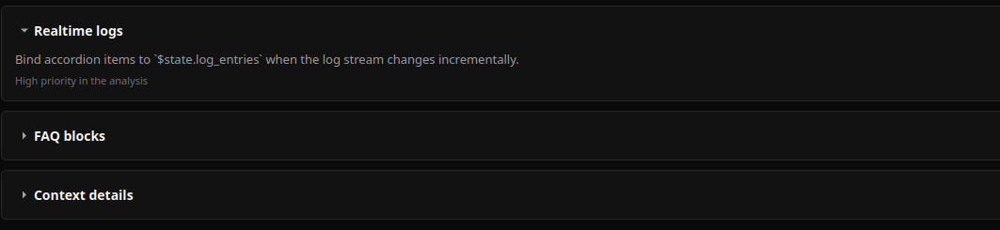
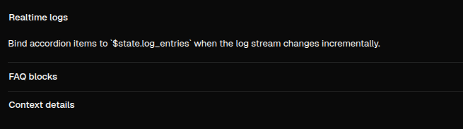

# Accordion

[<- Back to Complex Components](./index.md)

## Purpose

`Accordion` renders a group of expandable items. Use it when a page needs several related sections but only part of the content should be open at a time.

The component is client-interactive: clicking an item trigger opens or closes its panel. With `multiple=False`, opening one panel closes the others. With `multiple=True`, more than one panel can remain open. With `collapsible=False`, the web renderer keeps a single accordion from collapsing to no open item.

## Constructor

```python
Accordion(
    id: str,
    items: Optional[List[Dict[str, Any]]] = None,
    multiple: bool = False,
    collapsible: bool = True,
)
```

## Properties

| Property | Type | Default | Description |
|---|---|---:|---|
| `items` | `list[dict]` | `[]` | Item list rendered in order. Each item supports `title`, `content`, `open`; the desktop renderer also renders `meta` when present. |
| `multiple` | `bool` | `False` | Allows more than one item to stay open. |
| `collapsible` | `bool` | `True` | Allows a single web accordion item to be collapsed after it is open. |
| `children` | inherited list | `[]` | Optional child content rendered into item panels in item order. |

## Examples

<div class="docs-code-group" data-code-group>
  <div class="docs-code-group__tabs" role="tablist" aria-label="accordion example 1">
    <button class="docs-code-group__tab" type="button" role="tab" data-code-group-tab data-target="accordion-1-python" data-active="true" aria-selected="true">Python</button>
    <button class="docs-code-group__tab" type="button" role="tab" data-code-group-tab data-target="accordion-1-yaml" aria-selected="false">YAML</button>
  </div>
  <div class="docs-code-group__panel" id="accordion-1-python" data-code-group-panel data-active="true">
    <div class="language-python highlight"><pre><code>from democrai.sdk.client import active_sdk as sdk
from democrai.sdk.ui import bound

items = [
    {
        &quot;title&quot;: &quot;Realtime logs&quot;,
        &quot;content&quot;: &quot;Open by default and updated from runtime state.&quot;,
        &quot;meta&quot;: &quot;High priority&quot;,
        &quot;open&quot;: True,
    },
    {
        &quot;title&quot;: &quot;Audit notes&quot;,
        &quot;content&quot;: &quot;Collapsed until the user opens it.&quot;,
        &quot;open&quot;: False,
    },
]

builder.add(sdk.ui.Text(&quot;accordion_child&quot;, &quot;Rendered child content&quot;))
accordion = sdk.ui.Accordion(
    &quot;accordion_static&quot;,
    items=items,
    multiple=False,
    collapsible=True,
)
accordion.set_required_permissions([&quot;components.complex.view&quot;])
accordion.set_show_if({
    &quot;conditions&quot;: [
        {
            &quot;left&quot;: bound.store(&quot;/components_test/accordion/show&quot;, scope=&quot;page&quot;, default=True),
            &quot;op&quot;: &quot;==&quot;,
            &quot;right&quot;: True,
        }
    ]
})
accordion.set_hide_if({
    &quot;conditions&quot;: [
        {
            &quot;left&quot;: bound.store(&quot;/components_test/accordion/hide&quot;, scope=&quot;page&quot;, default=False),
            &quot;op&quot;: &quot;==&quot;,
            &quot;right&quot;: True,
        }
    ]
})
accordion.children.append(&quot;accordion_child&quot;)
accordion.allow(&quot;items.set&quot;, &quot;multiple.set&quot;, &quot;collapsible.set&quot;)</code></pre></div>
  </div>
  <div class="docs-code-group__panel" id="accordion-1-yaml" data-code-group-panel hidden>
    <div class="language-yaml highlight"><pre><code>- kind: Text
  id: accordion_child
  text: &quot;Rendered child content&quot;

- kind: Accordion
  id: accordion_static
  items:
    - title: &quot;Realtime logs&quot;
      content: &quot;Open by default and updated from runtime state.&quot;
      meta: &quot;High priority&quot;
      open: true
    - title: &quot;Audit notes&quot;
      content: &quot;Collapsed until the user opens it.&quot;
      open: false
  multiple: false
  collapsible: true
  required_permissions: [components.complex.view]
  show_if:
    conditions:
      - left: {type: store, scope: page, path: /components_test/accordion/show, default: true}
        op: &quot;==&quot;
        right: true
  hide_if:
    conditions:
      - left: {type: store, scope: page, path: /components_test/accordion/hide, default: false}
        op: &quot;==&quot;
        right: true
  capabilities: [items.set, multiple.set, collapsible.set]
  children:
    - accordion_child</code></pre></div>
  </div>
</div>

## Binding and Updates

`items`, `multiple`, and `collapsible` can be supplied as normal properties in Python and YAML. The demo also includes store-bound and data-model-bound versions of the accordion.

<div class="docs-code-group" data-code-group>
  <div class="docs-code-group__tabs" role="tablist" aria-label="accordion example 2">
    <button class="docs-code-group__tab" type="button" role="tab" data-code-group-tab data-target="accordion-2-python" data-active="true" aria-selected="true">Python</button>
    <button class="docs-code-group__tab" type="button" role="tab" data-code-group-tab data-target="accordion-2-yaml" aria-selected="false">YAML</button>
  </div>
  <div class="docs-code-group__panel" id="accordion-2-python" data-code-group-panel data-active="true">
    <div class="language-python highlight"><pre><code>store_bound = sdk.ui.Accordion(
    &quot;accordion_store&quot;,
    items=bound.store(&quot;/components_test/accordion/items&quot;, scope=&quot;page&quot;, default=items),
    multiple=bound.store(&quot;/components_test/accordion/multiple&quot;, scope=&quot;page&quot;, default=False),
    collapsible=bound.store(&quot;/components_test/accordion/collapsible&quot;, scope=&quot;page&quot;, default=True),
)

data_bound = sdk.ui.Accordion(
    &quot;accordion_data&quot;,
    items=bound.data(&quot;/components_test/accordion_model/items&quot;, default=items),
    multiple=bound.data(&quot;/components_test/accordion_model/multiple&quot;, default=False),
    collapsible=bound.data(&quot;/components_test/accordion_model/collapsible&quot;, default=True),
)

live = sdk.ui.Accordion(&quot;accordion_live&quot;, items=items, multiple=False, collapsible=True)
live.allow(&quot;items.set&quot;, &quot;multiple.set&quot;, &quot;collapsible.set&quot;)</code></pre></div>
  </div>
  <div class="docs-code-group__panel" id="accordion-2-yaml" data-code-group-panel hidden>
    <div class="language-yaml highlight"><pre><code>- kind: Accordion
  id: accordion_store
  items: {type: store, scope: page, path: /components_test/accordion/items, default: []}
  multiple: {type: store, scope: page, path: /components_test/accordion/multiple, default: false}
  collapsible: {type: store, scope: page, path: /components_test/accordion/collapsible, default: true}

- kind: Accordion
  id: accordion_data
  items: &quot;@data/components_test/accordion_model/items&quot;
  multiple: &quot;@data/components_test/accordion_model/multiple&quot;
  collapsible: &quot;@data/components_test/accordion_model/collapsible&quot;

- kind: Accordion
  id: accordion_live
  items: []
  multiple: false
  collapsible: true
  capabilities: [items.set, multiple.set, collapsible.set]</code></pre></div>
  </div>
</div>

Runtime updates must target the current surface:

```python
surface_id = ctx["_surface_id"]

return sdk.effects.respond(
    sdk.effects.ui_messages([
        {
            "stateUpdate": {
                "scope": "page",
                "values": {
                    "/components_test/accordion/items": next_items,
                    "/components_test/accordion/multiple": True,
                    "/components_test/accordion/collapsible": False,
                },
            }
        },
        sdk.ui.Builder.build_data_model_update_payload(
            surface_id=surface_id,
            data={
                "components_test": {
                    "accordion_model": {
                        "items": next_items,
                        "multiple": True,
                        "collapsible": False,
                    }
                }
            },
        ),
    ]),
    sdk.effects.ui_property_update("accordion_live", "items", next_items, surface_id=surface_id),
    sdk.effects.ui_property_update("accordion_live", "multiple", True, surface_id=surface_id),
    sdk.effects.ui_property_update("accordion_live", "collapsible", False, surface_id=surface_id),
)
```

## Renderer Notes

Desktop renders `items[].title`, `items[].content`, `items[].open`, and optional `items[].meta`. Desktop binding strategies are declared for `items` and `multiple`.

Web renders the same item fields and applies `collapsible` through the shadcn accordion primitive. Web also renders child content into item panels by index.

## Screenshots

Desktop:



Web:


