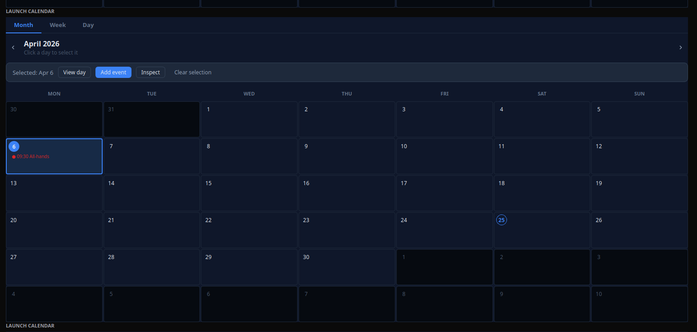
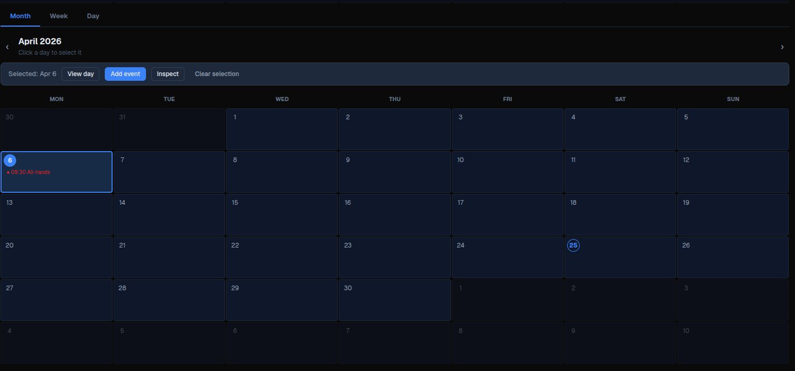

# Calendar

[<- Back to Complex Components](./index.md)

## Purpose

`Calendar` renders an event calendar with month, week, and day views. It displays dated events, highlights selected days or time slots, can expose custom selection buttons, emits calendar interaction intents through its primary `action`, and can emit an event-click action with the clicked event payload.

Use it for schedule, agenda, booking, and planning surfaces where events are supplied by the module. The component does not fetch events by itself and does not persist user selections automatically; actions must return store, data model, or property updates when the selection or event list must be synchronized.

## Constructor

```python
Calendar(
    id: str,
    value: str = "",
    min_date: str = "",
    max_date: str = "",
    max_width: int | None = None,
    action: str | ActionSpec | None = None,
    params: dict | None = None,
    *,
    label: str = "",
    date_format: str = "yyyy-MM-dd",
    input_mask: str = "",
    show_input: bool = True,
    events: list | None = None,
    view: str = "month",
    current_date: str = "",
    selected_dates: list | None = None,
    selected_slots: list | None = None,
    buttons: list | None = None,
    on_event_click: str | ActionSpec | None = None,
    on_event_click_params: dict | None = None,
    time_from: int = 0,
    time_to: int = 24,
)
```

## Properties

| Python argument | Payload/YAML property | Type | Default | Description |
|---|---|---:|---:|---|
| `label` | `label` | `str` | `""` | Optional field label. The desktop renderer displays it in the field shell. |
| `value` | `value` | `str` | `""` | Legacy selected-date value. The desktop event calendar can use it as the initial date when `current_date` is empty. |
| `min_date` | `min_date` | `str` | `""` | Serialized legacy date-picker bound. It is not enforced by the current event-calendar renderers. |
| `max_date` | `max_date` | `str` | `""` | Serialized legacy date-picker bound. It is not enforced by the current event-calendar renderers. |
| `max_width` | `max_width` | `int \| null` | `null` | Optional field-shell width limit where supported by the renderer shell. |
| `date_format` | `date_format` | `str` | `"yyyy-MM-dd"` | Serialized legacy date-picker format. Event dates should still be supplied as ISO `yyyy-MM-dd`. |
| `input_mask` | `input_mask` | `str` | `""` | Serialized legacy date-picker mask. It is not used by the event-calendar grid. |
| `show_input` | `show_input` | `bool` | `true` | Serialized legacy date-picker flag. It is not used by the event-calendar grid. |
| `events` | `events` | `list[dict]` | `[]` | Events rendered in the month, week, and day views. |
| `view` | `view` | `str` | `"month"` | Initial view. Supported values are `"month"`, `"week"`, and `"day"`. Unknown values fall back to month in the desktop renderer. |
| `current_date` | `current_date` | `str` | `""` | ISO date used as the visible month, week, or day anchor. |
| `selected_dates` | `selected_dates` | `list[str]` | `[]` | Selected ISO dates for month view. The UI treats month selection as single-day selection. |
| `selected_slots` | `selected_slots` | `list` | `[]` | Selected time slots. Week view uses objects with `date` and `time`; day view uses `HH:MM` strings. |
| `buttons` | `buttons` | `list[dict]` | `[]` | Custom buttons displayed in the selection bar when there is a selected day or slot. |
| `action` | `action` | action spec | `null` | Primary interaction action for navigation, view changes, day clicks, slot clicks, and desktop create-event requests. |
| `params` | `action.context` | `dict` | `{}` | Context merged into the primary action payload. |
| `on_event_click` | `on_event_click` | action spec | `null` | Action emitted when an event item is clicked. |
| `on_event_click_params` | `on_event_click.context` | `dict` | `{}` | Context merged into the event-click action payload. |
| `time_from` | `time_from` | `int` | `0` | First hour shown in week/day time grids, clamped to `0`. |
| `time_to` | `time_to` | `int` | `24` | End hour for week/day time grids, clamped to `24`. |

For direct property updates and YAML definitions, use the payload property names.

## Action Confirmation

Use `confirm` inside the `ActionSpec` for the primary `action`, `on_event_click`, or any custom `buttons[].action`. Confirmation text should use translation keys.

Primary calendar interactions confirm before changing local calendar state. If the user cancels a primary `action` confirmation, the view, visible date, selected day, or selected slot remains unchanged.

<div class="docs-code-group" data-code-group>
  <div class="docs-code-group__tabs" role="tablist" aria-label="Calendar confirm example">
    <button class="docs-code-group__tab" type="button" role="tab" data-code-group-tab data-target="calendar-confirm-python" data-active="true" aria-selected="true">Python</button>
    <button class="docs-code-group__tab" type="button" role="tab" data-code-group-tab data-target="calendar-confirm-yaml" aria-selected="false">YAML</button>
  </div>
  <div class="docs-code-group__panel" id="calendar-confirm-python" data-code-group-panel data-active="true">
    <div class="language-python highlight"><pre><code>calendar = sdk.ui.Calendar(
    "calendar_confirm",
    events=[
        {
            "_id": "event_alpha",
            "date": "2026-04-29",
            "time": "09:00",
            "title": "Confirmable event",
        }
    ],
    view="month",
    current_date="2026-04-29",
    action={
        "name": "components.calendar_confirm_action",
        "context": {"source": "python_calendar_primary"},
        "confirm": {
            "text": sdk.i18n.t("components.calendar.confirm.primary_prompt"),
            "confirm_text": sdk.i18n.t("components.calendar.confirm.accept"),
            "cancel_text": sdk.i18n.t("components.calendar.confirm.cancel"),
        },
    },
    on_event_click={
        "name": "components.calendar_confirm_action",
        "context": {"source": "python_calendar_event"},
        "confirm": {
            "text": sdk.i18n.t("components.calendar.confirm.event_prompt"),
            "confirm_text": sdk.i18n.t("components.calendar.confirm.accept"),
            "cancel_text": sdk.i18n.t("components.calendar.confirm.cancel"),
        },
    },
    buttons=[
        {
            "label": sdk.i18n.t("components.calendar.confirm.button_label"),
            "variant": "primary",
            "action": {
                "name": "components.calendar_confirm_action",
                "context": {"source": "python_calendar_button"},
                "confirm": {
                    "text": sdk.i18n.t("components.calendar.confirm.button_prompt"),
                    "confirm_text": sdk.i18n.t("components.calendar.confirm.accept"),
                    "cancel_text": sdk.i18n.t("components.calendar.confirm.cancel"),
                },
            },
        }
    ],
)</code></pre></div>
  </div>
  <div class="docs-code-group__panel" id="calendar-confirm-yaml" data-code-group-panel hidden>
    <div class="language-yaml highlight"><pre><code>- kind: Calendar
  id: calendar_confirm
  view: month
  current_date: "2026-04-29"
  events:
    - _id: event_alpha
      date: "2026-04-29"
      time: "09:00"
      title: Confirmable event
  action:
    name: components.calendar_confirm_action
    context:
      source: yaml_calendar_primary
    confirm:
      text: "@t/components.calendar.confirm.primary_prompt"
      confirm_text: "@t/components.calendar.confirm.accept"
      cancel_text: "@t/components.calendar.confirm.cancel"
  on_event_click:
    name: components.calendar_confirm_action
    context:
      source: yaml_calendar_event
    confirm:
      text: "@t/components.calendar.confirm.event_prompt"
      confirm_text: "@t/components.calendar.confirm.accept"
      cancel_text: "@t/components.calendar.confirm.cancel"
  buttons:
    - label: "@t/components.calendar.confirm.button_label"
      variant: primary
      action:
        name: components.calendar_confirm_action
        context:
          source: yaml_calendar_button
        confirm:
          text: "@t/components.calendar.confirm.button_prompt"
          confirm_text: "@t/components.calendar.confirm.accept"
          cancel_text: "@t/components.calendar.confirm.cancel"</code></pre></div>
  </div>
</div>

## Event Shape

| Field | Type | Description |
|---|---|---|
| `_id` | `str` | Optional stable id used by module actions. The renderer does not require it. |
| `date` | `str` | ISO date (`yyyy-MM-dd`). Used to place the event on the calendar. |
| `start` | `str` | Optional ISO datetime fallback used by renderers when `date` is missing. |
| `time` | `str` | Time label such as `09:00`. Week view groups by hour; day view places events into 30-minute buckets. |
| `title` | `str` | Display text for the event. |
| `duration` | `int` | Duration in minutes. Day view uses it to span event blocks. |
| `description` | `str` | Optional detail shown in day view and available to event-click actions. |
| `color` | `str` | Optional CSS/Qt color used for the event marker or block. |

## Selection Shapes

| View | Property | Shape |
|---|---|---|
| Month | `selected_dates` | `["2026-03-18"]` |
| Week | `selected_slots` | `[{"date": "2026-03-23", "time": "09:00"}]` |
| Day | `selected_slots` | `["09:30", "10:00"]` |

Week selection is same-day multi-select in the renderers. Selecting a slot on another day clears the previous week selection.

## Mutable Capabilities

`Calendar` exposes these mutable capabilities by default:

| Property | Capabilities |
|---|---|
| `value` | `value.set`, `value.append` |
| `events` | `events.set`, `events.append`, `events.remove`, `events.replace` |
| `selected_dates` | `selected_dates.set`, `selected_dates.append`, `selected_dates.remove` |
| `selected_slots` | `selected_slots.set`, `selected_slots.append`, `selected_slots.remove` |
| visibility state | `visible.set`, `enabled.set` |

Direct updates to other rendered properties, such as `label`, `view`, `current_date`, `buttons`, `time_from`, or `time_to`, must be declared explicitly with `allow(...)` or YAML `capabilities`.

## Calendar Example

<div class="docs-code-group" data-code-group>
  <div class="docs-code-group__tabs" role="tablist" aria-label="Calendar example">
    <button class="docs-code-group__tab" type="button" role="tab" data-code-group-tab data-target="calendar-example-python" data-active="true" aria-selected="true">Python</button>
    <button class="docs-code-group__tab" type="button" role="tab" data-code-group-tab data-target="calendar-example-yaml" aria-selected="false">YAML</button>
  </div>
  <div class="docs-code-group__panel" id="calendar-example-python" data-code-group-panel data-active="true">
    <div class="language-python highlight"><pre><code>from democrai.sdk.client import active_sdk as sdk
from democrai.sdk.ui import bound

events = [
    {
        "_id": "cal_evt_standup",
        "date": "2026-03-05",
        "time": "09:00",
        "title": "Team standup",
        "duration": 30,
        "description": "Daily project sync.",
        "color": "#2563eb",
    },
    {
        "_id": "cal_evt_review",
        "date": "2026-03-18",
        "time": "11:00",
        "title": "Board review",
        "duration": 120,
        "description": "Quarterly planning session.",
        "color": "#7c3aed",
    },
]

buttons = [
    {"label": "Add event", "action": "components.calendar_test_button", "params": {"source": "selection"}, "variant": "primary"},
    {"label": "Inspect", "action": "components.calendar_test_button", "params": {"source": "inspect"}, "variant": "default"},
]

calendar = sdk.ui.Calendar(
    "calendar_static",
    label="Planning calendar",
    value="2026-03-01",
    min_date="2026-03-01",
    max_date="2026-04-30",
    max_width=None,
    date_format="yyyy-MM-dd",
    input_mask="0000-00-00",
    show_input=True,
    view="month",
    current_date="2026-03-01",
    events=events,
    selected_dates=["2026-03-18"],
    selected_slots=[],
    buttons=buttons,
    action="components.calendar_test_interaction",
    params={"source": "calendar_static"},
    on_event_click="components.calendar_test_event_click",
    on_event_click_params={"source": "calendar_static"},
    time_from=8,
    time_to=18,
)
calendar.set_show_if({
    "conditions": [
        {
            "left": bound.store("/components_test/calendar/show", scope="page", default=True),
            "op": "==",
            "right": True,
        }
    ]
})
calendar.set_hide_if({
    "conditions": [
        {
            "left": bound.store("/components_test/calendar/hide", scope="page", default=False),
            "op": "==",
            "right": True,
        }
    ]
})
calendar.set_required_permissions(["components.complex.view"])
calendar.allow("label.set", "value.set", "current_date.set", "view.set", "events.set", "selected_dates.set", "selected_slots.set", "buttons.set", "time_from.set", "time_to.set")</code></pre></div>
  </div>
  <div class="docs-code-group__panel" id="calendar-example-yaml" data-code-group-panel hidden>
    <div class="language-yaml highlight"><pre><code>- kind: Calendar
  id: calendar_static
  label: Planning calendar
  value: "2026-03-01"
  min_date: "2026-03-01"
  max_date: "2026-04-30"
  max_width: null
  date_format: yyyy-MM-dd
  input_mask: "0000-00-00"
  show_input: true
  view: month
  current_date: "2026-03-01"
  action: components.calendar_test_interaction
  params: {source: calendar_static}
  on_event_click: components.calendar_test_event_click
  on_event_click_params: {source: calendar_static}
  time_from: 8
  time_to: 18
  events:
    - _id: cal_evt_standup
      date: "2026-03-05"
      time: "09:00"
      title: Team standup
      duration: 30
      description: Daily project sync.
      color: "#2563eb"
    - _id: cal_evt_review
      date: "2026-03-18"
      time: "11:00"
      title: Board review
      duration: 120
      description: Quarterly planning session.
      color: "#7c3aed"
  selected_dates: ["2026-03-18"]
  selected_slots: []
  buttons:
    - label: Add event
      action: components.calendar_test_button
      params: {source: selection}
      variant: primary
    - label: Inspect
      action: components.calendar_test_button
      params: {source: inspect}
      variant: default
  required_permissions: [components.complex.view]
  show_if:
    conditions:
      - left: {type: store, scope: page, path: /components_test/calendar/show, default: true}
        op: "=="
        right: true
  hide_if:
    conditions:
      - left: {type: store, scope: page, path: /components_test/calendar/hide, default: false}
        op: "=="
        right: true
  capabilities: [label.set, value.set, current_date.set, view.set, events.set, selected_dates.set, selected_slots.set, buttons.set, time_from.set, time_to.set]</code></pre></div>
  </div>
</div>

## Bindings and Updates

Store-bound and data-model-bound examples use the same event-calendar state as the static calendar. In Python, use `bound.store(...)` for page/global store and `bound.data(...)` for the surface data model. In YAML, use explicit store binding objects and `@data/...` paths.

Static calendars keep their initial `view`, `current_date`, events, and selection. Use store bindings, data-model bindings, or direct property updates when an external control must switch the visible month or replace the event list.

<div class="docs-code-group" data-code-group>
  <div class="docs-code-group__tabs" role="tablist" aria-label="Calendar binding example">
    <button class="docs-code-group__tab" type="button" role="tab" data-code-group-tab data-target="calendar-binding-python" data-active="true" aria-selected="true">Python</button>
    <button class="docs-code-group__tab" type="button" role="tab" data-code-group-tab data-target="calendar-binding-yaml" aria-selected="false">YAML</button>
  </div>
  <div class="docs-code-group__panel" id="calendar-binding-python" data-code-group-panel data-active="true">
    <div class="language-python highlight"><pre><code>store_calendar = sdk.ui.Calendar("calendar_store", buttons=buttons)
store_calendar.set_property("label", bound.store("/components_test/calendar/label", scope="page", default="Planning calendar"))
store_calendar.set_property("view", bound.store("/components_test/calendar/view", scope="page", default="month"))
store_calendar.set_property("current_date", bound.store("/components_test/calendar/current_date", scope="page", default="2026-03-01"))
store_calendar.set_property("events", bound.store("/components_test/calendar/events", scope="page", default=events))
store_calendar.set_property("selected_dates", bound.store("/components_test/calendar/selected_dates", scope="page", default=["2026-03-18"]))
store_calendar.set_property("selected_slots", bound.store("/components_test/calendar/selected_slots", scope="page", default=[]))

data_calendar = sdk.ui.Calendar("calendar_data", buttons=buttons)
data_calendar.set_property("label", bound.data("/components_test/calendar_model/label", default="Planning calendar"))
data_calendar.set_property("view", bound.data("/components_test/calendar_model/view", default="month"))
data_calendar.set_property("current_date", bound.data("/components_test/calendar_model/current_date", default="2026-03-01"))
data_calendar.set_property("events", bound.data("/components_test/calendar_model/events", default=events))
data_calendar.set_property("selected_dates", bound.data("/components_test/calendar_model/selected_dates", default=["2026-03-18"]))
data_calendar.set_property("selected_slots", bound.data("/components_test/calendar_model/selected_slots", default=[]))

live_calendar = sdk.ui.Calendar("calendar_live", label="Planning calendar", events=events)
live_calendar.allow("label.set", "value.set", "current_date.set", "view.set", "events.set", "selected_dates.set", "selected_slots.set", "buttons.set", "time_from.set", "time_to.set")</code></pre></div>
  </div>
  <div class="docs-code-group__panel" id="calendar-binding-yaml" data-code-group-panel hidden>
    <div class="language-yaml highlight"><pre><code>- kind: Calendar
  id: calendar_store
  label: Planning calendar
  view: {type: store, scope: page, path: /components_test/calendar/view, default: month}
  current_date: {type: store, scope: page, path: /components_test/calendar/current_date, default: "2026-03-01"}
  events: {type: store, scope: page, path: /components_test/calendar/events, default: []}
  selected_dates: {type: store, scope: page, path: /components_test/calendar/selected_dates, default: ["2026-03-18"]}
  selected_slots: {type: store, scope: page, path: /components_test/calendar/selected_slots, default: []}
  buttons: []

- kind: Calendar
  id: calendar_data
  label: Planning calendar
  view: "@data/components_test/calendar_model/view"
  current_date: "@data/components_test/calendar_model/current_date"
  events: "@data/components_test/calendar_model/events"
  selected_dates: "@data/components_test/calendar_model/selected_dates"
  selected_slots: "@data/components_test/calendar_model/selected_slots"
  buttons: []

- kind: Calendar
  id: calendar_live
  label: Planning calendar
  events: []
  capabilities: [label.set, value.set, current_date.set, view.set, events.set, selected_dates.set, selected_slots.set, buttons.set, time_from.set, time_to.set]</code></pre></div>
  </div>
</div>

Runtime updates must target the current surface:

```python
surface_id = ctx["_surface_id"]

return sdk.effects.respond(
    sdk.effects.ui_messages([
        {
            "stateUpdate": {
                "scope": "page",
                "values": {
                    "/components_test/calendar/label": next_label,
                    "/components_test/calendar/current_date": next_date,
                    "/components_test/calendar/view": next_view,
                    "/components_test/calendar/events": next_events,
                    "/components_test/calendar/selected_dates": next_selected_dates,
                    "/components_test/calendar/selected_slots": next_selected_slots,
                },
            }
        },
        sdk.ui.Builder.build_data_model_update_payload(
            surface_id=surface_id,
            data={
                "components_test": {
                    "calendar_model": {
                        "label": next_label,
                        "current_date": next_date,
                        "view": next_view,
                        "events": next_events,
                        "selected_dates": next_selected_dates,
                        "selected_slots": next_selected_slots,
                    }
                }
            },
        ),
    ]),
    sdk.effects.ui_property_update("calendar_live", "label", next_label, surface_id=surface_id),
    sdk.effects.ui_property_update("calendar_live", "current_date", next_date, surface_id=surface_id),
    sdk.effects.ui_property_update("calendar_live", "view", next_view, surface_id=surface_id),
    sdk.effects.ui_property_update("calendar_live", "events", next_events, surface_id=surface_id),
    sdk.effects.ui_property_update("calendar_live", "selected_dates", next_selected_dates, surface_id=surface_id),
    sdk.effects.ui_property_update("calendar_live", "selected_slots", next_selected_slots, surface_id=surface_id),
)
```

## Interactions

`on_event_click` is the only dedicated event callback property. It receives the clicked event plus `date`, `time`, and `title`.

The component does not define separate `on_day_click`, `on_hour_click`, `on_month_change`, `on_day_change`, or `on_week_change` properties. Use the primary `action` property for renderer interaction intents.

Custom `buttons` are shown in the selection bar. The renderer merges each button `params` with the current selection context:

| Active view | Button context |
|---|---|
| Month | `date` |
| Week | `date`, `time`, `slots` as `[{date, time}]` |
| Day | `date`, `time`, `slots` as `["HH:MM"]` |

The renderers emit these primary `action` intents:

| Intent | Clients | When it is emitted | Payload fields |
|---|---|---|---|
| `navigate` | Desktop, web | Previous/next navigation in month, week, or day view | `view`, `direction`, `date` |
| `view_change` | Desktop, web | View tab changes or switching from a month day to day view | `view`, optional `date` |
| `day_click` | Desktop, web | Day selection in month view | `view`, `date` |
| `slot_click` | Desktop, web | Time-slot selection in week or day view | `view`, `date`, `time` |
| `create_event_request` | Desktop | Context-menu create request in month view | `view`, `date`, `time` |

`create_event_request` is emitted by the desktop context menu. On web, use a custom `buttons` entry such as `Add event` for the same user flow after a day or slot is selected.

The test page binds every calendar primary `action` to `components.calendar_test_interaction`. The action can branch on `intent`:

```python
@action("calendar_test_interaction")
async def calendar_test_interaction(ctx, session, sdk):
    intent = ctx.get("intent")
    if intent == "navigate":
        view = ctx["view"]
        date = ctx["date"]
    elif intent == "view_change":
        view = ctx["view"]
        date = ctx.get("date")
    elif intent == "day_click":
        date = ctx["date"]
    elif intent == "slot_click":
        date = ctx["date"]
        time = ctx["time"]
    elif intent == "create_event_request":
        date = ctx["date"]
        time = ctx["time"]
```

Interaction examples reproduced by the test page:

| Interaction | Demo trigger | Example payload |
|---|---|---|
| Month change | Click previous/next while `view` is `month` | `{"intent": "navigate", "view": "month", "direction": 1, "date": "2026-04-01"}` |
| Week change | Click previous/next while `view` is `week` | `{"intent": "navigate", "view": "week", "direction": 1, "date": "2026-03-30"}` |
| Day change | Click previous/next while `view` is `day` | `{"intent": "navigate", "view": "day", "direction": 1, "date": "2026-03-24"}` |
| View change | Click the month, week, or day tab | `{"intent": "view_change", "view": "week"}` |
| Month day click | Click a day cell in month view | `{"intent": "day_click", "view": "month", "date": "2026-03-18"}` |
| Week hour click | Click a time slot in week view | `{"intent": "slot_click", "view": "week", "date": "2026-03-23", "time": "09:00"}` |
| Day hour click | Click a time slot in day view | `{"intent": "slot_click", "view": "day", "date": "2026-03-23", "time": "09:30"}` |
| Event click | Click an event item | `{"event": {...}, "date": "2026-03-18", "time": "11:00", "title": "Board review"}` |
| Add event button | Select a day or slot, then click `Add event` | `{"source": "selection", "date": "2026-03-18", "time": "11:00", "slots": [...]}` |
| Desktop create request | Right-click a month day and choose `Add event here` | `{"intent": "create_event_request", "view": "month", "date": "2026-03-18", "time": "09:00"}` |

## Screenshots

Desktop:



Web:


