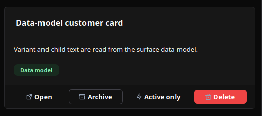
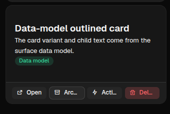

# Card

[<- Back to Complex Components](./index.md)

## Purpose

`Card` groups related content in a framed container. Use it for summaries, records, metrics, profile blocks, and compact panels that need their own footer actions.

The content area is defined by `children`. Footer actions are defined by `item_actions` in Python or `item_actions` / `itemActions` in YAML, depending on the authoring style used by the page.

## Constructor

```python
Card(
    id: str,
    children: list[str | Component] | None = None,
    background_image: str | None = None,
    variant: str = "elevated",
    item_actions: list[dict] | None = None,
    data: dict | None = None,
)
```

## Properties

| Property | Type | Default | Description |
|---|---:|---:|---|
| `children` | `list[str | Component]` | `[]` | Components rendered inside the card body. |
| `variant` | `str` | `elevated` | Visual variant hint. The demo uses `elevated`, `outlined`, and `flat`; on web the visual difference is intentionally limited. |
| `backgroundImage` / `background_image` | `str` | none | Optional background image URL. |
| `itemActions` / `item_actions` | `list[dict]` | `[]` | Footer action definitions rendered as buttons. |
| `data` | `dict` | `{}` | Item payload associated with the card. It is included when an item action is triggered. |
| `padding` | `list[int]` | client default | Runtime padding override supported by the renderers. |
| `style` | `str | dict` | none | Common style property for explicit sizing or visual overrides. |
| `visible` | `bool` | `true` | Common runtime visibility property. |

## Item Actions

Each item action describes one footer button. The action can have its own label, icon, visual variant, action spec, visibility rules, and permission requirements.

When the user clicks a footer action, the emitted action context contains the action's explicit `context` plus the card `data`. Put command-level fields such as `source` or `intent` in `action.context`; put record-level fields such as `id`, `kind`, `status`, or `owner` in `data`.

Action visibility can read the card item payload through `$item.<field>`. This is useful for actions such as "Active only" or "Archive only when status is active".

Card item action specs must use fully qualified module action names, for example `components.test_card_action_event`. See [Action Dispatch](../action-dispatch.md).

Item action specs can include `confirm`. If the user cancels the dialog, no backend action is sent.

<div class="docs-code-group" data-code-group>
  <div class="docs-code-group__tabs" role="tablist" aria-label="Card confirm example">
    <button class="docs-code-group__tab" type="button" role="tab" data-code-group-tab data-target="card-confirm-python" data-active="true" aria-selected="true">Python</button>
    <button class="docs-code-group__tab" type="button" role="tab" data-code-group-tab data-target="card-confirm-yaml" aria-selected="false">YAML</button>
  </div>
  <div class="docs-code-group__panel" id="card-confirm-python" data-code-group-panel data-active="true">
    <div class="language-python highlight"><pre><code>card = sdk.ui.Card(
    &quot;confirm_python_card&quot;,
    [
        sdk.ui.Text(&quot;confirm_python_card_title&quot;, sdk.i18n.t(&quot;components.card.confirm.title&quot;)),
        sdk.ui.Text(&quot;confirm_python_card_body&quot;, sdk.i18n.t(&quot;components.card.confirm.body&quot;)),
    ],
    variant=&quot;elevated&quot;,
    item_actions=[
        {
            &quot;label&quot;: sdk.i18n.t(&quot;components.card.confirm.action_open&quot;),
            &quot;icon&quot;: &quot;ric.external-link-line&quot;,
            &quot;variant&quot;: &quot;secondary&quot;,
            &quot;action&quot;: {
                &quot;name&quot;: &quot;components.card_confirm_action&quot;,
                &quot;context&quot;: {&quot;source&quot;: &quot;python_card&quot;, &quot;operation&quot;: &quot;open&quot;},
                &quot;confirm&quot;: {
                    &quot;text&quot;: sdk.i18n.t(&quot;components.card.confirm.prompt&quot;),
                    &quot;confirm_text&quot;: sdk.i18n.t(&quot;components.card.confirm.accept&quot;),
                    &quot;cancel_text&quot;: sdk.i18n.t(&quot;components.card.confirm.cancel&quot;),
                },
            },
        }
    ],
    data={&quot;id&quot;: &quot;python_card&quot;, &quot;kind&quot;: &quot;demo&quot;},
)</code></pre></div>
  </div>
  <div class="docs-code-group__panel" id="card-confirm-yaml" data-code-group-panel hidden>
    <div class="language-yaml highlight"><pre><code>- kind: Card
  id: confirm_yaml_card
  variant: elevated
  data:
    id: yaml_card
    kind: demo
  item_actions:
    - label: &quot;@t/components.card.confirm.action_open&quot;
      icon: ric.external-link-line
      variant: secondary
      action:
        name: components.card_confirm_action
        context:
          source: yaml_card
          operation: open
        confirm:
          text: &quot;@t/components.card.confirm.prompt&quot;
          confirm_text: &quot;@t/components.card.confirm.accept&quot;
          cancel_text: &quot;@t/components.card.confirm.cancel&quot;
  children:
    - kind: Text
      id: confirm_yaml_card_title
      text: &quot;@t/components.card.confirm.title&quot;
    - kind: Text
      id: confirm_yaml_card_body
      text: &quot;@t/components.card.confirm.body&quot;</code></pre></div>
  </div>
</div>

<div class="docs-code-group" data-code-group>
  <div class="docs-code-group__tabs" role="tablist" aria-label="Card item actions">
    <button class="docs-code-group__tab" type="button" role="tab" data-code-group-tab data-target="card-actions-python" data-active="true" aria-selected="true">Python</button>
    <button class="docs-code-group__tab" type="button" role="tab" data-code-group-tab data-target="card-actions-yaml" aria-selected="false">YAML</button>
  </div>
  <div class="docs-code-group__panel" id="card-actions-python" data-code-group-panel data-active="true">
    <div class="language-python highlight"><pre><code>item_actions = [
    {
        "label": "Open",
        "icon": "ric.external-link-line",
        "variant": "secondary",
        "action": {
            "name": "components.test_card_action_event",
            "context": {"source": "project_open", "intent": "open"},
        },
    },
    {
        "label": "Archive",
        "icon": "ric.archive-line",
        "variant": "default",
        "action": {
            "name": "components.test_card_action_event",
            "context": {"source": "project_archive", "intent": "archive"},
        },
        "show_if": {
            "conditions": [
                {
                    "left": bound.store("/components_test/card/show_archive", scope="page", default=True),
                    "op": "==",
                    "right": True,
                }
            ]
        },
    },
    {
        "label": "Active only",
        "icon": "ric.flashlight-line",
        "variant": "secondary",
        "action": {
            "name": "components.test_card_action_event",
            "context": {"source": "project_active", "intent": "active_only"},
        },
        "show_if": {"conditions": [{"left": "$item.status", "op": "==", "right": "active"}]},
    },
    {
        "label": "Delete",
        "icon": "ric.delete-bin-2-line",
        "variant": "danger",
        "action": {
            "name": "components.test_card_action_event",
            "context": {"source": "project_delete", "intent": "delete"},
        },
        "required_permissions": ["components.card.delete"],
    },
]

card = sdk.ui.Card(
    "project_card",
    [
        sdk.ui.Title("project_card_title", "Deployment pipeline", level=3),
        sdk.ui.Text("project_card_text", "Footer actions receive context merged with card data."),
        sdk.ui.Badge("project_card_badge", "Actions", variant="info"),
    ],
    variant="elevated",
    item_actions=item_actions,
    data={"id": "pipeline_42", "kind": "project", "owner": "Platform", "status": "active"},
)
card.set_property("padding", [18, 18, 18, 18])</code></pre></div>
  </div>
  <div class="docs-code-group__panel" id="card-actions-yaml" data-code-group-panel hidden>
    <div class="language-yaml highlight"><pre><code>- kind: Card
  id: project_card
  variant: elevated
  padding: [18, 18, 18, 18]
  data:
    id: pipeline_42
    kind: project
    owner: Platform
    status: active
  item_actions:
    - label: Open
      icon: ric.external-link-line
      variant: secondary
      action:
        name: components.test_card_action_event
        context: {source: project_open, intent: open}
    - label: Archive
      icon: ric.archive-line
      variant: default
      action:
        name: components.test_card_action_event
        context: {source: project_archive, intent: archive}
      show_if:
        conditions:
          - left: {type: store, scope: page, path: /components_test/card/show_archive, default: true}
            op: "=="
            right: true
    - label: Active only
      icon: ric.flashlight-line
      variant: secondary
      action:
        name: components.test_card_action_event
        context: {source: project_active, intent: active_only}
      show_if:
        conditions:
          - left: "$item.status"
            op: "=="
            right: active
    - label: Delete
      icon: ric.delete-bin-2-line
      variant: danger
      action:
        name: components.test_card_action_event
        context: {source: project_delete, intent: delete}
      required_permissions: [components.card.delete]
  children:
    - kind: Title
      id: project_card_title
      text: Deployment pipeline
      level: 3
    - kind: Text
      id: project_card_text
      text: Footer actions receive context merged with card data.
    - kind: Badge
      id: project_card_badge
      text: Actions
      variant: info</code></pre></div>
  </div>
</div>

## Binding Examples

`Card` supports binding on bindable properties such as `variant`, `background_image`, `padding`, `visible`, and its child components. In practice, bind the card's visual state and bind child content to the same source.

Use `variant` for semantic grouping and renderer/theme hints. Use `padding` and `style` when the card needs a visible cross-client difference such as compact spacing, fixed width, or an explicit border.

<div class="docs-code-group" data-code-group>
  <div class="docs-code-group__tabs" role="tablist" aria-label="Card bindings">
    <button class="docs-code-group__tab" type="button" role="tab" data-code-group-tab data-target="card-bind-python" data-active="true" aria-selected="true">Python</button>
    <button class="docs-code-group__tab" type="button" role="tab" data-code-group-tab data-target="card-bind-yaml" aria-selected="false">YAML</button>
  </div>
  <div class="docs-code-group__panel" id="card-bind-python" data-code-group-panel data-active="true">
    <div class="language-python highlight"><pre><code>store_card = sdk.ui.Card(
    "store_card",
    [
        sdk.ui.Title(
            "store_card_title",
            bound.store("/components_test/card/store_title", scope="page", default="Store-bound card"),
            level=3,
        ),
        sdk.ui.Text("store_card_text", "The title and variant come from page store."),
    ],
    variant=bound.store("/components_test/card/store_variant", scope="page", default="outlined"),
    item_actions=item_actions,
    data={"id": "store_card", "kind": "store_bound", "status": "active"},
)

data_card = sdk.ui.Card(
    "data_card",
    [
        sdk.ui.Title("data_card_title", bound.data("/components_test/card_model/title"), level=3),
        sdk.ui.Text("data_card_text", bound.data("/components_test/card_model/description")),
    ],
    variant=bound.data("/components_test/card_model/variant", default="flat"),
    item_actions=item_actions,
    data={"id": "data_card", "kind": "data_bound", "status": "active"},
)</code></pre></div>
  </div>
  <div class="docs-code-group__panel" id="card-bind-yaml" data-code-group-panel hidden>
    <div class="language-yaml highlight"><pre><code>- kind: Card
  id: store_card
  variant: {type: store, scope: page, path: /components_test/card/store_variant, default: outlined}
  item_actions: *card_item_actions
  data: {id: store_card, kind: store_bound, status: active}
  children:
    - kind: Title
      id: store_card_title
      text: {type: store, scope: page, path: /components_test/card/store_title, default: Store-bound card}
      level: 3
    - kind: Text
      id: store_card_text
      text: The title and variant come from page store.

- kind: Card
  id: data_card
  variant: "@data/components_test/card_model/variant"
  item_actions: *card_item_actions
  data: {id: data_card, kind: data_bound, status: active}
  children:
    - kind: Title
      id: data_card_title
      text: "@data/components_test/card_model/title"
      level: 3
    - kind: Text
      id: data_card_text
      text: "@data/components_test/card_model/description"</code></pre></div>
  </div>
</div>

## Direct Updates

Direct property updates must target the current surface and require explicit capabilities on the card. Use property updates for scalar properties and collection updates for `children`.

<div class="docs-code-group" data-code-group>
  <div class="docs-code-group__tabs" role="tablist" aria-label="Card direct updates">
    <button class="docs-code-group__tab" type="button" role="tab" data-code-group-tab data-target="card-update-python" data-active="true" aria-selected="true">Python</button>
    <button class="docs-code-group__tab" type="button" role="tab" data-code-group-tab data-target="card-update-yaml" aria-selected="false">YAML</button>
  </div>
  <div class="docs-code-group__panel" id="card-update-python" data-code-group-panel data-active="true">
    <div class="language-python highlight"><pre><code>live_card = sdk.ui.Card(
    "live_card",
    [
        sdk.ui.Title("live_card_title", "Direct update card", level=3),
        sdk.ui.Text("live_card_text", "Actions update this card without rebuilding the page."),
    ],
    variant="outlined",
    item_actions=item_actions,
    data={"id": "live_card", "kind": "direct_update", "status": "active"},
)
live_card.allow("variant.set", "padding.set", "children.append", "children.set", "style.set", "visible.set")

surface_id = ctx["_surface_id"]
sdk.effects.ui_property_update("live_card", "padding", [10, 10, 10, 10], surface_id=surface_id)
sdk.effects.ui_collection_append(
    "live_card",
    "children",
    sdk.ui.Text("live_card_note", "Added with children.append.").to_dict(),
    surface_id=surface_id,
)</code></pre></div>
  </div>
  <div class="docs-code-group__panel" id="card-update-yaml" data-code-group-panel hidden>
    <div class="language-yaml highlight"><pre><code>- kind: Button
  id: live_card_compact
  label: Direct compact
  action: components.test_card_direct_padding
  params: {target: live_card, size: compact}

- kind: Button
  id: live_card_append
  label: Append note
  action: components.test_card_append_child
  params: {target: live_card}

- kind: Card
  id: live_card
  variant: outlined
  padding: [18, 18, 18, 18]
  capabilities: [variant.set, padding.set, children.append, children.set, style.set, visible.set]
  item_actions: *card_item_actions
  data: {id: live_card, kind: direct_update, status: active}
  children:
    - kind: Title
      id: live_card_title
      text: Direct update card
      level: 3
    - kind: Text
      id: live_card_text
      text: Actions update this card without rebuilding the page.</code></pre></div>
  </div>
</div>

## Visibility and Permissions

`show_if`, `hide_if`, and `required_permissions` work on the card itself. The same three controls also work on each footer action, so the card can stay visible while individual actions appear or disappear.

<div class="docs-code-group" data-code-group>
  <div class="docs-code-group__tabs" role="tablist" aria-label="Card visibility">
    <button class="docs-code-group__tab" type="button" role="tab" data-code-group-tab data-target="card-vis-python" data-active="true" aria-selected="true">Python</button>
    <button class="docs-code-group__tab" type="button" role="tab" data-code-group-tab data-target="card-vis-yaml" aria-selected="false">YAML</button>
  </div>
  <div class="docs-code-group__panel" id="card-vis-python" data-code-group-panel data-active="true">
    <div class="language-python highlight"><pre><code>card.set_show_if({
    "conditions": [
        {
            "left": bound.store("/components_test/card/show", scope="page", default=True),
            "op": "==",
            "right": True,
        }
    ]
})
card.set_hide_if({
    "conditions": [
        {
            "left": bound.store("/components_test/card/hide", scope="page", default=False),
            "op": "==",
            "right": True,
        }
    ]
})
card.set_required_permissions(["components.card.view"])</code></pre></div>
  </div>
  <div class="docs-code-group__panel" id="card-vis-yaml" data-code-group-panel hidden>
    <div class="language-yaml highlight"><pre><code>- kind: Card
  id: permission_card
  required_permissions: [components.card.view]
  show_if:
    conditions:
      - left: {type: store, scope: page, path: /components_test/card/show, default: true}
        op: "=="
        right: true
  hide_if:
    conditions:
      - left: {type: store, scope: page, path: /components_test/card/hide, default: false}
        op: "=="
        right: true
  children:
    - kind: Text
      id: permission_card_text
      text: This card is controlled by store visibility and permissions.</code></pre></div>
  </div>
</div>

## Mutable Capabilities

| Capability | Effect |
|---|---|
| `variant.set` | Replaces the card variant value. |
| `padding.set` | Replaces the card padding. |
| `style.set` | Replaces the common style property. |
| `visible.set` | Updates common runtime visibility. |
| `children.append` | Appends a child component to the card body. |
| `children.set` | Replaces the card body children. |

## Screenshots

Desktop rendering:



Web rendering:


