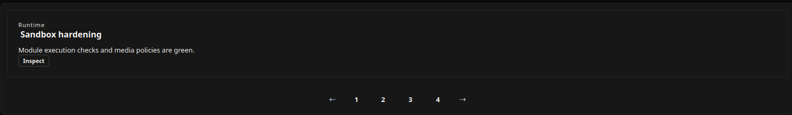

# Carousel

[<- Back to Complex Components](./index.md)

## Purpose

`Carousel` renders a sequence of data items as slides. Each slide is produced from the same `item_template`, with `{{field}}` placeholders resolved against the current item.

Use it when the UI must show a small set of featured records, summaries, cards, or actionable items one at a time while still keeping the data source bindable and replaceable at runtime.

## Constructor

```python
Carousel(
    id: str,
    data_source: dict,
    item_template: Component,
    on_item_click: dict | None = None,
    on_change: dict | None = None,
    active_index: int = 0,
    autoplay: bool = False,
    interval_ms: int = 3000,
    show_dots: bool = True,
    show_arrows: bool = True,
    loop: bool = True,
)
```

## Properties

| Property | Type | Default | Description |
|---|---:|---:|---|
| `dataSource` | `dict` | required | Slide data source. Supports inline data and binding data. |
| `itemTemplate` | `Component` | required | Component tree rendered for each item. `{{field}}` placeholders are resolved from the slide item. |
| `onItemClick` | `dict` | `None` | Action spec emitted when a slide is clicked. |
| `onChange` | `dict` | `None` | Action spec emitted when navigation changes the active slide. |
| `activeIndex` | `int` | `0` | Initially active slide index. Values below zero are normalized to `0`. |
| `autoplay` | `bool` | `false` | Advances slides automatically when more than one slide exists. |
| `intervalMs` | `int` | `3000` | Autoplay interval in milliseconds. Values below `300` are normalized to `300`. |
| `showDots` | `bool` | `true` | Shows numbered dot controls when more than one slide exists. |
| `showArrows` | `bool` | `true` | Shows previous/next arrow controls when more than one slide exists. |
| `loop` | `bool` | `true` | Allows navigation to wrap around at the first and last slide. |

Python constructor arguments use snake_case. YAML component definitions also use constructor keys such as `data_source`, `item_template`, `active_index`, `interval_ms`, `show_dots`, and `show_arrows`. Runtime property updates target the serialized property names such as `dataSource`, `activeIndex`, and `intervalMs`.

## Action Confirmation

`onItemClick` and `onChange` action specs can include `confirm`. If the user cancels the dialog, no backend action is sent.

<div class="docs-code-group" data-code-group>
  <div class="docs-code-group__tabs" role="tablist" aria-label="Carousel confirm example">
    <button class="docs-code-group__tab" type="button" role="tab" data-code-group-tab data-target="carousel-confirm-python" data-active="true" aria-selected="true">Python</button>
    <button class="docs-code-group__tab" type="button" role="tab" data-code-group-tab data-target="carousel-confirm-yaml" aria-selected="false">YAML</button>
  </div>
  <div class="docs-code-group__panel" id="carousel-confirm-python" data-code-group-panel data-active="true">
    <div class="language-python highlight"><pre><code>template = sdk.ui.Card(
    &quot;confirm_carousel_template&quot;,
    [
        sdk.ui.Text(&quot;confirm_carousel_title&quot;, &quot;{{title}}&quot;),
        sdk.ui.Text(&quot;confirm_carousel_body&quot;, &quot;{{body}}&quot;),
    ],
    variant=&quot;outlined&quot;,
)

carousel = sdk.ui.Carousel(
    &quot;confirm_python_carousel&quot;,
    data_source={
        &quot;type&quot;: &quot;inline&quot;,
        &quot;data&quot;: [
            {&quot;id&quot;: &quot;slide_alpha&quot;, &quot;title&quot;: &quot;Alpha slide&quot;, &quot;body&quot;: &quot;First carousel item.&quot;},
            {&quot;id&quot;: &quot;slide_beta&quot;, &quot;title&quot;: &quot;Beta slide&quot;, &quot;body&quot;: &quot;Second carousel item.&quot;},
        ],
    },
    item_template=template,
    on_item_click={
        &quot;name&quot;: &quot;components.carousel_confirm_action&quot;,
        &quot;context&quot;: {&quot;source&quot;: &quot;python_carousel_click&quot;},
        &quot;confirm&quot;: {
            &quot;text&quot;: sdk.i18n.t(&quot;components.carousel.confirm.click_prompt&quot;),
            &quot;confirm_text&quot;: sdk.i18n.t(&quot;components.carousel.confirm.accept&quot;),
            &quot;cancel_text&quot;: sdk.i18n.t(&quot;components.carousel.confirm.cancel&quot;),
        },
    },
    on_change={
        &quot;name&quot;: &quot;components.carousel_confirm_action&quot;,
        &quot;context&quot;: {&quot;source&quot;: &quot;python_carousel_change&quot;},
        &quot;confirm&quot;: {
            &quot;text&quot;: sdk.i18n.t(&quot;components.carousel.confirm.change_prompt&quot;),
            &quot;confirm_text&quot;: sdk.i18n.t(&quot;components.carousel.confirm.accept&quot;),
            &quot;cancel_text&quot;: sdk.i18n.t(&quot;components.carousel.confirm.cancel&quot;),
        },
    },
)</code></pre></div>
  </div>
  <div class="docs-code-group__panel" id="carousel-confirm-yaml" data-code-group-panel hidden>
    <div class="language-yaml highlight"><pre><code>- kind: Carousel
  id: confirm_yaml_carousel
  data_source:
    type: inline
    data:
      - id: slide_alpha
        title: Alpha slide
        body: First carousel item.
      - id: slide_beta
        title: Beta slide
        body: Second carousel item.
  item_template:
    kind: Card
    id: confirm_carousel_template
    variant: outlined
    children:
      - kind: Text
        id: confirm_carousel_title
        text: "{{title}}"
      - kind: Text
        id: confirm_carousel_body
        text: "{{body}}"
  on_item_click:
    name: components.carousel_confirm_action
    context:
      source: yaml_carousel_click
    confirm:
      text: &quot;@t/components.carousel.confirm.click_prompt&quot;
      confirm_text: &quot;@t/components.carousel.confirm.accept&quot;
      cancel_text: &quot;@t/components.carousel.confirm.cancel&quot;
  on_change:
    name: components.carousel_confirm_action
    context:
      source: yaml_carousel_change
    confirm:
      text: &quot;@t/components.carousel.confirm.change_prompt&quot;
      confirm_text: &quot;@t/components.carousel.confirm.accept&quot;
      cancel_text: &quot;@t/components.carousel.confirm.cancel&quot;</code></pre></div>
  </div>
</div>

## Data Source

Inline data passes the slide items directly:

```python
{"type": "inline", "data": [{"id": "slide_runtime", "title": "Runtime"}]}
```

Binding data resolves the `data` field from page/global store or from the surface data model:

```python
{"type": "binding", "data": bound.store("/components_test/carousel/slides", scope="page", default=[])}
{"type": "binding", "data": bound.data("/components_test/carousel_model/slides", default=[])}
```

In YAML, store bindings use the explicit binding object, while data-model bindings can use an `@data/...` path.

## Template and Actions

`item_template` is a normal component tree. Every slide receives a copy of that tree, with item fields available through `{{...}}` placeholders:

<div class="docs-code-group" data-code-group>
  <div class="docs-code-group__tabs" role="tablist" aria-label="Carousel template example">
    <button class="docs-code-group__tab" type="button" role="tab" data-code-group-tab data-target="carousel-template-python" data-active="true" aria-selected="true">Python</button>
    <button class="docs-code-group__tab" type="button" role="tab" data-code-group-tab data-target="carousel-template-yaml" aria-selected="false">YAML</button>
  </div>
  <div class="docs-code-group__panel" id="carousel-template-python" data-code-group-panel data-active="true">
    <div class="language-python highlight"><pre><code>template = sdk.ui.Card("carousel_template_card", [
    sdk.ui.Column("carousel_template_body", [
        sdk.ui.Text("carousel_template_eyebrow", "{{eyebrow}}"),
        sdk.ui.Title("carousel_template_title", "{{title}}", level=3),
        sdk.ui.Text("carousel_template_desc", "{{desc}}"),
        sdk.ui.Button("carousel_template_cta", "{{cta}}", variant="default", btnsize="sm"),
    ])
], variant="outlined")

carousel = sdk.ui.Carousel(
    "carousel_inline",
    data_source={"type": "inline", "data": [
        {"id": "slide_runtime", "eyebrow": "Runtime", "title": "Sandbox hardening", "desc": "Module execution checks are green.", "cta": "Inspect"},
        {"id": "slide_review", "eyebrow": "Review", "title": "Diff workflow", "desc": "CodeDiff previews are available.", "cta": "Open diff"},
    ]},
    item_template=template,
    on_item_click={
        "name": "components.carousel_test_item_click",
        "context": {"source": "carousel_inline", "slide_id": "{{id}}"},
    },
    on_change={
        "name": "components.carousel_test_change",
        "context": {"source": "carousel_inline", "slide_id": "{{id}}"},
    },
    active_index=0,
    autoplay=False,
    interval_ms=3000,
    show_dots=True,
    show_arrows=True,
    loop=True,
)</code></pre></div>
  </div>
  <div class="docs-code-group__panel" id="carousel-template-yaml" data-code-group-panel hidden>
    <div class="language-yaml highlight"><pre><code>- kind: Carousel
  id: carousel_inline
  data_source:
    type: inline
    data:
      - id: slide_runtime
        eyebrow: Runtime
        title: Sandbox hardening
        desc: Module execution checks are green.
        cta: Inspect
      - id: slide_review
        eyebrow: Review
        title: Diff workflow
        desc: CodeDiff previews are available.
        cta: Open diff
  item_template:
    kind: Card
    id: carousel_template_card
    variant: outlined
    children:
      - kind: Column
        id: carousel_template_body
        children:
          - kind: Text
            id: carousel_template_eyebrow
            text: "{{eyebrow}}"
          - kind: Title
            id: carousel_template_title
            text: "{{title}}"
            level: 3
          - kind: Text
            id: carousel_template_desc
            text: "{{desc}}"
          - kind: Button
            id: carousel_template_cta
            label: "{{cta}}"
            variant: default
            btnsize: sm
  on_item_click:
    name: components.carousel_test_item_click
    context: {source: carousel_inline, slide_id: "{{id}}"}
  on_change:
    name: components.carousel_test_change
    context: {source: carousel_inline, slide_id: "{{id}}"}
  active_index: 0
  autoplay: false
  interval_ms: 3000
  show_dots: true
  show_arrows: true
  loop: true</code></pre></div>
  </div>
</div>

## Screenshots

Desktop rendering:



Web rendering:


`onItemClick` receives the item context plus renderer payload fields. The payload includes `item`, `index`, and `itemId` on web, and item-context placeholders are resolved on both clients. `onChange` receives `source: "carousel"`, `index`, and `itemId`.

`onChange` is emitted by user navigation through arrows or dots and by autoplay navigation.

## Mutable Capabilities

`Carousel` enables collection mutations for `dataSource` by default. Add explicit capabilities when actions must update scalar properties or target the nested item list directly.

| Capability | Effect |
|---|---|
| `dataSource.set` | Replaces the complete data source object. |
| `dataSource.append` | Appends to `dataSource` when the renderer can treat the target as a collection. |
| `dataSource.remove` | Removes from `dataSource` when the renderer can treat the target as a collection. |
| `dataSource.replace` | Replaces an item in `dataSource` when the renderer can treat the target as a collection. |
| `dataSource.data.set` | Replaces only the slide item list. |
| `dataSource.data.append` | Appends one slide item to the current item list. |
| `dataSource.data.remove` | Removes one slide item from the current item list. |
| `dataSource.data.replace` | Replaces one slide item in the current item list. |
| `activeIndex.set` | Moves the active slide without emitting `onChange`. |
| `autoplay.set` | Starts or stops autoplay. |
| `intervalMs.set` | Changes the autoplay interval. |
| `showDots.set` | Shows or hides dot controls. |
| `showArrows.set` | Shows or hides arrow controls. |
| `loop.set` | Enables or disables wrapping navigation. |

## Bindings and Updates

`dataSource.data` can come from page store or from the surface data model. Direct updates can replace the data source, move the active slide, toggle autoplay, change the autoplay interval, toggle controls, and change loop behavior when the corresponding capabilities are allowed.

<div class="docs-code-group" data-code-group>
  <div class="docs-code-group__tabs" role="tablist" aria-label="Carousel binding example">
    <button class="docs-code-group__tab" type="button" role="tab" data-code-group-tab data-target="carousel-binding-python" data-active="true" aria-selected="true">Python</button>
    <button class="docs-code-group__tab" type="button" role="tab" data-code-group-tab data-target="carousel-binding-yaml" aria-selected="false">YAML</button>
  </div>
  <div class="docs-code-group__panel" id="carousel-binding-python" data-code-group-panel data-active="true">
    <div class="language-python highlight"><pre><code>store_carousel = sdk.ui.Carousel(
    "carousel_store",
    data_source={
        "type": "binding",
        "data": bound.store("/components_test/carousel/slides", scope="page", default=[]),
    },
    item_template=template,
)

data_carousel = sdk.ui.Carousel(
    "carousel_data",
    data_source={
        "type": "binding",
        "data": bound.data("/components_test/carousel_model/slides", default=[]),
    },
    item_template=template,
)

live_carousel = sdk.ui.Carousel(
    "carousel_live",
    data_source={"type": "inline", "data": []},
    item_template=template,
)
live_carousel.allow(
    "dataSource.set",
    "dataSource.data.append",
    "activeIndex.set",
    "autoplay.set",
    "intervalMs.set",
    "showDots.set",
    "showArrows.set",
    "loop.set",
)</code></pre></div>
  </div>
  <div class="docs-code-group__panel" id="carousel-binding-yaml" data-code-group-panel hidden>
    <div class="language-yaml highlight"><pre><code>- kind: Carousel
  id: carousel_store
  data_source:
    type: binding
    data: {type: store, scope: page, path: /components_test/carousel/slides, default: []}
  item_template: *carousel_template

- kind: Carousel
  id: carousel_data
  data_source:
    type: binding
    data: "@data/components_test/carousel_model/slides"
  item_template: *carousel_template

- kind: Carousel
  id: carousel_live
  data_source: {type: inline, data: []}
  item_template: *carousel_template
  capabilities: [dataSource.set, dataSource.data.append, activeIndex.set, autoplay.set, intervalMs.set, showDots.set, showArrows.set, loop.set]</code></pre></div>
  </div>
</div>

Runtime updates target the current surface:

```python
surface_id = ctx["_surface_id"]

sdk.effects.ui_messages([
    {
        "stateUpdate": {
            "scope": "page",
            "values": {"/components_test/carousel/slides": slides},
        }
    },
    sdk.ui.Builder.build_data_model_update_payload(
        surface_id=surface_id,
        data={"components_test": {"carousel_model": {"slides": slides}}},
    ),
])
sdk.effects.ui_property_update(
    "carousel_live",
    "dataSource",
    {"type": "inline", "data": slides},
    surface_id=surface_id,
)
sdk.effects.ui_property_update("carousel_live", "activeIndex", 1, surface_id=surface_id)
sdk.effects.ui_property_update("carousel_live", "autoplay", True, surface_id=surface_id)
sdk.effects.ui_property_update("carousel_live", "intervalMs", 1200, surface_id=surface_id)
sdk.effects.ui_property_update("carousel_live", "showDots", False, surface_id=surface_id)
sdk.effects.ui_property_update("carousel_live", "showArrows", True, surface_id=surface_id)
sdk.effects.ui_property_update("carousel_live", "loop", False, surface_id=surface_id)
sdk.effects.ui_collection_append("carousel_live", "dataSource.data", extra_slide, surface_id=surface_id)
```

## Visibility and Permissions

`Carousel` supports the common component visibility and permission properties. The examples below use real page-store bindings, so actions can show, hide, or remove the component from the rendered surface.

<div class="docs-code-group" data-code-group>
  <div class="docs-code-group__tabs" role="tablist" aria-label="Carousel visibility example">
    <button class="docs-code-group__tab" type="button" role="tab" data-code-group-tab data-target="carousel-visibility-python" data-active="true" aria-selected="true">Python</button>
    <button class="docs-code-group__tab" type="button" role="tab" data-code-group-tab data-target="carousel-visibility-yaml" aria-selected="false">YAML</button>
  </div>
  <div class="docs-code-group__panel" id="carousel-visibility-python" data-code-group-panel data-active="true">
    <div class="language-python highlight"><pre><code>carousel.set_show_if({
    "conditions": [
        {
            "left": bound.store("/components_test/carousel/show", scope="page", default=True),
            "op": "==",
            "right": True,
        }
    ]
})
carousel.set_hide_if({
    "conditions": [
        {
            "left": bound.store("/components_test/carousel/hide", scope="page", default=False),
            "op": "==",
            "right": True,
        }
    ]
})
carousel.set_required_permissions(["components.data.view"])</code></pre></div>
  </div>
  <div class="docs-code-group__panel" id="carousel-visibility-yaml" data-code-group-panel hidden>
    <div class="language-yaml highlight"><pre><code>- kind: Carousel
  id: carousel_guarded
  data_source: {type: inline, data: []}
  item_template: *carousel_template
  required_permissions: [components.data.view]
  show_if:
    conditions:
      - left: {type: store, scope: page, path: /components_test/carousel/show, default: true}
        op: "=="
        right: true
  hide_if:
    conditions:
      - left: {type: store, scope: page, path: /components_test/carousel/hide, default: false}
        op: "=="
        right: true</code></pre></div>
  </div>
</div>
