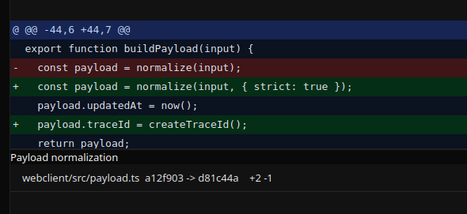
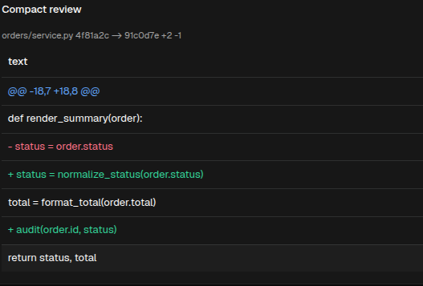

# CodeDiff

[<- Back to Complex Components](./index.md)

## Purpose

`CodeDiff` renders a structured diff as a review table with hunk headers, added lines, removed lines, context lines, optional old/new line numbers, file metadata, and revision labels.

Use it when a module needs to show a prepared diff payload. The component does not compute text diffs from raw files; it renders the hunks supplied by the module.

## Constructor

```python
CodeDiff(
    id: str,
    *,
    file_path: str = "",
    hunks: list[dict] | None = None,
    title: str = "",
    old_revision: str = "",
    new_revision: str = "",
    show_line_numbers: bool = True,
)
```

## Properties

| Python argument | Payload/YAML property | Type | Default | Description |
|---|---|---:|---:|---|
| `title` | `title` | `str` | `""` | Optional title displayed above the diff. |
| `file_path` | `filePath` | `str` | `""` | File label displayed in the diff header. |
| `hunks` | `hunks` | `list[dict]` | `[]` | Diff hunks rendered in order. |
| `old_revision` | `oldRevision` | `str` | `""` | Left revision label. |
| `new_revision` | `newRevision` | `str` | `""` | Right revision label. |
| `show_line_numbers` | `showLineNumbers` | `bool` | `True` | Shows or hides the old/new line-number columns. |

For direct property updates and YAML definitions, use the payload property names.

## Hunk Shape

| Field | Type | Description |
|---|---|---|
| `old_start` / `oldStart` | `int` | Starting line on the old side. |
| `new_start` / `newStart` | `int` | Starting line on the new side. |
| `header` | `str` | Hunk header. When omitted, the renderer derives one from the start lines. |
| `lines` | `list[dict]` | Line entries rendered inside the hunk. |

Line entries use `type`, `text`, and optional explicit line numbers:

| Field | Type | Description |
|---|---|---|
| `type` | `str` | `context`, `add`, or `remove`. Unknown values are rendered as context lines. |
| `text` | `str` | Line content without the diff prefix. |
| `old_no` / `oldNo` | `int` | Explicit old-side line number. |
| `new_no` / `newNo` | `int` | Explicit new-side line number. |

## Examples

<div class="docs-code-group" data-code-group>
  <div class="docs-code-group__tabs" role="tablist" aria-label="CodeDiff example">
    <button class="docs-code-group__tab" type="button" role="tab" data-code-group-tab data-target="codediff-example-python" data-active="true" aria-selected="true">Python</button>
    <button class="docs-code-group__tab" type="button" role="tab" data-code-group-tab data-target="codediff-example-yaml" aria-selected="false">YAML</button>
  </div>
  <div class="docs-code-group__panel" id="codediff-example-python" data-code-group-panel data-active="true">
    <div class="language-python highlight"><pre><code>from democrai.sdk.client import active_sdk as sdk
from democrai.sdk.ui import bound

hunks = [
    {
        "old_start": 18,
        "new_start": 18,
        "header": "@@ -18,7 +18,8 @@",
        "lines": [
            {"type": "context", "text": "def render_summary(order):"},
            {"type": "remove", "old_no": 19, "text": "    status = order.status"},
            {"type": "add", "new_no": 19, "text": "    status = normalize_status(order.status)"},
            {"type": "context", "text": "    total = format_total(order.total)"},
            {"type": "add", "new_no": 21, "text": "    audit(order.id, status)"},
            {"type": "context", "text": "    return status, total"},
        ],
    }
]

diff = sdk.ui.CodeDiff(
    "diff_static",
    title="Checkout validation",
    file_path="orders/service.py",
    old_revision="4f81a2c",
    new_revision="91c0d7e",
    show_line_numbers=True,
    hunks=hunks,
)
diff.set_show_if({
    "conditions": [
        {
            "left": bound.store("/components_test/codediff/show", scope="page", default=True),
            "op": "==",
            "right": True,
        }
    ]
})
diff.set_hide_if({
    "conditions": [
        {
            "left": bound.store("/components_test/codediff/hide", scope="page", default=False),
            "op": "==",
            "right": True,
        }
    ]
})
diff.set_required_permissions(["components.complex.view"])
diff.allow("title.set", "filePath.set", "hunks.set", "oldRevision.set", "newRevision.set", "showLineNumbers.set")</code></pre></div>
  </div>
  <div class="docs-code-group__panel" id="codediff-example-yaml" data-code-group-panel hidden>
    <div class="language-yaml highlight"><pre><code>- kind: CodeDiff
  id: diff_static
  title: Checkout validation
  filePath: orders/service.py
  oldRevision: 4f81a2c
  newRevision: 91c0d7e
  showLineNumbers: true
  hunks:
    - old_start: 18
      new_start: 18
      header: "@@ -18,7 +18,8 @@"
      lines:
        - type: context
          text: "def render_summary(order):"
        - type: remove
          old_no: 19
          text: "    status = order.status"
        - type: add
          new_no: 19
          text: "    status = normalize_status(order.status)"
        - type: context
          text: "    total = format_total(order.total)"
        - type: add
          new_no: 21
          text: "    audit(order.id, status)"
        - type: context
          text: "    return status, total"
  required_permissions: [components.complex.view]
  show_if:
    conditions:
      - left: {type: store, scope: page, path: /components_test/codediff/show, default: true}
        op: "=="
        right: true
  hide_if:
    conditions:
      - left: {type: store, scope: page, path: /components_test/codediff/hide, default: false}
        op: "=="
        right: true
  capabilities: [title.set, filePath.set, hunks.set, oldRevision.set, newRevision.set, showLineNumbers.set]</code></pre></div>
  </div>
</div>

## Binding and Updates

For direct property updates and YAML definitions, use the payload property names. Python can also assign bound values with `set_property` when the payload name differs from the constructor argument.

<div class="docs-code-group" data-code-group>
  <div class="docs-code-group__tabs" role="tablist" aria-label="CodeDiff binding example">
    <button class="docs-code-group__tab" type="button" role="tab" data-code-group-tab data-target="codediff-binding-python" data-active="true" aria-selected="true">Python</button>
    <button class="docs-code-group__tab" type="button" role="tab" data-code-group-tab data-target="codediff-binding-yaml" aria-selected="false">YAML</button>
  </div>
  <div class="docs-code-group__panel" id="codediff-binding-python" data-code-group-panel data-active="true">
    <div class="language-python highlight"><pre><code>store_diff = sdk.ui.CodeDiff("diff_store")
store_diff.set_property("title", bound.store("/components_test/codediff/title", scope="page", default="Checkout validation"))
store_diff.set_property("filePath", bound.store("/components_test/codediff/filePath", scope="page", default="orders/service.py"))
store_diff.set_property("hunks", bound.store("/components_test/codediff/hunks", scope="page", default=hunks))
store_diff.set_property("oldRevision", bound.store("/components_test/codediff/oldRevision", scope="page", default="4f81a2c"))
store_diff.set_property("newRevision", bound.store("/components_test/codediff/newRevision", scope="page", default="91c0d7e"))
store_diff.set_property("showLineNumbers", bound.store("/components_test/codediff/showLineNumbers", scope="page", default=True))

data_diff = sdk.ui.CodeDiff("diff_data")
data_diff.set_property("title", bound.data("/components_test/codediff_model/title", default="Checkout validation"))
data_diff.set_property("filePath", bound.data("/components_test/codediff_model/filePath", default="orders/service.py"))
data_diff.set_property("hunks", bound.data("/components_test/codediff_model/hunks", default=hunks))
data_diff.set_property("oldRevision", bound.data("/components_test/codediff_model/oldRevision", default="4f81a2c"))
data_diff.set_property("newRevision", bound.data("/components_test/codediff_model/newRevision", default="91c0d7e"))
data_diff.set_property("showLineNumbers", bound.data("/components_test/codediff_model/showLineNumbers", default=True))

live_diff = sdk.ui.CodeDiff("diff_live", title="Checkout validation", file_path="orders/service.py", hunks=hunks)</code></pre></div>
  </div>
  <div class="docs-code-group__panel" id="codediff-binding-yaml" data-code-group-panel hidden>
    <div class="language-yaml highlight"><pre><code>- kind: CodeDiff
  id: diff_store
  title: {type: store, scope: page, path: /components_test/codediff/title, default: Checkout validation}
  filePath: {type: store, scope: page, path: /components_test/codediff/filePath, default: orders/service.py}
  oldRevision: {type: store, scope: page, path: /components_test/codediff/oldRevision, default: 4f81a2c}
  newRevision: {type: store, scope: page, path: /components_test/codediff/newRevision, default: 91c0d7e}
  showLineNumbers: {type: store, scope: page, path: /components_test/codediff/showLineNumbers, default: true}
  hunks: {type: store, scope: page, path: /components_test/codediff/hunks, default: []}

- kind: CodeDiff
  id: diff_data
  title: "@data/components_test/codediff_model/title"
  filePath: "@data/components_test/codediff_model/filePath"
  oldRevision: "@data/components_test/codediff_model/oldRevision"
  newRevision: "@data/components_test/codediff_model/newRevision"
  showLineNumbers: "@data/components_test/codediff_model/showLineNumbers"
  hunks: "@data/components_test/codediff_model/hunks"

- kind: CodeDiff
  id: diff_live
  title: Checkout validation
  filePath: orders/service.py
  hunks: []
  capabilities: [title.set, filePath.set, hunks.set, oldRevision.set, newRevision.set, showLineNumbers.set]</code></pre></div>
  </div>
</div>

Runtime updates must target the current surface:

```python
surface_id = ctx["_surface_id"]

return sdk.effects.respond(
    sdk.effects.ui_messages([
        {
            "stateUpdate": {
                "scope": "page",
                "values": {
                    "/components_test/codediff/title": next_title,
                    "/components_test/codediff/filePath": next_file_path,
                    "/components_test/codediff/hunks": next_hunks,
                    "/components_test/codediff/oldRevision": next_old_revision,
                    "/components_test/codediff/newRevision": next_new_revision,
                    "/components_test/codediff/showLineNumbers": next_show_line_numbers,
                },
            }
        },
        sdk.ui.Builder.build_data_model_update_payload(
            surface_id=surface_id,
            data={
                "components_test": {
                    "codediff_model": {
                        "title": next_title,
                        "filePath": next_file_path,
                        "hunks": next_hunks,
                        "oldRevision": next_old_revision,
                        "newRevision": next_new_revision,
                        "showLineNumbers": next_show_line_numbers,
                    }
                }
            },
        ),
    ]),
    sdk.effects.ui_property_update("diff_live", "title", next_title, surface_id=surface_id),
    sdk.effects.ui_property_update("diff_live", "filePath", next_file_path, surface_id=surface_id),
    sdk.effects.ui_property_update("diff_live", "hunks", next_hunks, surface_id=surface_id),
    sdk.effects.ui_property_update("diff_live", "oldRevision", next_old_revision, surface_id=surface_id),
    sdk.effects.ui_property_update("diff_live", "newRevision", next_new_revision, surface_id=surface_id),
    sdk.effects.ui_property_update("diff_live", "showLineNumbers", next_show_line_numbers, surface_id=surface_id),
)
```

## Screenshots

Desktop:



Web:


