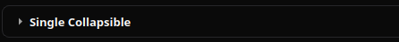
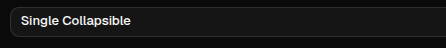

# Collapsible

[<- Back to Complex Components](./index.md)

## Purpose

`Collapsible` renders a single expandable block with a trigger title and body content. It uses the same open/closed interaction model as a one-item accordion.

Clicking the trigger toggles the block. Runtime updates can replace the trigger title, body content, or open state.

## Constructor

```python
Collapsible(
    id: str,
    title: str,
    content: str = "",
    open: bool = False,
)
```

## Properties

| Property | Type | Default | Description |
|---|---|---:|---|
| `title` | `str` | required | Trigger label. Python wraps constructor values as `literalString`. |
| `content` | `str` | `""` | Text body shown inside the expanded panel. Python wraps constructor values as `literalString`. |
| `open` | `bool` | `False` | Initial and externally updated open state. |
| `children` | inherited list | `[]` | Optional child content rendered before the text body. |

## Examples

<div class="docs-code-group" data-code-group>
  <div class="docs-code-group__tabs" role="tablist" aria-label="collapsible example 1">
    <button class="docs-code-group__tab" type="button" role="tab" data-code-group-tab data-target="collapsible-1-python" data-active="true" aria-selected="true">Python</button>
    <button class="docs-code-group__tab" type="button" role="tab" data-code-group-tab data-target="collapsible-1-yaml" aria-selected="false">YAML</button>
  </div>
  <div class="docs-code-group__panel" id="collapsible-1-python" data-code-group-panel data-active="true">
    <div class="language-python highlight"><pre><code>from democrai.sdk.client import active_sdk as sdk
from democrai.sdk.ui import bound

builder.add(sdk.ui.Text(&quot;collapsible_child&quot;, &quot;Rendered child content&quot;))
collapsible = sdk.ui.Collapsible(
    &quot;collapsible_static&quot;,
    &quot;Advanced details&quot;,
    &quot;Keep secondary content outside the default reading path.&quot;,
    open=False,
)
collapsible.set_required_permissions([&quot;components.complex.view&quot;])
collapsible.set_show_if({
    &quot;conditions&quot;: [
        {
            &quot;left&quot;: bound.store(&quot;/components_test/accordion/show&quot;, scope=&quot;page&quot;, default=True),
            &quot;op&quot;: &quot;==&quot;,
            &quot;right&quot;: True,
        }
    ]
})
collapsible.set_hide_if({
    &quot;conditions&quot;: [
        {
            &quot;left&quot;: bound.store(&quot;/components_test/accordion/hide&quot;, scope=&quot;page&quot;, default=False),
            &quot;op&quot;: &quot;==&quot;,
            &quot;right&quot;: True,
        }
    ]
})
collapsible.children.append(&quot;collapsible_child&quot;)
collapsible.allow(&quot;title.set&quot;, &quot;content.set&quot;, &quot;open.set&quot;)</code></pre></div>
  </div>
  <div class="docs-code-group__panel" id="collapsible-1-yaml" data-code-group-panel hidden>
    <div class="language-yaml highlight"><pre><code>- kind: Text
  id: collapsible_child
  text: &quot;Rendered child content&quot;

- kind: Collapsible
  id: collapsible_static
  title: &quot;Advanced details&quot;
  content: &quot;Keep secondary content outside the default reading path.&quot;
  open: false
  required_permissions: [components.complex.view]
  show_if:
    conditions:
      - left: {type: store, scope: page, path: /components_test/accordion/show, default: true}
        op: &quot;==&quot;
        right: true
  hide_if:
    conditions:
      - left: {type: store, scope: page, path: /components_test/accordion/hide, default: false}
        op: &quot;==&quot;
        right: true
  capabilities: [title.set, content.set, open.set]
  children:
    - collapsible_child</code></pre></div>
  </div>
</div>

## Binding and Updates

`title`, `content`, and `open` support store binding, data-model binding, and direct property updates in the component demo.

<div class="docs-code-group" data-code-group>
  <div class="docs-code-group__tabs" role="tablist" aria-label="collapsible example 2">
    <button class="docs-code-group__tab" type="button" role="tab" data-code-group-tab data-target="collapsible-2-python" data-active="true" aria-selected="true">Python</button>
    <button class="docs-code-group__tab" type="button" role="tab" data-code-group-tab data-target="collapsible-2-yaml" aria-selected="false">YAML</button>
  </div>
  <div class="docs-code-group__panel" id="collapsible-2-python" data-code-group-panel data-active="true">
    <div class="language-python highlight"><pre><code>store_bound = sdk.ui.Collapsible(
    &quot;collapsible_store&quot;,
    &quot;Store title&quot;,
    &quot;Store content&quot;,
    open=bound.store(&quot;/components_test/collapsible/open&quot;, scope=&quot;page&quot;, default=False),
)
store_bound.set_prop(
    &quot;title&quot;,
    bound.store(&quot;/components_test/collapsible/title&quot;, scope=&quot;page&quot;, default=&quot;Store title&quot;),
)
store_bound.set_prop(
    &quot;content&quot;,
    bound.store(&quot;/components_test/collapsible/content&quot;, scope=&quot;page&quot;, default=&quot;Store content&quot;),
)

data_bound = sdk.ui.Collapsible(
    &quot;collapsible_data&quot;,
    &quot;Data title&quot;,
    &quot;Data content&quot;,
    open=bound.data(&quot;/components_test/collapsible_model/open&quot;, default=False),
)
data_bound.set_prop(
    &quot;title&quot;,
    bound.data(&quot;/components_test/collapsible_model/title&quot;, default=&quot;Data title&quot;),
)
data_bound.set_prop(
    &quot;content&quot;,
    bound.data(&quot;/components_test/collapsible_model/content&quot;, default=&quot;Data content&quot;),
)

live = sdk.ui.Collapsible(&quot;collapsible_live&quot;, &quot;Live title&quot;, &quot;Live content&quot;, open=False)
live.allow(&quot;title.set&quot;, &quot;content.set&quot;, &quot;open.set&quot;)</code></pre></div>
  </div>
  <div class="docs-code-group__panel" id="collapsible-2-yaml" data-code-group-panel hidden>
    <div class="language-yaml highlight"><pre><code>- kind: Collapsible
  id: collapsible_store
  title: {type: store, scope: page, path: /components_test/collapsible/title, default: &quot;Store title&quot;}
  content: {type: store, scope: page, path: /components_test/collapsible/content, default: &quot;Store content&quot;}
  open: {type: store, scope: page, path: /components_test/collapsible/open, default: false}

- kind: Collapsible
  id: collapsible_data
  title: &quot;@data/components_test/collapsible_model/title&quot;
  content: &quot;@data/components_test/collapsible_model/content&quot;
  open: &quot;@data/components_test/collapsible_model/open&quot;

- kind: Collapsible
  id: collapsible_live
  title: &quot;Live title&quot;
  content: &quot;Live content&quot;
  open: false
  capabilities: [title.set, content.set, open.set]</code></pre></div>
  </div>
</div>

Runtime updates must target the current surface:

```python
surface_id = ctx["_surface_id"]

return sdk.effects.respond(
    sdk.effects.ui_messages([
        {
            "stateUpdate": {
                "scope": "page",
                "values": {
                    "/components_test/collapsible/title": next_title,
                    "/components_test/collapsible/content": next_content,
                    "/components_test/collapsible/open": True,
                },
            }
        },
        sdk.ui.Builder.build_data_model_update_payload(
            surface_id=surface_id,
            data={
                "components_test": {
                    "collapsible_model": {
                        "title": next_title,
                        "content": next_content,
                        "open": True,
                    }
                }
            },
        ),
    ]),
    sdk.effects.ui_property_update("collapsible_live", "title", next_title, surface_id=surface_id),
    sdk.effects.ui_property_update("collapsible_live", "content", next_content, surface_id=surface_id),
    sdk.effects.ui_property_update("collapsible_live", "open", True, surface_id=surface_id),
)
```

## Renderer Notes

Desktop renders `Collapsible` with a dedicated compact disclosure block. Binding strategies are declared for `title`, `content`, `open`, and `children`.

Web renders a shadcn collapsible primitive. Child content is rendered before the `content` text.

## Screenshots

Desktop:



Web:


