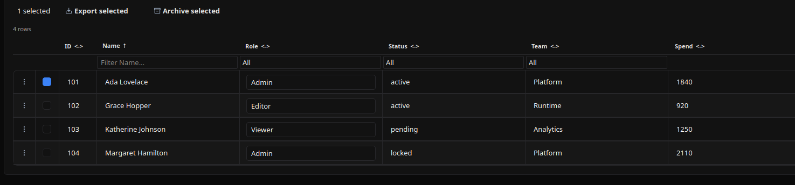
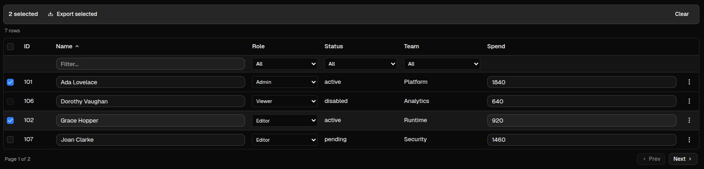

# DataTable

[<- Back to Complex Components](./index.md)

## Purpose

`DataTable` renders model-driven tabular data with pagination, filters, sorting, inline edits, row actions, selection actions, and remote loading.

Use it for data that has a stable column schema and may grow beyond a small inline list. For non-trivial datasets, prefer `remote_service` so the table can request only the current page and keep filter/sort state in the client.

## Constructor

```python
DataTable(
    id: str,
    model: list[dict] | None = None,
    rows: list[dict] | None = None,
    page: int = 0,
    page_size: int = 25,
    total_rows: int = 0,
    remote_service: str | dict | None = None,
    pagination: bool | None = None,
    on_page_change: str | None = None,
    on_cell_edit: str | None = None,
    on_row_add: str | None = None,
    on_row_delete: str | None = None,
    on_filter_change: str | None = None,
    show_row_numbers: bool = False,
    selectable: bool = False,
    row_actions: list[dict] | None = None,
    selection_actions: list[dict] | None = None,
    paginated: bool = True,
    virtual: bool = False,
    auto_refresh: int | None = None,
    sort_field: str | None = None,
    sort_direction: str = "asc",
)
```

## Properties

| Property | Type | Default | Description |
|---|---:|---:|---|
| `model` | `list[ColumnDef]` | `[]` | Column contract. Each column reads a field from each row. |
| `rows` | `list[dict]` | `[]` | Current rows rendered by the table. |
| `page` | `int` | `0` | Zero-based current page. |
| `page_size` | `int` | `25` | Rows requested or displayed per page. |
| `total_rows` | `int` | `0` | Total result count across all pages. |
| `remote_service` | `str | dict` | none | Action spec used for initial load, remote pagination, remote filters, remote sorting, and auto-refresh. |
| `paginated` / `pagination` | `bool` | `true` | Shows pagination controls. `pagination` is accepted as an alias. |
| `show_row_numbers` | `bool` | `false` | Adds a row-number column. |
| `selectable` | `bool` | `false` | Adds row checkboxes and enables `selection_actions`. |
| `row_actions` | `list[ActionDef]` | `[]` | Per-row menu actions. |
| `selection_actions` | `list[ActionDef]` | `[]` | Bulk action buttons shown when at least one row is selected. |
| `on_cell_edit` | `str | dict` | none | Action called after an editable cell changes. |
| `on_row_add` | `str | dict` | none | Action called by the built-in Add row button. |
| `on_row_delete` | `str | dict` | none | Legacy per-row delete action. Prefer `row_actions` for new tables. |
| `on_page_change` | `str | dict` | none | Action called by pagination when `remote_service` is not used. |
| `on_filter_change` | `str | dict` | none | Action called by filters when `remote_service` is not used. |
| `sort` | `dict` | none | Serialized sort state, for example `{"field": "name", "direction": "asc"}`. |
| `auto_refresh` | `int` | none | Seconds between remote reloads. |
| `virtual` | `bool` | `false` | Renderer hint for large tables. |

Python uses `sort_field` and `sort_direction` in the constructor; the serialized property is `sort`. YAML should use `sort`.

## Action Confirmation

Use `confirm` inside the `ActionSpec` for user-triggered table actions such as `on_row_add`, `row_actions`, `selection_actions`, and the legacy `on_row_delete`. Confirmation text should use translation keys.

`remote_service`, pagination, filter, sort, auto-refresh, and `on_cell_edit` dispatch without confirmation because they are data loading or cell-edit synchronization flows.

<div class="docs-code-group" data-code-group>
  <div class="docs-code-group__tabs" role="tablist" aria-label="DataTable confirm example">
    <button class="docs-code-group__tab" type="button" role="tab" data-code-group-tab data-target="datatable-confirm-python" data-active="true" aria-selected="true">Python</button>
    <button class="docs-code-group__tab" type="button" role="tab" data-code-group-tab data-target="datatable-confirm-yaml" aria-selected="false">YAML</button>
  </div>
  <div class="docs-code-group__panel" id="datatable-confirm-python" data-code-group-panel data-active="true">
    <div class="language-python highlight"><pre><code>table = sdk.ui.DataTable(
    "datatable_confirm",
    model=model,
    rows=rows,
    paginated=False,
    selectable=True,
    on_row_add={
        "name": "components.datatable_confirm_action",
        "context": {"source": "python_datatable_add", "operation": "add"},
        "confirm": {
            "text": sdk.i18n.t("components.datatable.confirm.add_prompt"),
            "confirm_text": sdk.i18n.t("components.datatable.confirm.accept"),
            "cancel_text": sdk.i18n.t("components.datatable.confirm.cancel"),
        },
    },
    row_actions=[
        {
            "label": sdk.i18n.t("components.datatable.confirm.row_action"),
            "action": {
                "name": "components.datatable_confirm_action",
                "context": {"source": "python_datatable_row", "operation": "inspect"},
                "confirm": {
                    "text": sdk.i18n.t("components.datatable.confirm.row_prompt"),
                    "confirm_text": sdk.i18n.t("components.datatable.confirm.accept"),
                    "cancel_text": sdk.i18n.t("components.datatable.confirm.cancel"),
                },
            },
        }
    ],
    selection_actions=[
        {
            "label": sdk.i18n.t("components.datatable.confirm.selection_action"),
            "variant": "danger",
            "action": {
                "name": "components.datatable_confirm_action",
                "context": {"source": "python_datatable_selection", "operation": "archive"},
                "confirm": {
                    "text": sdk.i18n.t("components.datatable.confirm.selection_prompt"),
                    "confirm_text": sdk.i18n.t("components.datatable.confirm.accept"),
                    "cancel_text": sdk.i18n.t("components.datatable.confirm.cancel"),
                },
            },
        }
    ],
)</code></pre></div>
  </div>
  <div class="docs-code-group__panel" id="datatable-confirm-yaml" data-code-group-panel hidden>
    <div class="language-yaml highlight"><pre><code>- kind: DataTable
  id: datatable_confirm
  paginated: false
  selectable: true
  on_row_add:
    name: components.datatable_confirm_action
    context:
      source: yaml_datatable_add
      operation: add
    confirm:
      text: "@t/components.datatable.confirm.add_prompt"
      confirm_text: "@t/components.datatable.confirm.accept"
      cancel_text: "@t/components.datatable.confirm.cancel"
  row_actions:
    - label: "@t/components.datatable.confirm.row_action"
      action:
        name: components.datatable_confirm_action
        context:
          source: yaml_datatable_row
          operation: inspect
        confirm:
          text: "@t/components.datatable.confirm.row_prompt"
          confirm_text: "@t/components.datatable.confirm.accept"
          cancel_text: "@t/components.datatable.confirm.cancel"
  selection_actions:
    - label: "@t/components.datatable.confirm.selection_action"
      variant: danger
      action:
        name: components.datatable_confirm_action
        context:
          source: yaml_datatable_selection
          operation: archive
        confirm:
          text: "@t/components.datatable.confirm.selection_prompt"
          confirm_text: "@t/components.datatable.confirm.accept"
          cancel_text: "@t/components.datatable.confirm.cancel"
  model:
    - {field: id, header: ID, type: int, width: 70, editable: false}
    - {field: name, header: Name, type: str, editable: false}
    - {field: status, header: Status, type: str, editable: false}
  rows:
    - {id: 101, name: Ada Lovelace, status: active}
    - {id: 102, name: Grace Hopper, status: pending}</code></pre></div>
  </div>
</div>

## Column Model

Each column maps one row field to one rendered cell. `field` is also the key used in filter, sort, edit, row-action, and remote-service payloads, so keep field names stable.

```python
model = [
    {"field": "id", "header": "ID", "type": "int", "width": 70, "editable": False, "sortable": True},
    {"field": "name", "header": "Name", "type": "str", "editable": True, "filterable": True, "filter_type": "text"},
    {"field": "role", "header": "Role", "type": "enum", "editable": True, "filterable": True, "filter_type": "select", "options": ["Admin", "Editor", "Viewer"]},
    {"field": "active", "header": "Active", "type": "bool", "editable": True, "filterable": True, "filter_type": "boolean"},
    {"field": "joined", "header": "Joined", "type": "str", "transform": "date|%Y-%m-%d"},
    {"field": "tags", "header": "Tags", "type": "str", "transform": "join_list|, |upper"},
]
```

ColumnDef schema:

| Key | Type | Required | Meaning |
|---|---:|---:|---|
| `field` | `str` | yes | Row key read by the cell. Every rendered row should contain this key. |
| `header` | `str` | yes | Column label shown in the table header. |
| `type` | `str` | no | Cell type. Supported values are `str`, `int`, `float`, `bool`, and `enum`. Omitted values behave like `str`. |
| `editable` | `bool | rule` | no | Enables inline editing. It can be a boolean or a visibility/condition rule evaluated against the current row as `$item`. |
| `filterable` | `bool` | no | Shows a filter control for the column. |
| `filter_type` | `str` | no | Filter control type. Supported values are `text`, `select`, `boolean`, `date`, and `number`. |
| `options` | `list[str]` | no | Values for `enum` editors and `select` filters. |
| `sortable` | `bool` | no | Marks the column as sortable for remote sort interactions. |
| `width` | `int` | no | Initial column width hint in pixels. |
| `transform` | `str` | no | Display formatter applied to read-only display text. |

### Field Types

| `type` | Display | Editable control | Edit payload |
|---|---|---|---|
| `str` | Text, optionally passed through `transform`. | Text input. | String from the input. |
| `int` | Text, optionally passed through `transform`. | Text input. | String from the input; validate/cast in the action if needed. |
| `float` | Text, optionally passed through `transform`. | Text input. | String from the input; validate/cast in the action if needed. |
| `bool` | Disabled checkbox. | Checkbox. | Boolean. |
| `enum` | Text, optionally passed through `transform`. | Select using `options`. | Selected option value. |

### Filter Types

| `filter_type` | Control | Filter payload |
|---|---|---|
| `text` | Text input. | String, or absent/null when cleared. |
| `select` | Select with `All` plus `options`. | Selected option value, or absent/null when `All` is selected. |
| `boolean` | Select with `All`, `Yes`, `No`. | Boolean, or absent/null when `All` is selected. |
| `date` | Text input. | String. The renderer does not parse dates before dispatch. |
| `number` | Text input. | String. The renderer does not parse numbers before dispatch. |

For client-side filtering, non-boolean filters compare by case-insensitive substring. For remote tables, filter values are sent to `remote_service` and the backend action owns parsing and matching.

### Formatters

`transform` supports the pipe syntax:

```text
formatter|arg1|arg2|...
```

The old colon syntax is still accepted for `date`, `truncate`, and `get_stub` for compatibility.

| Formatter | Syntax | Input | Output |
|---|---|---|---|
| `upper` | `upper` | Any value | Uppercase string. |
| `lower` | `lower` | Any value | Lowercase string. |
| `title` | `title` | Any value | Title-cased string. |
| `truncate` | `truncate|N` | Any value | String shortened to `N` characters with ellipsis. Default `N` is `50`. Legacy: `truncate:N`. |
| `date` | `date|FORMAT` | ISO-like date/datetime string | Formatted date string. Default format is `%Y-%m-%d`. Legacy: `date:FORMAT`. |
| `join_list` | `join_list|SEP|INNER` | List of primitive values | Values joined with `SEP`. Optional `INNER` applies another formatter to each value. |
| `join_objects` | `join_objects|KEY|SEP|INNER` | List of objects | Extracts `KEY` from each object, optionally applies `INNER`, and joins with `SEP`. |
| `get_stub` | `get_stub|STUB|FIELD` | Lookup key | Reads `/stubs/{STUB}` from client state, finds a row whose `key` matches the cell value, and returns `FIELD` or `value`. Legacy: `get_stub:STUB:FIELD`. |

Examples:

```yaml
model:
  - {field: name, header: Name, type: str, transform: title}
  - {field: description, header: Description, type: str, transform: "truncate|80"}
  - {field: joined, header: Joined, type: str, transform: "date|%Y-%m-%d"}
  - {field: tags, header: Tags, type: str, transform: "join_list|, |upper"}
  - {field: groups, header: Groups, type: str, transform: "join_objects|name|, |title"}
  - {field: owner_id, header: Owner, type: str, transform: "get_stub|users|label"}
```

## Row Data Format

`rows` is always a list of dictionaries. Each row should have a stable `id`, one key for each visible column `field`, and optional metadata such as `selectable`.

```python
rows = [
    {
        "id": 101,
        "name": "Ada Lovelace",
        "role": "Admin",
        "status": "active",
        "team": "Platform",
        "spend": 1840,
        "selectable": True,
    },
    {
        "id": 104,
        "name": "Margaret Hamilton",
        "role": "Admin",
        "status": "locked",
        "team": "Platform",
        "spend": 2110,
        "selectable": False,
    },
]
```

The renderer reads `row[column["field"]]` for each visible cell. Extra row keys are not displayed unless the model declares a matching column, but they are still available to row actions and row visibility rules through `$item`.

For inline tables, `total_rows` normally equals `len(rows)`. For remote paginated tables, `rows` is only the current page and `total_rows` is the total number of matching records.

## Row And Selection Actions

`row_actions` render a per-row menu. The current row is resolved as the standard action item, so explicit `action.context` can bind row fields with `$item.*`.

```python
{"item": row, "item_index": row_index, "tableId": table_id}
```

`selection_actions` render in a bulk action bar after the user selects at least one row. Each action receives:

```python
{"selected_ids": [...], "selected_rows": [...], "tableId": table_id}
```

Rows should have a stable `id`. A row can disable selection with `selectable: false` or with a rule object.

Action visibility uses the same nested-action contract as other components: `show_if`, `hide_if`, and `required_permissions`. Row actions can inspect the current row through `$item.<field>`. Selection actions do not have a single row item, so use store/data bindings or permissions for their visibility.

Use non-mutating row actions on inline, store-bound, data-model-bound, and direct-update tables unless the action also updates that specific table source. Use mutating row actions such as promote/delete on the remote table that owns the backing data.

Action specs in row, selection, pagination, filter, edit, and remote loading flows must use fully qualified module action names, for example `components.test_datatable_remote`. See [Action Dispatch](../action-dispatch.md).

<div class="docs-code-group" data-code-group>
  <div class="docs-code-group__tabs" role="tablist" aria-label="DataTable actions">
    <button class="docs-code-group__tab" type="button" role="tab" data-code-group-tab data-target="datatable-actions-python" data-active="true" aria-selected="true">Python</button>
    <button class="docs-code-group__tab" type="button" role="tab" data-code-group-tab data-target="datatable-actions-yaml" aria-selected="false">YAML</button>
  </div>
  <div class="docs-code-group__panel" id="datatable-actions-python" data-code-group-panel data-active="true">
    <div class="language-python highlight"><pre><code>row_actions = [
    {
        "label": "Inspect",
        "icon": "ric.search-eye-line",
        "action": {
            "name": "components.test_datatable_action_event",
            "context": {"op": "inspect", "source": "users_table"},
        },
    },
    {
        "label": "Pending only",
        "icon": "ric.time-line",
        "action": {
            "name": "components.test_datatable_action_event",
            "context": {"op": "pending_only", "source": "users_table"},
        },
        "show_if": {"conditions": [{"left": "$item.status", "op": "==", "right": "pending"}]},
    },
]

selection_actions = [
    {
        "label": "Export selected",
        "icon": "ric.download-2-line",
        "action": {
            "name": "components.test_datatable_action_event",
            "context": {"op": "export_selected", "source": "users_table"},
        },
    },
    {
        "label": "Archive selected",
        "icon": "ric.archive-line",
        "variant": "danger",
        "action": {
            "name": "components.test_datatable_remote_archive_selected",
            "context": {"op": "archive_selected", "source": "users_table"},
        },
        "show_if": {
            "conditions": [
                {
                    "left": bound.store("/components_test/datatable/show_bulk_archive", scope="page", default=True),
                    "op": "==",
                    "right": True,
                }
            ]
        },
        "required_permissions": ["components.datatable.bulk_archive"],
    },
]

table = sdk.ui.DataTable(
    "users_table",
    model=model,
    rows=rows,
    paginated=False,
    show_row_numbers=True,
    selectable=True,
    row_actions=row_actions,
    selection_actions=selection_actions,
    on_cell_edit="components.test_datatable_action_event",
)</code></pre></div>
  </div>
  <div class="docs-code-group__panel" id="datatable-actions-yaml" data-code-group-panel hidden>
    <div class="language-yaml highlight"><pre><code>- kind: DataTable
  id: users_table
  show_row_numbers: true
  selectable: true
  paginated: false
  on_cell_edit: components.test_datatable_action_event
  row_actions:
    - label: Inspect
      icon: ric.search-eye-line
      action:
        name: components.test_datatable_action_event
        context: {op: inspect, source: users_table}
    - label: Pending only
      icon: ric.time-line
      action:
        name: components.test_datatable_action_event
        context: {op: pending_only, source: users_table}
      show_if:
        conditions:
          - left: "$item.status"
            op: "=="
            right: pending
  selection_actions:
    - label: Export selected
      icon: ric.download-2-line
      action:
        name: components.test_datatable_action_event
        context: {op: export_selected, source: users_table}
    - label: Archive selected
      icon: ric.archive-line
      variant: danger
      action:
        name: components.test_datatable_remote_archive_selected
        context: {op: archive_selected, source: users_table}
      show_if:
        conditions:
          - left: {type: store, scope: page, path: /components_test/datatable/show_bulk_archive, default: true}
            op: "=="
            right: true
      required_permissions: [components.datatable.bulk_archive]
  model:
    - {field: id, header: ID, type: int, width: 70, editable: false}
    - {field: name, header: Name, type: str, editable: true, filterable: true, filter_type: text}
    - {field: role, header: Role, type: enum, editable: true, options: [Admin, Editor, Viewer]}
    - {field: status, header: Status, type: str, editable: false}
  rows:
    - {id: 101, name: Ada Lovelace, role: Admin, status: active, selectable: true}
    - {id: 103, name: Katherine Johnson, role: Viewer, status: pending, selectable: true}</code></pre></div>
  </div>
</div>

Remote tables can add mutating row actions. These actions should update the backing data and then reload the same table using the `tableId` received in the payload.

```yaml
row_actions:
  - label: Promote
    icon: ric.arrow-up-circle-line
    action:
      name: components.test_datatable_remote_promote
      context: {op: promote, source: users_remote}
    show_if:
      conditions:
        - left: "$item.status"
          op: "!="
          right: locked
  - label: Delete
    icon: ric.delete-bin-2-line
    variant: danger
    action:
      name: components.test_datatable_remote_delete
      context: {op: delete, source: users_remote}
    hide_if:
      conditions:
        - left: "$item.status"
          op: "=="
          right: locked
    required_permissions: [components.datatable.delete]
```

Action payload rules:

| Trigger | Payload added by the table |
|---|---|
| `row_actions` | `item`, `item_index`, `tableId` |
| `selection_actions` | `selected_ids`, `selected_rows`, `tableId` |
| `on_cell_edit` | `rowId`, `rowIndex`, `field`, `value`, `row`, `tableId` |
| `remote_service` | `page`, `pageSize`, `filters`, `sort`, `sortField`, `sortDirection`, `tableId`, and optionally `autoRefresh` |

The action's explicit `context` is merged before the table payload. Use `context` for command metadata such as `op` and `source`; use `$item.*` in row action context when a route or command needs values from the current row.

## Bindings And Direct Updates

`rows`, `page`, `page_size`, `total_rows`, `sort`, and `filters` are mutable table state. `rows` also supports collection patches.

<div class="docs-code-group" data-code-group>
  <div class="docs-code-group__tabs" role="tablist" aria-label="DataTable bindings">
    <button class="docs-code-group__tab" type="button" role="tab" data-code-group-tab data-target="datatable-bind-python" data-active="true" aria-selected="true">Python</button>
    <button class="docs-code-group__tab" type="button" role="tab" data-code-group-tab data-target="datatable-bind-yaml" aria-selected="false">YAML</button>
  </div>
  <div class="docs-code-group__panel" id="datatable-bind-python" data-code-group-panel data-active="true">
    <div class="language-python highlight"><pre><code>store_table = sdk.ui.DataTable(
    "store_table",
    model=model,
    rows=bound.store("/components_test/datatable/store_rows", scope="page", default=rows),
    total_rows=bound.store("/components_test/datatable/store_total", scope="page", default=len(rows)),
    paginated=False,
)

data_table = sdk.ui.DataTable(
    "data_table",
    model=model,
    rows=bound.data("/components_test/datatable_model/rows", default=[]),
    total_rows=bound.data("/components_test/datatable_model/total", default=0),
    paginated=False,
)

live_table = sdk.ui.DataTable("live_table", model=model, rows=rows, total_rows=len(rows), paginated=False)
live_table.allow("rows.set", "rows.append", "rows.remove", "rows.replace", "page.set", "page_size.set", "total_rows.set", "sort.set", "filters.set")

surface_id = ctx["_surface_id"]
sdk.effects.ui_property_update("live_table", "rows", new_rows, action="set", surface_id=surface_id)
sdk.effects.ui_collection_append("live_table", "rows", new_row, surface_id=surface_id)
sdk.effects.ui_collection_replace("live_table", "rows", {"id": row_id, "item": updated_row}, surface_id=surface_id)
sdk.effects.ui_collection_remove("live_table", "rows", {"id": row_id}, surface_id=surface_id)</code></pre></div>
  </div>
  <div class="docs-code-group__panel" id="datatable-bind-yaml" data-code-group-panel hidden>
    <div class="language-yaml highlight"><pre><code>- kind: DataTable
  id: store_table
  capabilities: [rows.set, rows.append, rows.remove, rows.replace, page.set, page_size.set, total_rows.set, sort.set, filters.set]
  paginated: false
  model: *datatable_model
  rows: {type: store, scope: page, path: /components_test/datatable/store_rows, default: *datatable_rows}
  total_rows: {type: store, scope: page, path: /components_test/datatable/store_total, default: 4}

- kind: DataTable
  id: data_table
  capabilities: [rows.set, rows.append, rows.remove, rows.replace, page.set, page_size.set, total_rows.set, sort.set, filters.set]
  paginated: false
  model: *datatable_model
  rows: "@data/components_test/datatable_model/rows"
  total_rows: "@data/components_test/datatable_model/total"

- kind: Button
  id: live_table_append
  label: Direct append row
  action: components.test_datatable_direct_append
  params: {target: live_table}</code></pre></div>
  </div>
</div>

## Remote Service

When `remote_service` is present, the table calls it on initial render and when remote filter, sort, pagination, or auto-refresh state changes.

The action receives:

```python
{
    "page": 0,
    "pageSize": 25,
    "filters": {"status": "active"},
    "sort": {"field": "name", "direction": "asc"},
    "sortField": "name",
    "sortDirection": "asc",
    "tableId": "users_table",
    "autoRefresh": True,  # only on auto-refresh
}
```

The action should return targeted property updates for `rows`, `page`, `page_size`, `total_rows`, and optionally `sort`.

<div class="docs-code-group" data-code-group>
  <div class="docs-code-group__tabs" role="tablist" aria-label="DataTable remote service">
    <button class="docs-code-group__tab" type="button" role="tab" data-code-group-tab data-target="datatable-remote-python" data-active="true" aria-selected="true">Python</button>
    <button class="docs-code-group__tab" type="button" role="tab" data-code-group-tab data-target="datatable-remote-yaml" aria-selected="false">YAML</button>
  </div>
  <div class="docs-code-group__panel" id="datatable-remote-python" data-code-group-panel data-active="true">
    <div class="language-python highlight"><pre><code>remote_row_actions = [
    *row_actions,
    {
        "label": "Promote",
        "icon": "ric.arrow-up-circle-line",
        "action": {
            "name": "components.test_datatable_remote_promote",
            "context": {"op": "promote", "source": "users_remote"},
        },
        "show_if": {"conditions": [{"left": "$item.status", "op": "!=", "right": "locked"}]},
    },
    {
        "label": "Delete",
        "icon": "ric.delete-bin-2-line",
        "variant": "danger",
        "action": {
            "name": "components.test_datatable_remote_delete",
            "context": {"op": "delete", "source": "users_remote"},
        },
        "hide_if": {"conditions": [{"left": "$item.status", "op": "==", "right": "locked"}]},
        "required_permissions": ["components.datatable.delete"],
    },
]

remote_table = sdk.ui.DataTable(
    "users_remote",
    model=model,
    rows=rows,
    page=0,
    page_size=25,
    total_rows=len(rows),
    remote_service="components.test_datatable_remote_list",
    paginated=True,
    selectable=True,
    row_actions=remote_row_actions,
    selection_actions=selection_actions,
    sort_field="name",
    sort_direction="asc",
)</code></pre></div>
  </div>
  <div class="docs-code-group__panel" id="datatable-remote-yaml" data-code-group-panel hidden>
    <div class="language-yaml highlight"><pre><code>- kind: DataTable
  id: users_remote
  page: 0
  page_size: 25
  total_rows: 4
  remote_service: components.test_datatable_remote_list
  paginated: true
  selectable: true
  row_actions:
    - label: Promote
      icon: ric.arrow-up-circle-line
      action:
        name: components.test_datatable_remote_promote
        context: {op: promote, source: users_remote}
      show_if:
        conditions:
          - left: "$item.status"
            op: "!="
            right: locked
    - label: Delete
      icon: ric.delete-bin-2-line
      variant: danger
      action:
        name: components.test_datatable_remote_delete
        context: {op: delete, source: users_remote}
      hide_if:
        conditions:
          - left: "$item.status"
            op: "=="
            right: locked
      required_permissions: [components.datatable.delete]
  selection_actions: *datatable_selection_actions
  sort:
    field: name
    direction: asc
  model: *datatable_model
  rows: *datatable_rows</code></pre></div>
  </div>
</div>

Initial `rows` are a fallback for the first paint. When `remote_service` runs, its response should replace `rows`, `page`, `page_size`, `total_rows`, and optionally `sort` with authoritative values.

## Model CRUD Action

The remote service pattern used by the monitor module is the same pattern to use with model-driven CRUD: read `page`, `pageSize`, `filters`, `sort`, and `tableId` from the action context, call `module_sdk.models.<model>`, then update only the table properties.

This example is intentionally complete. Replace `objective_mappings` with the writable model owned by the module or platform area you are exposing.

```python
from __future__ import annotations

from typing import Any

from democrai.sdk.decorators import action


def _table_id(ctx: dict[str, Any], default: str = "objective_mappings_table") -> str:
    return str(ctx.get("tableId") or ctx.get("table_id") or default).strip()


def _page(ctx: dict[str, Any]) -> int:
    return max(0, int(ctx.get("page", 0) or 0))


def _page_size(ctx: dict[str, Any]) -> int:
    return max(1, min(int(ctx.get("pageSize", 25) or 25), 200))


def _filters(ctx: dict[str, Any]) -> dict[str, Any]:
    raw = ctx.get("filters") or {}
    if not isinstance(raw, dict):
        return {}
    return {
        str(key): value
        for key, value in raw.items()
        if value is not None and value != ""
    }


def _sort(ctx: dict[str, Any], default_field: str = "name") -> dict[str, str]:
    raw = ctx.get("sort") or {}
    if not isinstance(raw, dict):
        raw = {}
    field = str(raw.get("field") or raw.get("sortField") or default_field).strip()
    direction = str(raw.get("direction") or raw.get("sortDirection") or "asc").lower()
    return {"field": field or default_field, "direction": "desc" if direction == "desc" else "asc"}


def _surface_id(ctx: dict[str, Any]) -> str:
    return str(ctx.get("_surface_id") or "main").strip() or "main"


def _refresh_table(module_sdk, ctx: dict[str, Any]):
    table_id = _table_id(ctx)
    page = _page(ctx)
    page_size = _page_size(ctx)
    filters = _filters(ctx)
    sort = _sort(ctx)

    listing = module_sdk.models.objective_mappings.list(
        page=page,
        page_size=page_size,
        filters=filters,
        sort=sort,
    )
    rows = list(listing.get("rows") or [])
    total_rows = int(listing.get("total_rows") or 0)
    resolved_page = int(listing.get("page") or page)
    resolved_page_size = int(listing.get("page_size") or page_size)
    resolved_sort = dict(listing.get("sort") or sort)
    surface_id = _surface_id(ctx)

    return module_sdk.effects.respond(
        module_sdk.effects.ui_property_update(table_id, "rows", rows, action="set", surface_id=surface_id),
        module_sdk.effects.ui_property_update(table_id, "page", resolved_page, surface_id=surface_id),
        module_sdk.effects.ui_property_update(table_id, "page_size", resolved_page_size, surface_id=surface_id),
        module_sdk.effects.ui_property_update(table_id, "total_rows", total_rows, surface_id=surface_id),
        module_sdk.effects.ui_property_update(table_id, "sort", resolved_sort, surface_id=surface_id),
    )


@action("list_objective_mappings")
async def list_objective_mappings(ctx: dict, session: dict, module_sdk):
    del session
    return _refresh_table(module_sdk, ctx)


@action("create_objective_mapping")
async def create_objective_mapping(ctx: dict, session: dict, module_sdk):
    del session
    payload = {
        "objective": str(ctx.get("objective") or "support_triage"),
        "capability": str(ctx.get("capability") or "chat"),
        "priority": int(ctx.get("priority", 100) or 100),
    }
    module_sdk.models.objective_mappings.create(payload)
    return _refresh_table(module_sdk, {**ctx, "page": 0})


@action("update_objective_mapping")
async def update_objective_mapping(ctx: dict, session: dict, module_sdk):
    del session
    item = dict(ctx.get("item") or {})
    row_id = int(item.get("id") or 0)
    payload = {
        "objective": str(item.get("objective") or ctx.get("objective") or ""),
        "capability": str(item.get("capability") or ctx.get("capability") or ""),
        "priority": int(ctx.get("priority", item.get("priority", 100)) or 100),
    }
    module_sdk.models.objective_mappings.update(row_id, payload)
    return _refresh_table(module_sdk, ctx)


@action("delete_objective_mapping")
async def delete_objective_mapping(ctx: dict, session: dict, module_sdk):
    del session
    item = dict(ctx.get("item") or {})
    row_id = int(item.get("id") or 0)
    module_sdk.models.objective_mappings.delete(row_id)
    return _refresh_table(module_sdk, ctx)


@action("delete_selected_objective_mappings")
async def delete_selected_objective_mappings(ctx: dict, session: dict, module_sdk):
    del session
    for row_id in ctx.get("selected_ids", []):
        module_sdk.models.objective_mappings.delete(int(row_id))
    return _refresh_table(module_sdk, ctx)
```

## Visibility And Permissions

`show_if`, `hide_if`, and `required_permissions` work on the table itself. `row_actions` and `selection_actions` can also define their own visibility and permissions.

<div class="docs-code-group" data-code-group>
  <div class="docs-code-group__tabs" role="tablist" aria-label="DataTable visibility">
    <button class="docs-code-group__tab" type="button" role="tab" data-code-group-tab data-target="datatable-vis-python" data-active="true" aria-selected="true">Python</button>
    <button class="docs-code-group__tab" type="button" role="tab" data-code-group-tab data-target="datatable-vis-yaml" aria-selected="false">YAML</button>
  </div>
  <div class="docs-code-group__panel" id="datatable-vis-python" data-code-group-panel data-active="true">
    <div class="language-python highlight"><pre><code>table.set_show_if({
    "conditions": [
        {
            "left": bound.store("/components_test/datatable/show", scope="page", default=True),
            "op": "==",
            "right": True,
        }
    ]
})
table.set_hide_if({
    "conditions": [
        {
            "left": bound.store("/components_test/datatable/hide", scope="page", default=False),
            "op": "==",
            "right": True,
        }
    ]
})
table.set_required_permissions(["components.datatable.view"])</code></pre></div>
  </div>
  <div class="docs-code-group__panel" id="datatable-vis-yaml" data-code-group-panel hidden>
    <div class="language-yaml highlight"><pre><code>- kind: DataTable
  id: permission_table
  required_permissions: [components.datatable.view]
  show_if:
    conditions:
      - left: {type: store, scope: page, path: /components_test/datatable/show, default: true}
        op: "=="
        right: true
  hide_if:
    conditions:
      - left: {type: store, scope: page, path: /components_test/datatable/hide, default: false}
        op: "=="
        right: true
  model: *datatable_model
  rows: []</code></pre></div>
  </div>
</div>

## Mutable Capabilities

| Capability | Effect |
|---|---|
| `rows.set` | Replaces the rendered row list. |
| `rows.append` | Appends one row. |
| `rows.remove` | Removes a row by collection patch value, usually `{"id": row_id}`. |
| `rows.replace` | Replaces one row by collection patch value. |
| `page.set` | Updates the current page. |
| `page_size.set` | Updates the page size. |
| `total_rows.set` | Updates the total result count. |
| `sort.set` | Updates the sort state. |
| `filters.set` | Updates the filter state. |
| `visible.set` | Updates common runtime visibility. |

`DataTable` exposes row collection and pagination capabilities by default. Declare capabilities explicitly in YAML when using direct runtime updates in examples or tests.

## Screenshots

Desktop rendering:



Web rendering:


