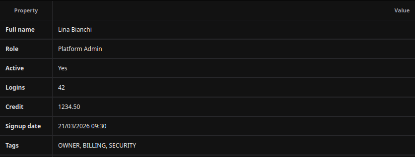
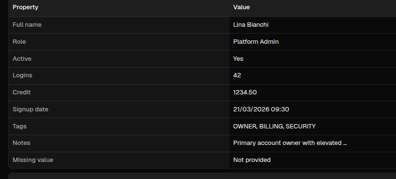

# Descriptions

[<- Back to Complex Components](./index.md)

## Purpose

`Descriptions` renders a single object as a two-column key/value table. Use it for account profiles, order snapshots, audit metadata, configuration summaries, and any detail view where fields should be shown with stable labels and formatted values.

The component is model-driven: `model` declares which fields to show and how to label or format them; `data` supplies the object values.

## Constructor

```python
Descriptions(
    id: str,
    model: list[dict[str, Any]] | None = None,
    data: dict[str, Any] | None = None,
    key_header: str = "Property",
    value_header: str = "Value",
    borders: bool = True,
)
```

## Properties

| Property | Type | Default | Description |
|---|---|---:|---|
| `model` | `list[dict]` | `[]` | Field definitions rendered in order. |
| `data` | `dict` | `{}` | Object read by each model field. |
| `key_header` | `str` | `Property` | Header for the label column. |
| `value_header` | `str` | `Value` | Header for the value column. |
| `borders` | `bool` | `True` | Enables table border/grid styling. |

## Model Fields

| Field | Type | Description |
|---|---|---|
| `field` | `str` | Key read from `data`. Required for a row to render. |
| `label` | `str` | Label shown in the left column. |
| `header` | `str` | Alternate label key used when `label` is not present. |
| `type` | `str` | Value coercion: `str`, `bool`, `int`, `float`, `date`, `datetime`. |
| `format` | `str` | Numeric or date formatting. |
| `transform` | `str` | Value transform such as `title`, `upper`, `truncate\|36`, or `join_list\|, \|upper`. |
| `placeholder` | `str` | Text shown when the value is missing. |

When `model` is empty, the component builds rows from the keys present in `data`.

## Examples

<div class="docs-code-group" data-code-group>
  <div class="docs-code-group__tabs" role="tablist" aria-label="Descriptions example">
    <button class="docs-code-group__tab" type="button" role="tab" data-code-group-tab data-target="descriptions-example-python" data-active="true" aria-selected="true">Python</button>
    <button class="docs-code-group__tab" type="button" role="tab" data-code-group-tab data-target="descriptions-example-yaml" aria-selected="false">YAML</button>
  </div>
  <div class="docs-code-group__panel" id="descriptions-example-python" data-code-group-panel data-active="true">
    <div class="language-python highlight"><pre><code>from democrai.sdk.client import active_sdk as sdk
from democrai.sdk.ui import bound

model = [
    {"field": "full_name", "label": "Full name", "type": "str"},
    {"field": "role", "label": "Role", "type": "str", "transform": "title"},
    {"field": "active", "label": "Active", "type": "bool"},
    {"field": "login_count", "label": "Logins", "type": "int"},
    {"field": "credit", "label": "Credit", "type": "float", "format": ".2f"},
    {"field": "signup_at", "label": "Signup date", "type": "datetime", "format": "%d/%m/%Y %H:%M"},
    {"field": "tags", "label": "Tags", "transform": "join_list|, |upper", "placeholder": "No tags"},
    {"field": "notes", "label": "Notes", "transform": "truncate|36", "placeholder": "No notes"},
    {"field": "missing", "label": "Missing value", "placeholder": "Not provided"},
]

data = {
    "full_name": "Lina Bianchi",
    "role": "platform admin",
    "active": True,
    "login_count": 42,
    "credit": 1234.5,
    "signup_at": "2026-03-21T09:30:00",
    "tags": ["owner", "billing", "security"],
    "notes": "Primary account owner with elevated operational permissions.",
}

details = sdk.ui.Descriptions(
    "details_static",
    model=model,
    data=data,
    key_header="Property",
    value_header="Value",
    borders=True,
)
details.set_show_if({
    "conditions": [
        {
            "left": bound.store("/components_test/descriptions/show", scope="page", default=True),
            "op": "==",
            "right": True,
        }
    ]
})
details.set_hide_if({
    "conditions": [
        {
            "left": bound.store("/components_test/descriptions/hide", scope="page", default=False),
            "op": "==",
            "right": True,
        }
    ]
})
details.set_required_permissions(["components.complex.view"])</code></pre></div>
  </div>
  <div class="docs-code-group__panel" id="descriptions-example-yaml" data-code-group-panel hidden>
    <div class="language-yaml highlight"><pre><code>- kind: Descriptions
  id: details_static
  model:
    - field: full_name
      label: Full name
      type: str
    - field: role
      label: Role
      type: str
      transform: title
    - field: active
      label: Active
      type: bool
    - field: login_count
      label: Logins
      type: int
    - field: credit
      label: Credit
      type: float
      format: ".2f"
    - field: signup_at
      label: Signup date
      type: datetime
      format: "%d/%m/%Y %H:%M"
    - field: tags
      label: Tags
      transform: "join_list|, |upper"
      placeholder: No tags
    - field: notes
      label: Notes
      transform: "truncate|36"
      placeholder: No notes
    - field: missing
      label: Missing value
      placeholder: Not provided
  data:
    full_name: Lina Bianchi
    role: platform admin
    active: true
    login_count: 42
    credit: 1234.5
    signup_at: "2026-03-21T09:30:00"
    tags: [owner, billing, security]
    notes: Primary account owner with elevated operational permissions.
  key_header: Property
  value_header: Value
  borders: true
  required_permissions: [components.complex.view]
  show_if:
    conditions:
      - left: {type: store, scope: page, path: /components_test/descriptions/show, default: true}
        op: "=="
        right: true
  hide_if:
    conditions:
      - left: {type: store, scope: page, path: /components_test/descriptions/hide, default: false}
        op: "=="
        right: true
  capabilities: [model.set, data.set, key_header.set, value_header.set, borders.set]</code></pre></div>
  </div>
</div>

## Fallback Model

When `model` is empty, `Descriptions` creates one row per key in `data`.

<div class="docs-code-group" data-code-group>
  <div class="docs-code-group__tabs" role="tablist" aria-label="Descriptions fallback example">
    <button class="docs-code-group__tab" type="button" role="tab" data-code-group-tab data-target="descriptions-fallback-python" data-active="true" aria-selected="true">Python</button>
    <button class="docs-code-group__tab" type="button" role="tab" data-code-group-tab data-target="descriptions-fallback-yaml" aria-selected="false">YAML</button>
  </div>
  <div class="docs-code-group__panel" id="descriptions-fallback-python" data-code-group-panel data-active="true">
    <div class="language-python highlight"><pre><code>sdk.ui.Descriptions(
    "details_fallback",
    model=[],
    data={
        "order_id": "ORD-2026-0042",
        "status": "shipped",
        "total": 289.9,
    },
    key_header="Auto field",
    value_header="Auto value",
    borders=False,
)</code></pre></div>
  </div>
  <div class="docs-code-group__panel" id="descriptions-fallback-yaml" data-code-group-panel hidden>
    <div class="language-yaml highlight"><pre><code>- kind: Descriptions
  id: details_fallback
  model: []
  data:
    order_id: ORD-2026-0042
    status: shipped
    total: 289.9
  key_header: Auto field
  value_header: Auto value
  borders: false</code></pre></div>
  </div>
</div>

## Binding and Updates

The demo binds `model`, `data`, `key_header`, `value_header`, and `borders` through both page store and surface data model. The same properties can be updated directly with `propertyUpdate`.

<div class="docs-code-group" data-code-group>
  <div class="docs-code-group__tabs" role="tablist" aria-label="Descriptions binding example">
    <button class="docs-code-group__tab" type="button" role="tab" data-code-group-tab data-target="descriptions-binding-python" data-active="true" aria-selected="true">Python</button>
    <button class="docs-code-group__tab" type="button" role="tab" data-code-group-tab data-target="descriptions-binding-yaml" aria-selected="false">YAML</button>
  </div>
  <div class="docs-code-group__panel" id="descriptions-binding-python" data-code-group-panel data-active="true">
    <div class="language-python highlight"><pre><code>store_details = sdk.ui.Descriptions(
    "details_store",
    model=bound.store("/components_test/descriptions/model", scope="page", default=model),
    data=bound.store("/components_test/descriptions/data", scope="page", default=data),
    key_header=bound.store("/components_test/descriptions/key_header", scope="page", default="Property"),
    value_header=bound.store("/components_test/descriptions/value_header", scope="page", default="Value"),
    borders=bound.store("/components_test/descriptions/borders", scope="page", default=True),
)

data_details = sdk.ui.Descriptions(
    "details_data",
    model=bound.data("/components_test/descriptions_model/model", default=model),
    data=bound.data("/components_test/descriptions_model/data", default=data),
    key_header=bound.data("/components_test/descriptions_model/key_header", default="Property"),
    value_header=bound.data("/components_test/descriptions_model/value_header", default="Value"),
    borders=bound.data("/components_test/descriptions_model/borders", default=True),
)

live_details = sdk.ui.Descriptions("details_live", model=model, data=data)</code></pre></div>
  </div>
  <div class="docs-code-group__panel" id="descriptions-binding-yaml" data-code-group-panel hidden>
    <div class="language-yaml highlight"><pre><code>- kind: Descriptions
  id: details_store
  model: {type: store, scope: page, path: /components_test/descriptions/model, default: []}
  data: {type: store, scope: page, path: /components_test/descriptions/data, default: {}}
  key_header: {type: store, scope: page, path: /components_test/descriptions/key_header, default: Property}
  value_header: {type: store, scope: page, path: /components_test/descriptions/value_header, default: Value}
  borders: {type: store, scope: page, path: /components_test/descriptions/borders, default: true}

- kind: Descriptions
  id: details_data
  model: "@data/components_test/descriptions_model/model"
  data: "@data/components_test/descriptions_model/data"
  key_header: "@data/components_test/descriptions_model/key_header"
  value_header: "@data/components_test/descriptions_model/value_header"
  borders: "@data/components_test/descriptions_model/borders"

- kind: Descriptions
  id: details_live
  model: []
  data: {}
  capabilities: [model.set, data.set, key_header.set, value_header.set, borders.set]</code></pre></div>
  </div>
</div>

Runtime updates must target the current surface:

```python
surface_id = ctx["_surface_id"]

return sdk.effects.respond(
    sdk.effects.ui_messages([
        {
            "stateUpdate": {
                "scope": "page",
                "values": {
                    "/components_test/descriptions/model": next_model,
                    "/components_test/descriptions/data": next_data,
                    "/components_test/descriptions/key_header": "Field",
                    "/components_test/descriptions/value_header": "Current value",
                    "/components_test/descriptions/borders": False,
                },
            }
        },
        sdk.ui.Builder.build_data_model_update_payload(
            surface_id=surface_id,
            data={
                "components_test": {
                    "descriptions_model": {
                        "model": next_model,
                        "data": next_data,
                        "key_header": "Field",
                        "value_header": "Current value",
                        "borders": False,
                    }
                }
            },
        ),
    ]),
    sdk.effects.ui_property_update("details_live", "model", next_model, surface_id=surface_id),
    sdk.effects.ui_property_update("details_live", "data", next_data, surface_id=surface_id),
    sdk.effects.ui_property_update("details_live", "key_header", "Field", surface_id=surface_id),
    sdk.effects.ui_property_update("details_live", "value_header", "Current value", surface_id=surface_id),
    sdk.effects.ui_property_update("details_live", "borders", False, surface_id=surface_id),
)
```

## Screenshots

Desktop:



Web:


