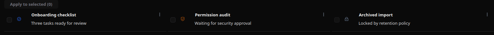
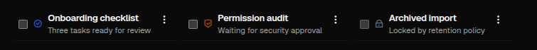

# List

[<- Back to Complex Components](./index.md)

## Purpose

`List` renders a sequence of items from an explicit `dataSource`. Each item can use a built-in display template or a custom `item_template` component tree cloned for every row.

Use `List` for compact feeds, queues, task lists, selectable item collections, or card-like repeated content that does not need a fixed tabular schema. Use `DataTable` when rows need columns, sorting, filtering, pagination, or cell editing.

## Constructor

```python
List(
    id: str,
    data_source: dict,
    item_template: Component | None = None,
    on_item_click: dict | None = None,
    orientation: str = "vertical",
    selectable: bool = False,
    template: str = "custom",
    item_actions: list[dict] | None = None,
    selected_items_action: dict | None = None,
    selected_items_action_label: str = "Apply to selected",
)
```

## Properties

| Property | Type | Default | Description |
|---|---:|---:|---|
| `dataSource` | `dict` | required | Item source. Cross-client examples use `inline` and `binding`. |
| `itemTemplate` | `Component` | none | Custom component tree rendered once per item. |
| `template` | `str` | `custom` | Built-in item template: `text`, `title_text`, or `custom`. |
| `orientation` | `str` | `vertical` | `vertical` stacks rows; `horizontal` wraps items horizontally where supported by layout. |
| `selectable` | `bool` | `false` | Enables row checkboxes and `selectedItemsAction`. |
| `onItemClick` | `dict` | none | Action spec emitted when a non-selecting row click is handled. |
| `itemActions` | `list[ActionDef]` | `[]` | Per-item menu actions. Visibility rules can read `$item`. |
| `selectedItemsAction` | `dict` | none | Batch action emitted for selected items. |
| `selectedItemsActionLabel` | `str` | `Apply to selected` | Label used for the selected-items action button. |

Python constructor arguments use snake_case. YAML definitions use the constructor keys such as `data_source`, `item_template`, `on_item_click`, `item_actions`, `selected_items_action`, and `selected_items_action_label`. Runtime updates target serialized property names such as `dataSource`, `dataSource.data`, `itemActions`, and `selectable`.

Action specs in `onItemClick`, `itemActions`, and `selectedItemsAction` must use fully qualified module action names, for example `components.test_list_action_event`. See [Action Dispatch](../action-dispatch.md).

## Action Confirmation

Use `confirm` inside the `ActionSpec` for `onItemClick`, item action payloads, or `selectedItemsAction`. Confirmation text should use translation keys.

<div class="docs-code-group" data-code-group>
  <div class="docs-code-group__tabs" role="tablist" aria-label="List confirm example">
    <button class="docs-code-group__tab" type="button" role="tab" data-code-group-tab data-target="list-confirm-python" data-active="true" aria-selected="true">Python</button>
    <button class="docs-code-group__tab" type="button" role="tab" data-code-group-tab data-target="list-confirm-yaml" aria-selected="false">YAML</button>
  </div>
  <div class="docs-code-group__panel" id="list-confirm-python" data-code-group-panel data-active="true">
    <div class="language-python highlight"><pre><code>list_component = sdk.ui.List(
    "list_confirm",
    data_source={
        "type": "inline",
        "data": [
            {
                "id": "list_alpha",
                "title": "Alpha item",
                "text": "Click the row or the menu action.",
                "selectable": False,
            },
            {
                "id": "list_beta",
                "title": "Beta item",
                "text": "Select rows and confirm the batch action.",
            },
        ],
    },
    template="title_text",
    selectable=True,
    on_item_click={
        "name": "components.list_confirm_action",
        "context": {"source": "python_list_click", "item_id": "$item.id"},
        "confirm": {
            "text": sdk.i18n.t("components.list.confirm.click_prompt"),
            "confirm_text": sdk.i18n.t("components.list.confirm.accept"),
            "cancel_text": sdk.i18n.t("components.list.confirm.cancel"),
        },
    },
    item_actions=[
        {
            "label": sdk.i18n.t("components.list.confirm.item_action"),
            "action": {
                "name": "components.list_confirm_action",
                "context": {"source": "python_list_menu", "item_id": "$item.id"},
                "confirm": {
                    "text": sdk.i18n.t("components.list.confirm.menu_prompt"),
                    "confirm_text": sdk.i18n.t("components.list.confirm.accept"),
                    "cancel_text": sdk.i18n.t("components.list.confirm.cancel"),
                },
            },
        }
    ],
    selected_items_action={
        "name": "components.list_confirm_action",
        "context": {"source": "python_list_selected"},
        "confirm": {
            "text": sdk.i18n.t("components.list.confirm.selected_prompt"),
            "confirm_text": sdk.i18n.t("components.list.confirm.accept"),
            "cancel_text": sdk.i18n.t("components.list.confirm.cancel"),
        },
    },
)</code></pre></div>
  </div>
  <div class="docs-code-group__panel" id="list-confirm-yaml" data-code-group-panel hidden>
    <div class="language-yaml highlight"><pre><code>- kind: List
  id: list_confirm
  template: title_text
  selectable: true
  data_source:
    type: inline
    data:
      - id: list_alpha
        title: Alpha item
        text: Click the row or the menu action.
        selectable: false
      - id: list_beta
        title: Beta item
        text: Select rows and confirm the batch action.
  on_item_click:
    name: components.list_confirm_action
    context:
      source: yaml_list_click
      item_id: "$item.id"
    confirm:
      text: "@t/components.list.confirm.click_prompt"
      confirm_text: "@t/components.list.confirm.accept"
      cancel_text: "@t/components.list.confirm.cancel"
  item_actions:
    - label: "@t/components.list.confirm.item_action"
      action:
        name: components.list_confirm_action
        context:
          source: yaml_list_menu
          item_id: "$item.id"
        confirm:
          text: "@t/components.list.confirm.menu_prompt"
          confirm_text: "@t/components.list.confirm.accept"
          cancel_text: "@t/components.list.confirm.cancel"
  selected_items_action:
    name: components.list_confirm_action
    context:
      source: yaml_list_selected
    confirm:
      text: "@t/components.list.confirm.selected_prompt"
      confirm_text: "@t/components.list.confirm.accept"
      cancel_text: "@t/components.list.confirm.cancel"</code></pre></div>
  </div>
</div>

## Data Source

The cross-client `dataSource` forms are:

| Type | Shape | Usage |
|---|---|---|
| Inline | `{"type": "inline", "data": items}` | Static list seeded at render time or later replaced with direct property updates. |
| Store binding | `{"type": "binding", "data": bound.store(...)}` | Reads items from page/global store. |
| Data-model binding | `{"type": "binding", "data": bound.data(...)}` | Reads items from the current surface data model. |

The web renderer also accepts remote `http` and `websocket` sources. The portable examples use `inline` and `binding` because they work on both clients.

Items are dictionaries. A stable `id` is recommended because selection is tracked by item key.

```python
items = [
    {
        "id": "list-101",
        "title": "Onboarding checklist",
        "text": "Three tasks ready for review",
        "status": "active",
        "owner": "Runtime",
        "priority": "High",
        "icon": "ric.checkbox-circle-line",
        "icon_color": "#2563eb",
        "selectable": True,
        "show_badge": True,
    }
]
```

`selectable` on an item can be a boolean or a visibility-style rule. When `selectable=True` on the list, selectable row clicks toggle selection. Use item actions or an inline button when the same row also needs an explicit action.

## Built-In Templates

`template="text"` renders each item from `text`, with optional `icon` and `icon_color`.

`template="title_text"` renders `title` and `text`, with optional `icon` and `icon_color`. The desktop renderer also reads a `badges` list for this template; do not rely on that key for a cross-client visual result.

`template="custom"` is set automatically when `item_template` is provided. Custom templates can render any normal component tree supported by the clients.

<div class="docs-code-group" data-code-group>
  <div class="docs-code-group__tabs" role="tablist" aria-label="List presets example">
    <button class="docs-code-group__tab" type="button" role="tab" data-code-group-tab data-target="list-presets-python" data-active="true" aria-selected="true">Python</button>
    <button class="docs-code-group__tab" type="button" role="tab" data-code-group-tab data-target="list-presets-yaml" aria-selected="false">YAML</button>
  </div>
  <div class="docs-code-group__panel" id="list-presets-python" data-code-group-panel data-active="true">
    <div class="language-python highlight"><pre><code>text_list = sdk.ui.List(
    "list_text",
    data_source={"type": "inline", "data": items},
    template="text",
    selectable=True,
    orientation="vertical",
    on_item_click={
        "name": "components.test_list_action_event",
        "context": {"op": "item_click", "source": "python_text"},
    },
    item_actions=item_actions,
    selected_items_action={
        "name": "components.test_list_action_event",
        "context": {"op": "selected", "source": "python_text"},
    },
    selected_items_action_label="Apply to selected",
)

title_text_list = sdk.ui.List(
    "list_title_text",
    data_source={"type": "inline", "data": items},
    template="title_text",
    selectable=True,
    orientation="horizontal",
    item_actions=item_actions,
)</code></pre></div>
  </div>
  <div class="docs-code-group__panel" id="list-presets-yaml" data-code-group-panel hidden>
    <div class="language-yaml highlight"><pre><code>- kind: List
  id: list_text
  template: text
  selectable: true
  orientation: vertical
  on_item_click:
    name: components.test_list_action_event
    context: {op: item_click, source: yaml_text}
  item_actions: *list_item_actions
  selected_items_action:
    name: components.test_list_action_event
    context: {op: selected, source: yaml_text}
  selected_items_action_label: Apply to selected
  data_source:
    type: inline
    data: *list_items

- kind: List
  id: list_title_text
  template: title_text
  selectable: true
  orientation: horizontal
  item_actions: *list_item_actions
  data_source:
    type: inline
    data: *list_items</code></pre></div>
  </div>
</div>

## Custom Item Template

`item_template` receives the current item. Use `{{field}}` placeholders in visible component props and `$item.field` in action contexts or visibility rules.

Inline `show_if`, `hide_if`, and `required_permissions` are evaluated on the cloned inline components. This allows badges, buttons, and sections inside a list item to appear only for matching item data.

<div class="docs-code-group" data-code-group>
  <div class="docs-code-group__tabs" role="tablist" aria-label="List custom template example">
    <button class="docs-code-group__tab" type="button" role="tab" data-code-group-tab data-target="list-template-python" data-active="true" aria-selected="true">Python</button>
    <button class="docs-code-group__tab" type="button" role="tab" data-code-group-tab data-target="list-template-yaml" aria-selected="false">YAML</button>
  </div>
  <div class="docs-code-group__panel" id="list-template-python" data-code-group-panel data-active="true">
    <div class="language-python highlight"><pre><code>badge = sdk.ui.Badge("item_status", "{{status}}", variant="secondary")
badge.set_show_if({
    "conditions": [
        {"left": "$item.show_badge", "op": "==", "right": True}
    ]
})

button = sdk.ui.Button(
    "item_open",
    "Open",
    action="components.test_list_action_event",
    params={"op": "inline_button", "item_id": "{{id}}"},
    variant="secondary",
    btnsize="sm",
)
button.set_show_if({
    "conditions": [
        {
            "left": bound.store(
                "/components_test/list/show_inline_buttons",
                scope="page",
                default=True,
            ),
            "op": "==",
            "right": True,
        },
        {"left": "$item.status", "op": "!=", "right": "locked"},
    ]
})

template = sdk.ui.Card(
    "item_card",
    [
        sdk.ui.Column(
            "item_content",
            [
                sdk.ui.Title("item_title", "{{title}}", level=4),
                sdk.ui.Text("item_owner", "Owner: {{owner}}"),
                sdk.ui.Text("item_text", "{{text}}"),
                sdk.ui.Row("item_meta", [badge, button]),
            ],
        )
    ],
    variant="outlined",
)

custom_list = sdk.ui.List(
    "list_custom",
    data_source={"type": "inline", "data": items},
    item_template=template,
    selectable=True,
    item_actions=item_actions,
)</code></pre></div>
  </div>
  <div class="docs-code-group__panel" id="list-template-yaml" data-code-group-panel hidden>
    <div class="language-yaml highlight"><pre><code>- kind: List
  id: list_custom
  selectable: true
  item_actions: *list_item_actions
  data_source: {type: inline, data: *list_items}
  item_template:
    kind: Card
    id: item_card
    variant: outlined
    children:
      - kind: Column
        id: item_content
        children:
          - kind: Title
            id: item_title
            text: "{{title}}"
            level: 4
          - kind: Text
            id: item_owner
            text: "Owner: {{owner}}"
          - kind: Text
            id: item_text
            text: "{{text}}"
          - kind: Row
            id: item_meta
            children:
              - kind: Badge
                id: item_status
                text: "{{status}}"
                variant: secondary
                show_if:
                  conditions:
                    - left: "$item.show_badge"
                      op: "=="
                      right: true
              - kind: Button
                id: item_open
                label: Open
                action: components.test_list_action_event
                params: {op: inline_button, item_id: "{{id}}"}
                variant: secondary
                btnsize: sm
                show_if:
                  conditions:
                    - left: {type: store, scope: page, path: /components_test/list/show_inline_buttons, default: true}
                      op: "=="
                      right: true
                    - left: "$item.status"
                      op: "!="
                      right: locked</code></pre></div>
  </div>
</div>

## Item And Selection Actions

`item_actions` render a per-item menu. Each action receives the explicit `action.context` after item placeholders are resolved. The renderer also adds:

```python
{"item": item, "item_index": index}
```

`selected_items_action` is a single batch action. It is enabled when at least one selectable item is selected and receives:

```python
{
    "selected_items": selected_items,
    "selected_count": len(selected_items),
    "selected_ids": [item["id"], ...],
}
```

Action entries support `show_if`, `hide_if`, and `required_permissions`. Rules can read `$item.field`.

When an item action navigates to a route, use `nav` and include `type: nav` in the context:

```yaml
item_actions:
  - label: Open
    icon: ric.external-link-line
    action:
      name: nav
      context:
        type: nav
        path: "/module/item/$item.id/view"
```

`path` without `type: nav` is reserved for implicit data-model binding shapes and must not be used as the only key in a navigation context.

<div class="docs-code-group" data-code-group>
  <div class="docs-code-group__tabs" role="tablist" aria-label="List actions example">
    <button class="docs-code-group__tab" type="button" role="tab" data-code-group-tab data-target="list-actions-python" data-active="true" aria-selected="true">Python</button>
    <button class="docs-code-group__tab" type="button" role="tab" data-code-group-tab data-target="list-actions-yaml" aria-selected="false">YAML</button>
  </div>
  <div class="docs-code-group__panel" id="list-actions-python" data-code-group-panel data-active="true">
    <div class="language-python highlight"><pre><code>item_actions = [
    {
        "label": "Inspect",
        "icon": "ric.search-eye-line",
        "action": {
            "name": "components.test_list_action_event",
            "context": {"op": "inspect", "item_id": "$item.id"},
        },
    },
    {
        "label": "Promote pending",
        "icon": "ric.arrow-up-circle-line",
        "action": {
            "name": "components.test_list_action_event",
            "context": {"op": "promote_pending", "item_id": "$item.id"},
        },
        "show_if": {
            "conditions": [
                {"left": "$item.status", "op": "==", "right": "pending"}
            ]
        },
    },
    {
        "label": "Archive active",
        "icon": "ric.archive-line",
        "action": {
            "name": "components.test_list_action_event",
            "context": {"op": "archive_active", "item_id": "$item.id"},
        },
        "hide_if": {
            "conditions": [
                {"left": "$item.status", "op": "!=", "right": "active"}
            ]
        },
        "required_permissions": ["components.list.archive"],
    },
]</code></pre></div>
  </div>
  <div class="docs-code-group__panel" id="list-actions-yaml" data-code-group-panel hidden>
    <div class="language-yaml highlight"><pre><code>item_actions:
  - label: Inspect
    icon: ric.search-eye-line
    action:
      name: components.test_list_action_event
      context: {op: inspect, item_id: "$item.id"}
  - label: Promote pending
    icon: ric.arrow-up-circle-line
    action:
      name: components.test_list_action_event
      context: {op: promote_pending, item_id: "$item.id"}
    show_if:
      conditions:
        - left: "$item.status"
          op: "=="
          right: pending
  - label: Archive active
    icon: ric.archive-line
    action:
      name: components.test_list_action_event
      context: {op: archive_active, item_id: "$item.id"}
    hide_if:
      conditions:
        - left: "$item.status"
          op: "!="
          right: active
    required_permissions: [components.list.archive]</code></pre></div>
  </div>
</div>

## Bindings And Updates

Store-bound and data-model-bound examples use the same item format as the inline examples. In Python, use `bound.store(...)` for page/global store and `bound.data(...)` for the surface data model. In YAML, use explicit store binding objects and `@data/...` paths.

Direct updates can replace the complete `dataSource` or mutate the nested item list through `dataSource.data` when the corresponding capabilities are declared.

<div class="docs-code-group" data-code-group>
  <div class="docs-code-group__tabs" role="tablist" aria-label="List binding example">
    <button class="docs-code-group__tab" type="button" role="tab" data-code-group-tab data-target="list-binding-python" data-active="true" aria-selected="true">Python</button>
    <button class="docs-code-group__tab" type="button" role="tab" data-code-group-tab data-target="list-binding-yaml" aria-selected="false">YAML</button>
  </div>
  <div class="docs-code-group__panel" id="list-binding-python" data-code-group-panel data-active="true">
    <div class="language-python highlight"><pre><code>builder.set_store(
    "/components_test/list/store_items",
    items,
    scope="page",
)
builder.set_data(
    "/components_test/list_model",
    {"items": items},
)

store_list = sdk.ui.List(
    "list_store",
    data_source={
        "type": "binding",
        "data": bound.store(
            "/components_test/list/store_items",
            scope="page",
            default=[],
        ),
    },
    item_template=template,
)

data_list = sdk.ui.List(
    "list_data",
    data_source={
        "type": "binding",
        "data": bound.data(
            "/components_test/list_model/items",
            default=[],
        ),
    },
    item_template=template,
)

live_list = sdk.ui.List(
    "list_live",
    data_source={"type": "inline", "data": items},
    item_template=template,
)
live_list.allow(
    "dataSource.set",
    "dataSource.data.append",
    "dataSource.data.replace",
    "visible.set",
)</code></pre></div>
  </div>
  <div class="docs-code-group__panel" id="list-binding-yaml" data-code-group-panel hidden>
    <div class="language-yaml highlight"><pre><code>- kind: List
  id: list_store
  data_source:
    type: binding
    data: {type: store, scope: page, path: /components_test/list/store_items, default: []}
  item_template: *list_template

- kind: List
  id: list_data
  data_source:
    type: binding
    data: "@data/components_test/list_model/items"
  item_template: *list_template

- kind: List
  id: list_live
  data_source: {type: inline, data: []}
  item_template: *list_template
  capabilities: [dataSource.set, dataSource.data.append, dataSource.data.replace, visible.set]</code></pre></div>
  </div>
</div>

Runtime updates target the current surface:

```python
surface_id = ctx["_surface_id"]

sdk.effects.ui_messages([
    {
        "stateUpdate": {
            "scope": "page",
            "values": {"/components_test/list/store_items": items},
        }
    },
    sdk.ui.Builder.build_data_model_update_payload(
        surface_id=surface_id,
        data={"components_test": {"list_model": {"items": items}}},
    ),
])

sdk.effects.ui_property_update(
    "list_live",
    "dataSource",
    {"type": "inline", "data": items},
    action="set",
    surface_id=surface_id,
)

sdk.effects.ui_collection_append(
    "list_live",
    "dataSource.data",
    new_item,
    surface_id=surface_id,
)
```

## Visibility And Permissions

`List` supports the common component-level `show_if`, `hide_if`, and `required_permissions` properties. The demo also applies item-aware visibility inside `item_template` and inside `item_actions`.

<div class="docs-code-group" data-code-group>
  <div class="docs-code-group__tabs" role="tablist" aria-label="List visibility example">
    <button class="docs-code-group__tab" type="button" role="tab" data-code-group-tab data-target="list-visibility-python" data-active="true" aria-selected="true">Python</button>
    <button class="docs-code-group__tab" type="button" role="tab" data-code-group-tab data-target="list-visibility-yaml" aria-selected="false">YAML</button>
  </div>
  <div class="docs-code-group__panel" id="list-visibility-python" data-code-group-panel data-active="true">
    <div class="language-python highlight"><pre><code>list_component.set_show_if({
    "conditions": [
        {
            "left": bound.store(
                "/components_test/list/show",
                scope="page",
                default=True,
            ),
            "op": "==",
            "right": True,
        }
    ]
})
list_component.set_hide_if({
    "conditions": [
        {
            "left": bound.store(
                "/components_test/list/hide",
                scope="page",
                default=False,
            ),
            "op": "==",
            "right": True,
        }
    ]
})
list_component.set_required_permissions(["components.list.view"])</code></pre></div>
  </div>
  <div class="docs-code-group__panel" id="list-visibility-yaml" data-code-group-panel hidden>
    <div class="language-yaml highlight"><pre><code>- kind: List
  id: list_guarded
  data_source: {type: inline, data: []}
  template: text
  required_permissions: [components.list.view]
  show_if:
    conditions:
      - left: {type: store, scope: page, path: /components_test/list/show, default: true}
        op: "=="
        right: true
  hide_if:
    conditions:
      - left: {type: store, scope: page, path: /components_test/list/hide, default: false}
        op: "=="
        right: true</code></pre></div>
  </div>
</div>

## Screenshots




