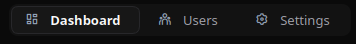
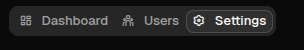

# Tabs

[<- Back to Complex Components](./index.md)

## Purpose

`Tabs` renders a tabbed container. A tab can show a small inline component tree, a complete page-like layout, or a route-backed page mounted inside the tab panel.

Use inline panes when each tab is just a section of the current surface. Use page panes when each tab is a full view made of nested rows, columns, forms, lists, charts, or other components. Use route-backed tabs when the pane should lazy-render another route into the tab content area.

## Constructor

```python
Tabs(
    id: str,
    children: list[str | Component] | None = None,
)
```

`children` contains the inline panes. Each inline pane must have an id that matches a `tabs[].id` entry.

## Properties

| Python/YAML property | Type | Default | Description |
|---|---:|---:|---|
| `children` | `list` | `[]` | Inline tab panes. Each child can be an id or an inline component definition. |
| `tabs` | `list[TabDef]` | `[]` | Tab metadata used to render labels, icons, and route-backed panes. |
| `stretch` | `bool` | `false` | Lets the web renderer expand the tab container vertically. |
| `style` | `str` | `""` | Renderer style string applied to the tab container where supported. |

## Tab Definition

| Field | Type | Description |
|---|---:|---|
| `id` | `str` | Inline child id, or stable route-tab id when `route` is set. |
| `label` | `str` | Visible tab label. |
| `route` | `str` | Optional route to render inside the tab pane. Route-only tabs do not require a matching child. |
| `icon` | `str` | Optional icon name. |
| `icon_asset` | `str` | Optional icon asset used by renderers that support asset-backed icons. |

In Python, use `add_tab(...)` to append entries to `tabs`:

```python
tabs.add_tab("tab_settings", "Settings", icon="ric.settings-3-line")
tabs.add_tab("tab_docs", "Docs", route="/components/_complex/card", icon="ric.layout-3-line")
```

## Inline and Page Panes

Inline panes and page panes use the same contract. The difference is only the size and complexity of the child tree.

<div class="docs-code-group" data-code-group>
  <div class="docs-code-group__tabs" role="tablist" aria-label="Tabs panes example">
    <button class="docs-code-group__tab" type="button" role="tab" data-code-group-tab data-target="tabs-panes-python" data-active="true" aria-selected="true">Python</button>
    <button class="docs-code-group__tab" type="button" role="tab" data-code-group-tab data-target="tabs-panes-yaml" aria-selected="false">YAML</button>
  </div>
  <div class="docs-code-group__panel" id="tabs-panes-python" data-code-group-panel data-active="true">
    <div class="language-python highlight"><pre><code>overview = sdk.ui.Column("tab_overview", [
    sdk.ui.Title("tab_overview_title", "Overview", level=4),
    sdk.ui.Text("tab_overview_text", "Inline pane content."),
])

settings = sdk.ui.Column("tab_settings", [
    sdk.ui.Title("tab_settings_title", "Settings", level=4),
    sdk.ui.Text("tab_settings_text", "Any component tree can be rendered here."),
])

tabs = sdk.ui.Tabs("tabs_inline", ["tab_overview", "tab_settings"])
tabs.add_tab("tab_overview", "Overview", icon="ric.home-2-line")
tabs.add_tab("tab_settings", "Settings", icon="ric.settings-3-line")</code></pre></div>
  </div>
  <div class="docs-code-group__panel" id="tabs-panes-yaml" data-code-group-panel hidden>
    <div class="language-yaml highlight"><pre><code>- kind: Tabs
  id: tabs_inline
  tabs:
    - id: tab_overview
      label: Overview
      icon: ric.home-2-line
    - id: tab_settings
      label: Settings
      icon: ric.settings-3-line
  children:
    - kind: Column
      id: tab_overview
      children:
        - kind: Title
          id: tab_overview_title
          text: Overview
          level: 4
        - kind: Text
          id: tab_overview_text
          text: Inline pane content.
    - kind: Column
      id: tab_settings
      children:
        - kind: Title
          id: tab_settings_title
          text: Settings
          level: 4
        - kind: Text
          id: tab_settings_text
          text: Any component tree can be rendered here.</code></pre></div>
  </div>
</div>

A page pane is just a larger child tree:

```python
dashboard = sdk.ui.Column("tab_dashboard", ["kpi_row", "activity_list", "filters_form"])
users = sdk.ui.Column("tab_users", ["users_toolbar", "users_table"])
settings = sdk.ui.Column("tab_settings_page", ["settings_header", "settings_form"])

tabs = sdk.ui.Tabs("tabs_pages", ["tab_dashboard", "tab_users", "tab_settings_page"])
tabs.add_tab("tab_dashboard", "Dashboard", icon="ric.dashboard-line")
tabs.add_tab("tab_users", "Users", icon="ric.team-line")
tabs.add_tab("tab_settings_page", "Settings", icon="ric.settings-3-line")
```

## Route-Backed Pages

When a tab has `route`, the renderer creates a tab pane and requests that route as a nested surface. The route page is rendered inside the tab content area. The tab id is also written to the URL query string so the active tab can be restored.

<div class="docs-code-group" data-code-group>
  <div class="docs-code-group__tabs" role="tablist" aria-label="Tabs route example">
    <button class="docs-code-group__tab" type="button" role="tab" data-code-group-tab data-target="tabs-route-python" data-active="true" aria-selected="true">Python</button>
    <button class="docs-code-group__tab" type="button" role="tab" data-code-group-tab data-target="tabs-route-yaml" aria-selected="false">YAML</button>
  </div>
  <div class="docs-code-group__panel" id="tabs-route-python" data-code-group-panel data-active="true">
    <div class="language-python highlight"><pre><code>tabs = sdk.ui.Tabs("tabs_routes", [])
tabs.add_tab("route_card", "Card page", route="/components/_complex/card", icon="ric.layout-3-line")
tabs.add_tab("route_tree", "Tree page", route="/components/_complex/treeview", icon="ric.node-tree")
tabs.add_tab("route_wizard", "Wizard page", route="/components/_complex/wizard", icon="ric.map-pin-line")</code></pre></div>
  </div>
  <div class="docs-code-group__panel" id="tabs-route-yaml" data-code-group-panel hidden>
    <div class="language-yaml highlight"><pre><code>- kind: Tabs
  id: tabs_routes
  tabs:
    - id: route_card
      label: Card page
      icon: ric.layout-3-line
      route: /components/_complex/card
    - id: route_tree
      label: Tree page
      icon: ric.node-tree
      route: /components/_complex/treeview
  children: []</code></pre></div>
  </div>
</div>

Route-backed tabs can be mixed with inline panes. If a tab has both a matching inline child and a `route`, renderers treat it as an inline tab.

## Bindings and Updates

`tabs` can be bound to page store or the surface data model. Direct property updates can replace the tab metadata when `tabs.set` is allowed.

<div class="docs-code-group" data-code-group>
  <div class="docs-code-group__tabs" role="tablist" aria-label="Tabs binding example">
    <button class="docs-code-group__tab" type="button" role="tab" data-code-group-tab data-target="tabs-binding-python" data-active="true" aria-selected="true">Python</button>
    <button class="docs-code-group__tab" type="button" role="tab" data-code-group-tab data-target="tabs-binding-yaml" aria-selected="false">YAML</button>
  </div>
  <div class="docs-code-group__panel" id="tabs-binding-python" data-code-group-panel data-active="true">
    <div class="language-python highlight"><pre><code>store_tabs = sdk.ui.Tabs("tabs_store", ["store_overview", "store_activity"])
store_tabs.set_property(
    "tabs",
    bound.store("/components_test/tabs/store_tabs", scope="page", default=[
        {"id": "store_overview", "label": "Overview", "icon": "ric.home-2-line"},
        {"id": "store_activity", "label": "Activity", "icon": "ric.history-line"},
    ]),
)

data_tabs = sdk.ui.Tabs("tabs_data", ["data_profile", "data_security"])
data_tabs.set_property(
    "tabs",
    bound.data("/components_test/tabs_model/tabs", default=[
        {"id": "data_profile", "label": "Profile", "icon": "ric.user-line"},
        {"id": "data_security", "label": "Security", "icon": "ric.lock-line"},
    ]),
)

live_tabs = sdk.ui.Tabs("tabs_live", ["live_alpha", "live_beta"])
live_tabs.set_property("tabs", [
    {"id": "live_alpha", "label": "Alpha", "icon": "ric.number-1"},
    {"id": "live_beta", "label": "Beta", "icon": "ric.number-2"},
])
live_tabs.allow("tabs.set", "tabs.append", "tabs.remove", "children.set", "children.append", "children.remove")</code></pre></div>
  </div>
  <div class="docs-code-group__panel" id="tabs-binding-yaml" data-code-group-panel hidden>
    <div class="language-yaml highlight"><pre><code>- kind: Tabs
  id: tabs_store
  tabs: {type: store, scope: page, path: /components_test/tabs/store_tabs, default: [{id: store_overview, label: Overview}]}
  children:
    - kind: Column
      id: store_overview
      children: []

- kind: Tabs
  id: tabs_data
  tabs: "@data/components_test/tabs_model/tabs"
  children:
    - kind: Column
      id: data_profile
      children: []

- kind: Tabs
  id: tabs_live
  tabs:
    - id: live_alpha
      label: Alpha
      icon: ric.number-1
  capabilities: [tabs.set, tabs.append, tabs.remove, children.set, children.append, children.remove]
  children:
    - kind: Column
      id: live_alpha
      children: []</code></pre></div>
  </div>
</div>

Runtime updates target the current surface:

```python
surface_id = ctx["_surface_id"]

return sdk.effects.respond(
    sdk.effects.ui_messages([
        {
            "stateUpdate": {
                "scope": "page",
                "values": {
                    "/components_test/tabs/store_tabs": next_store_tabs,
                },
            }
        },
        sdk.ui.Builder.build_data_model_update_payload(
            surface_id=surface_id,
            data={"components_test": {"tabs_model": {"tabs": next_data_tabs}}},
        ),
    ]),
    sdk.effects.ui_property_update("tabs_live", "tabs", next_live_tabs, surface_id=surface_id),
)
```

## Runtime Add and Remove

Use collection updates when tabs and panes must be added or removed at runtime. Append or remove both `tabs` metadata and the matching `children` pane.

```python
new_pane = sdk.ui.Column("runtime_3", [sdk.ui.Text("runtime_3_text", "Runtime page")])

return sdk.effects.respond(
    sdk.effects.ui_collection_append("tabs_dynamic", "children", new_pane.to_dict()),
    sdk.effects.ui_collection_append(
        "tabs_dynamic",
        "tabs",
        {"id": "runtime_3", "label": "Runtime 3", "icon": "ric.file-add-line"},
    ),
)
```

```python
return sdk.effects.respond(
    sdk.effects.ui_collection_remove("tabs_dynamic", "children", {"id": "runtime_3"}),
    sdk.effects.ui_collection_remove("tabs_dynamic", "tabs", {"id": "runtime_3"}),
)
```

## Visibility and Permissions

`Tabs` supports the common visibility and permission properties. The test page applies these properties to Python and YAML examples.

<div class="docs-code-group" data-code-group>
  <div class="docs-code-group__tabs" role="tablist" aria-label="Tabs visibility example">
    <button class="docs-code-group__tab" type="button" role="tab" data-code-group-tab data-target="tabs-visibility-python" data-active="true" aria-selected="true">Python</button>
    <button class="docs-code-group__tab" type="button" role="tab" data-code-group-tab data-target="tabs-visibility-yaml" aria-selected="false">YAML</button>
  </div>
  <div class="docs-code-group__panel" id="tabs-visibility-python" data-code-group-panel data-active="true">
    <div class="language-python highlight"><pre><code>tabs.set_show_if({
    "conditions": [
        {
            "left": bound.store("/components_test/tabs/show", scope="page", default=True),
            "op": "==",
            "right": True,
        }
    ]
})
tabs.set_hide_if({
    "conditions": [
        {
            "left": bound.store("/components_test/tabs/hide", scope="page", default=False),
            "op": "==",
            "right": True,
        }
    ]
})
tabs.set_required_permissions(["components.complex.view"])</code></pre></div>
  </div>
  <div class="docs-code-group__panel" id="tabs-visibility-yaml" data-code-group-panel hidden>
    <div class="language-yaml highlight"><pre><code>show_if:
  conditions:
    - left: {type: store, scope: page, path: /components_test/tabs/show, default: true}
      op: "=="
      right: true
hide_if:
  conditions:
    - left: {type: store, scope: page, path: /components_test/tabs/hide, default: false}
      op: "=="
      right: true
required_permissions: [components.complex.view]</code></pre></div>
  </div>
</div>

## Screenshots

Desktop:



Web:


