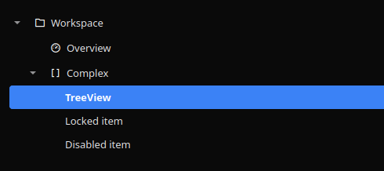
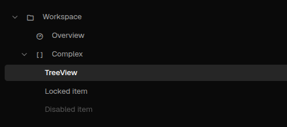

# TreeView

[<- Back to Complex Components](./index.md)

## Purpose

`TreeView` renders hierarchical navigation or selection data. Use it for side navigation, nested resource pickers, permission trees, file-like structures, and any UI where users need to expand branches and choose nodes.

The component supports two independent interactions:

- click activation through `click_action`, commonly used for navigation
- selection through `select_action`, used to inspect or act on selected nodes

## Constructor

```python
TreeView(
    id: str,
    nodes: Optional[List[Dict[str, Any]]] = None,
    *,
    click_action: Optional[str | ActionSpec] = None,
    select_action: Optional[str | ActionSpec] = None,
    params: Optional[dict] = None,
    expand_all: bool = False,
    click_mode: str = "single",
    selection_mode: str = "single",
    active_id: Optional[str] = None,
)
```

## Properties

| Property | Type | Default | Description |
|---|---|---:|---|
| `nodes` | `list[dict]` | `[]` | Nested node list. |
| `click_action` | `str` or `ActionSpec` | `""` | Action emitted when a node is activated. Use `nav` for route navigation. |
| `select_action` | `str` or `ActionSpec` | `""` | Action emitted after selection changes. |
| `params` | `dict` | `{}` | Static context merged into emitted click and selection actions. |
| `expand_all` | `bool` | `False` | Expands all branches on render. |
| `click_mode` | `single`, `double`, `none` | `single` | Controls whether node activation uses single click, double click, or no click action. |
| `selection_mode` | `single`, `multiple`, `none` | `single` | Controls selection behavior. |
| `active_id` | `str`, `list[str]`, `None` | `None` | Marks one or more nodes as active. |
| `active_as_selection` | `bool` | `False` | Also selects the active node when the client supports selection. |
| `min_height` | `int` | client default | Minimum rendered height. |
| `full_height` | `bool` | `False` | Lets the tree stretch vertically in desktop layouts. |

## Node Fields

| Field | Type | Description |
|---|---|---|
| `id` | `str` | Stable node id. Required for selection, active state, and property updates. |
| `type` | `str` | Use `nav` on nodes where `path` is a navigation route. |
| `label` | `str` | Visible text. |
| `children` | `list[dict]` | Nested child nodes. |
| `path` | `str` | Route consumed by navigation actions. |
| `icon` | `str` | Optional icon name. |
| `value` | any | Optional value copied into emitted action context. |
| `meta` | dict | Optional metadata copied into emitted action context. |
| `expanded` | `bool` | Initial expanded state for the branch. |
| `selectable` | `bool` | `false` prevents node selection and node click action, while still allowing branch expansion. |
| `disabled` | `bool` | Prevents interaction with the node. |
| `active` | rule or bool | Marks a node active from a visibility-style rule or static boolean. |

## Navigation and Selection

For navigation trees, set `click_action` to `nav`, put `type: "nav"` on navigable nodes, and then set `path` to the target route. The `type: "nav"` marker keeps route paths distinct from implicit data-model bindings and is required for structural navigation payloads that carry `path`. Set `select_action` when you also need to inspect the selected node or show a selection payload.

<div class="docs-code-group" data-code-group>
  <div class="docs-code-group__tabs" role="tablist" aria-label="treeview example 1">
    <button class="docs-code-group__tab" type="button" role="tab" data-code-group-tab data-target="treeview-1-python" data-active="true" aria-selected="true">Python</button>
    <button class="docs-code-group__tab" type="button" role="tab" data-code-group-tab data-target="treeview-1-yaml" aria-selected="false">YAML</button>
  </div>
  <div class="docs-code-group__panel" id="treeview-1-python" data-code-group-panel data-active="true">
    <div class="language-python highlight"><pre><code>from democrai.sdk.client import active_sdk as sdk
from democrai.sdk.ui import bound

nodes = [
    {
        &quot;id&quot;: &quot;workspace&quot;,
        &quot;label&quot;: &quot;Workspace&quot;,
        &quot;expanded&quot;: True,
        &quot;selectable&quot;: False,
        &quot;children&quot;: [
            {
                &quot;id&quot;: &quot;overview&quot;,
                &quot;type&quot;: &quot;nav&quot;,
                &quot;label&quot;: &quot;Overview&quot;,
                &quot;path&quot;: &quot;/components/index&quot;,
                &quot;value&quot;: &quot;overview&quot;,
            },
            {
                &quot;id&quot;: &quot;treeview&quot;,
                &quot;type&quot;: &quot;nav&quot;,
                &quot;label&quot;: &quot;TreeView&quot;,
                &quot;path&quot;: &quot;/components/_complex/treeview&quot;,
                &quot;value&quot;: &quot;treeview&quot;,
            },
            {
                &quot;id&quot;: &quot;locked&quot;,
                &quot;label&quot;: &quot;Locked item&quot;,
                &quot;selectable&quot;: False,
            },
            {
                &quot;id&quot;: &quot;disabled&quot;,
                &quot;label&quot;: &quot;Disabled item&quot;,
                &quot;disabled&quot;: True,
            },
        ],
    }
]

tree = sdk.ui.TreeView(
    &quot;tree_navigation&quot;,
    nodes=nodes,
    click_action=&quot;nav&quot;,
    select_action=&quot;components.treeview_test_select&quot;,
    params={&quot;source&quot;: &quot;python_static&quot;},
    expand_all=False,
    click_mode=&quot;single&quot;,
    selection_mode=&quot;single&quot;,
    active_id=&quot;treeview&quot;,
)
tree.set_property(&quot;active_as_selection&quot;, True)
tree.set_show_if({
    &quot;conditions&quot;: [
        {
            &quot;left&quot;: bound.store(&quot;/components_test/treeview/show&quot;, scope=&quot;page&quot;, default=True),
            &quot;op&quot;: &quot;==&quot;,
            &quot;right&quot;: True,
        }
    ]
})
tree.set_hide_if({
    &quot;conditions&quot;: [
        {
            &quot;left&quot;: bound.store(&quot;/components_test/treeview/hide&quot;, scope=&quot;page&quot;, default=False),
            &quot;op&quot;: &quot;==&quot;,
            &quot;right&quot;: True,
        }
    ]
})
tree.set_required_permissions([&quot;components.complex.view&quot;])
tree.allow(&quot;nodes.set&quot;, &quot;active_id.set&quot;)</code></pre></div>
  </div>
  <div class="docs-code-group__panel" id="treeview-1-yaml" data-code-group-panel hidden>
    <div class="language-yaml highlight"><pre><code>- kind: TreeView
  id: tree_navigation
  nodes:
    - id: workspace
      label: Workspace
      expanded: true
      selectable: false
      children:
        - id: overview
          type: nav
          label: Overview
          path: /components/index
          value: overview
        - id: treeview
          type: nav
          label: TreeView
          path: /components/_complex/treeview
          value: treeview
        - id: locked
          label: Locked item
          selectable: false
        - id: disabled
          label: Disabled item
          disabled: true
  click_action: nav
  select_action: components.treeview_test_yaml_select
  params: {source: yaml_static}
  expand_all: false
  click_mode: single
  selection_mode: single
  active_id: treeview
  active_as_selection: true
  required_permissions: [components.complex.view]
  show_if:
    conditions:
      - left: {type: store, scope: page, path: /components_test/treeview/show, default: true}
        op: &quot;==&quot;
        right: true
  hide_if:
    conditions:
      - left: {type: store, scope: page, path: /components_test/treeview/hide, default: false}
        op: &quot;==&quot;
        right: true
  capabilities: [nodes.set, active_id.set]</code></pre></div>
  </div>
</div>

`select_action` receives `selected_items` and `active_id`. Each selected item includes the node `id`, `label`, `value`, `path`, and `meta` when present. With `selection_mode: multiple`, `selected_items` contains all selected nodes.

## Action Confirmation

Use `click_action.confirm` or `select_action.confirm` to ask for confirmation before dispatch. Confirmation text should use translation keys. When a `select_action` confirmation is cancelled, the selection remains on the previous confirmed value.

<div class="docs-code-group" data-code-group>
  <div class="docs-code-group__tabs" role="tablist" aria-label="TreeView confirm example">
    <button class="docs-code-group__tab" type="button" role="tab" data-code-group-tab data-target="treeview-confirm-python" data-active="true" aria-selected="true">Python</button>
    <button class="docs-code-group__tab" type="button" role="tab" data-code-group-tab data-target="treeview-confirm-yaml" aria-selected="false">YAML</button>
  </div>
  <div class="docs-code-group__panel" id="treeview-confirm-python" data-code-group-panel data-active="true">
    <div class="language-python highlight"><pre><code>tree = sdk.ui.TreeView(
    "tree_confirm",
    nodes=nodes,
    click_action={
        "name": "components.treeview_confirm_action",
        "context": {"source": "python_tree_click"},
        "confirm": {
            "text": sdk.i18n.t("components.treeview.confirm.click_prompt"),
            "confirm_text": sdk.i18n.t("components.treeview.confirm.accept"),
            "cancel_text": sdk.i18n.t("components.treeview.confirm.cancel"),
        },
    },
    expand_all=True,
    click_mode="single",
    selection_mode="none",
)</code></pre></div>
  </div>
  <div class="docs-code-group__panel" id="treeview-confirm-yaml" data-code-group-panel hidden>
    <div class="language-yaml highlight"><pre><code>- kind: TreeView
  id: tree_confirm
  nodes:
    - id: root
      label: Confirmable nodes
      expanded: true
      selectable: false
      children:
        - id: alpha
          label: Alpha node
        - id: beta
          label: Beta node
  select_action:
    name: components.treeview_confirm_action
    context:
      source: yaml_tree_select
    confirm:
      text: "@t/components.treeview.confirm.select_prompt"
      confirm_text: "@t/components.treeview.confirm.accept"
      cancel_text: "@t/components.treeview.confirm.cancel"
  expand_all: true
  click_mode: none
  selection_mode: single</code></pre></div>
  </div>
</div>

## Selection Modes

Use `selection_mode: single` when one node should be selected at a time. Use `multiple` for multi-select trees. Use `none` for pure navigation trees.

`click_mode: none` disables click activation while keeping selection available. This is useful for picker trees where selecting nodes should not navigate.

## Binding and Updates

The demo binds `nodes`, `active_id`, `expand_all`, `click_mode`, and `selection_mode` through both page store and surface data model. It updates `nodes` and `active_id` directly with `propertyUpdate`.

<div class="docs-code-group" data-code-group>
  <div class="docs-code-group__tabs" role="tablist" aria-label="treeview example 2">
    <button class="docs-code-group__tab" type="button" role="tab" data-code-group-tab data-target="treeview-2-python" data-active="true" aria-selected="true">Python</button>
    <button class="docs-code-group__tab" type="button" role="tab" data-code-group-tab data-target="treeview-2-yaml" aria-selected="false">YAML</button>
  </div>
  <div class="docs-code-group__panel" id="treeview-2-python" data-code-group-panel data-active="true">
    <div class="language-python highlight"><pre><code>store_tree = sdk.ui.TreeView(
    &quot;tree_store&quot;,
    nodes=bound.store(&quot;/components_test/treeview/nodes&quot;, scope=&quot;page&quot;, default=nodes),
    click_action=&quot;nav&quot;,
    select_action=&quot;components.treeview_test_select&quot;,
    expand_all=bound.store(&quot;/components_test/treeview/expand_all&quot;, scope=&quot;page&quot;, default=False),
    click_mode=bound.store(&quot;/components_test/treeview/click_mode&quot;, scope=&quot;page&quot;, default=&quot;single&quot;),
    selection_mode=bound.store(&quot;/components_test/treeview/selection_mode&quot;, scope=&quot;page&quot;, default=&quot;single&quot;),
    active_id=bound.store(&quot;/components_test/treeview/active_id&quot;, scope=&quot;page&quot;, default=&quot;treeview&quot;),
)

data_tree = sdk.ui.TreeView(
    &quot;tree_data&quot;,
    nodes=bound.data(&quot;/components_test/treeview_model/nodes&quot;, default=nodes),
    click_action=&quot;nav&quot;,
    select_action=&quot;components.treeview_test_select&quot;,
    expand_all=bound.data(&quot;/components_test/treeview_model/expand_all&quot;, default=False),
    click_mode=bound.data(&quot;/components_test/treeview_model/click_mode&quot;, default=&quot;single&quot;),
    selection_mode=bound.data(&quot;/components_test/treeview_model/selection_mode&quot;, default=&quot;single&quot;),
    active_id=bound.data(&quot;/components_test/treeview_model/active_id&quot;, default=&quot;treeview&quot;),
)

live_tree = sdk.ui.TreeView(
    &quot;tree_live&quot;,
    nodes=nodes,
    click_action=&quot;nav&quot;,
    select_action=&quot;components.treeview_test_select&quot;,
    active_id=&quot;treeview&quot;,
)
live_tree.allow(&quot;nodes.set&quot;, &quot;active_id.set&quot;)</code></pre></div>
  </div>
  <div class="docs-code-group__panel" id="treeview-2-yaml" data-code-group-panel hidden>
    <div class="language-yaml highlight"><pre><code>- kind: TreeView
  id: tree_store
  nodes: {type: store, scope: page, path: /components_test/treeview/nodes, default: []}
  click_action: nav
  select_action: components.treeview_test_yaml_select
  expand_all: {type: store, scope: page, path: /components_test/treeview/expand_all, default: false}
  click_mode: {type: store, scope: page, path: /components_test/treeview/click_mode, default: single}
  selection_mode: {type: store, scope: page, path: /components_test/treeview/selection_mode, default: single}
  active_id: {type: store, scope: page, path: /components_test/treeview/active_id, default: treeview}

- kind: TreeView
  id: tree_data
  nodes: &quot;@data/components_test/treeview_model/nodes&quot;
  click_action: nav
  select_action: components.treeview_test_yaml_select
  expand_all: &quot;@data/components_test/treeview_model/expand_all&quot;
  click_mode: &quot;@data/components_test/treeview_model/click_mode&quot;
  selection_mode: &quot;@data/components_test/treeview_model/selection_mode&quot;
  active_id: &quot;@data/components_test/treeview_model/active_id&quot;

- kind: TreeView
  id: tree_live
  nodes: []
  click_action: nav
  select_action: components.treeview_test_yaml_select
  active_id: treeview
  capabilities: [nodes.set, active_id.set]</code></pre></div>
  </div>
</div>

Runtime updates must target the current surface:

```python
surface_id = ctx["_surface_id"]

return sdk.effects.respond(
    sdk.effects.ui_messages([
        {
            "stateUpdate": {
                "scope": "page",
                "values": {
                    "/components_test/treeview/nodes": next_nodes,
                    "/components_test/treeview/active_id": "collapsible",
                    "/components_test/treeview/expand_all": True,
                    "/components_test/treeview/click_mode": "single",
                    "/components_test/treeview/selection_mode": "multiple",
                },
            }
        },
        sdk.ui.Builder.build_data_model_update_payload(
            surface_id=surface_id,
            data={
                "components_test": {
                    "treeview_model": {
                        "nodes": next_nodes,
                        "active_id": "collapsible",
                        "expand_all": True,
                        "click_mode": "single",
                        "selection_mode": "multiple",
                    }
                }
            },
        ),
    ]),
    sdk.effects.ui_property_update("tree_live", "nodes", next_nodes, surface_id=surface_id),
    sdk.effects.ui_property_update("tree_live", "active_id", "collapsible", surface_id=surface_id),
)
```

## Active State

Use `active_id` when the active node is known by id. Use `active_as_selection: true` when the active node should also appear selected.

Use a node-level `active` rule when active state should be computed from store or data-model values. Active branches stay expanded so the active node remains visible.

## Screenshots

Desktop:



Web:


