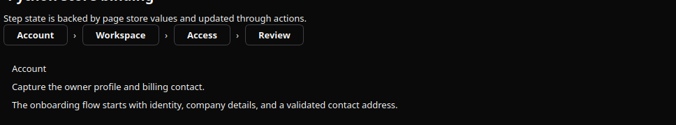
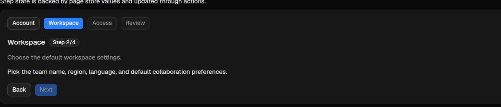

# Wizard

[<- Back to Complex Components](./index.md)

## Purpose

`Wizard` renders a multi-step workflow with a step bar, current-step content, optional previous/next controls, and action hooks for navigation.

The component stores navigation state in `active_step_id` and completion state in `validated_steps`. The renderer emits navigation actions, but the action decides whether the user can move forward. To lock the next step until the current step is complete, keep the current id out of `validated_steps` until a validation action adds it.

## Constructor

```python
Wizard(
    id: str,
    steps: list[dict] | None = None,
    *,
    active_step_id: str = "",
    validated_steps: list[str] | None = None,
    action: str | ActionSpec = "",
    params: dict | None = None,
    allow_step_click: bool = True,
    show_controls: bool = True,
    prev_label: str = "Previous",
    next_label: str = "Next",
)
```

## Properties

| Property | Type | Default | Description |
|---|---:|---:|---|
| `steps` | `list[Step]` | `[]` | Ordered step definitions. |
| `active_step_id` | `str` | `""` | Current step id. If empty, renderers use the first step. |
| `validated_steps` | `list[str]` | `[]` | Step ids completed by action logic. Use this list to unlock forward navigation. |
| `action` | `str` or `ActionSpec` | `""` | Action used by internal step buttons and previous/next controls. |
| `params` | `dict` | `{}` | Extra context sent with wizard actions. Include `wizard_id` or `target_wizard` when multiple wizards share the same action. |
| `allow_step_click` | `bool` | `true` | Enables direct click on step headers. Action logic should still block locked forward jumps. |
| `show_controls` | `bool` | `true` | Shows or hides the built-in previous/next controls. |
| `prev_label` | `str` | `"Previous"` | Previous button label. |
| `next_label` | `str` | `"Next"` | Next button label. |

## Step Definition

| Field | Type | Description |
|---|---:|---|
| `id` | `str` | Stable step id. Required for state updates. |
| `title` | `str` | Label shown in the step bar and current-step title. |
| `description` | `str` | Optional descriptive text for the active step. |
| `content` | `str` | Optional body text for the active step. |
| `status` | `str` | Optional renderer hint such as `current`, `done`, `pending`, or `locked`. |

## Navigation and Unlocking

`Wizard` does not automatically validate a step. Runtime navigation should treat the component as a small client-side state machine:

1. `Validate current` adds `active_step_id` to `validated_steps`.
2. `Next` advances only when the current `active_step_id` is already in `validated_steps`.
3. Direct step clicks can go backward, but forward jumps are allowed only when every previous step is validated.
4. Backend actions should read the current state with `sdk.effects.ask_current_component_props(...)`.
5. Backend actions should write the next state with `sdk.effects.ui_property_update(...)`.

For cross-client internal controls, use an action name ending in `wizard_dispatch` and expose matching concrete actions with the same prefix: `wizard_next`, `wizard_prev`, and `wizard_go_to`. The demo uses `components.test_wizard_dispatch`, `components.test_wizard_next`, `components.test_wizard_prev`, and `components.test_wizard_go_to`.

## Basic Example

<div class="docs-code-group" data-code-group>
  <div class="docs-code-group__tabs" role="tablist" aria-label="Wizard example">
    <button class="docs-code-group__tab" type="button" role="tab" data-code-group-tab data-target="wizard-example-python" data-active="true" aria-selected="true">Python</button>
    <button class="docs-code-group__tab" type="button" role="tab" data-code-group-tab data-target="wizard-example-yaml" aria-selected="false">YAML</button>
  </div>
  <div class="docs-code-group__panel" id="wizard-example-python" data-code-group-panel data-active="true">
    <div class="language-python highlight"><pre><code>steps = [
    {
        "id": "profile",
        "title": "Account",
        "description": "Capture the owner profile and billing contact.",
        "content": "The onboarding flow starts with identity, company details, and a validated contact address.",
    },
    {
        "id": "workspace",
        "title": "Workspace",
        "description": "Choose the default workspace settings.",
        "content": "Pick the team name, region, language, and default collaboration preferences.",
    },
    {
        "id": "access",
        "title": "Access",
        "description": "Invite team members and assign initial roles.",
        "content": "Review administrator access, reviewer seats, and audit visibility before launch.",
    },
    {
        "id": "review",
        "title": "Review",
        "description": "Confirm the configuration before activation.",
        "content": "The final step summarizes all choices and keeps launch locked until earlier steps are validated.",
    },
]

wizard = sdk.ui.Wizard(
    "wizard_inline",
    steps=steps,
    active_step_id="profile",
    validated_steps=[],
    action="components.test_wizard_dispatch",
    params={"wizard_id": "wizard_inline", "target_wizard": "wizard_inline"},
    allow_step_click=True,
    show_controls=True,
    prev_label="Back",
    next_label="Next",
)
wizard.set_required_permissions(["components.navigation.view"])</code></pre></div>
  </div>
  <div class="docs-code-group__panel" id="wizard-example-yaml" data-code-group-panel hidden>
    <div class="language-yaml highlight"><pre><code>- kind: Wizard
  id: wizard_inline
  steps:
    - id: profile
      title: Account
      description: Capture the owner profile and billing contact.
      content: The onboarding flow starts with identity, company details, and a validated contact address.
    - id: workspace
      title: Workspace
      description: Choose the default workspace settings.
      content: Pick the team name, region, language, and default collaboration preferences.
    - id: access
      title: Access
      description: Invite team members and assign initial roles.
      content: Review administrator access, reviewer seats, and audit visibility before launch.
    - id: review
      title: Review
      description: Confirm the configuration before activation.
      content: The final step summarizes all choices and keeps launch locked until earlier steps are validated.
  active_step_id: profile
  validated_steps: []
  action: components.test_wizard_dispatch
  params: {wizard_id: wizard_inline, target_wizard: wizard_inline}
  allow_step_click: true
  show_controls: true
  prev_label: Back
  next_label: Next
  required_permissions: [components.navigation.view]</code></pre></div>
  </div>
</div>

## Runtime Updates

Use literal/YAML values to seed `steps`, `active_step_id`, and `validated_steps`. For runtime navigation, update the Wizard directly. Store/data bindings are not the recommended runtime state channel for `active_step_id` and `validated_steps`, because the Wizard combines interaction state, validation gates, and internal controls.

<div class="docs-code-group" data-code-group>
  <div class="docs-code-group__tabs" role="tablist" aria-label="Wizard runtime example">
    <button class="docs-code-group__tab" type="button" role="tab" data-code-group-tab data-target="wizard-runtime-python" data-active="true" aria-selected="true">Python</button>
    <button class="docs-code-group__tab" type="button" role="tab" data-code-group-tab data-target="wizard-runtime-yaml" aria-selected="false">YAML</button>
  </div>
  <div class="docs-code-group__panel" id="wizard-runtime-python" data-code-group-panel data-active="true">
    <div class="language-python highlight"><pre><code>live_wizard = sdk.ui.Wizard(
    "wizard_live",
    steps=steps,
    active_step_id="profile",
    validated_steps=[],
    action="components.test_wizard_dispatch",
    params={"target_wizard": "wizard_live"},
)
live_wizard.allow("steps.set", "active_step_id.set", "validated_steps.set")</code></pre></div>
  </div>
  <div class="docs-code-group__panel" id="wizard-runtime-yaml" data-code-group-panel hidden>
    <div class="language-yaml highlight"><pre><code>- kind: Wizard
  id: wizard_live
  steps:
    - id: profile
      title: Account
      description: Capture the owner profile and billing contact.
    - id: workspace
      title: Workspace
      description: Choose the default workspace settings.
  active_step_id: profile
  validated_steps: []
  action: components.test_wizard_dispatch
  params: {target_wizard: wizard_live}
  capabilities: [steps.set, active_step_id.set, validated_steps.set]</code></pre></div>
  </div>
</div>

Runtime actions read the current component state from the client, then write the next state directly:

```python
surface_id = ctx["_surface_id"]
stream_id = ctx["_stream_id"]
wizard_id = ctx["target_wizard"]

props = await sdk.effects.ask_current_component_props(
    stream_id,
    wizard_id,
    surface_id=surface_id,
)
steps = props["steps"]
validated_steps = [*props["validated_steps"], props["active_step_id"]]

return sdk.effects.respond(
    sdk.effects.ui_property_update(wizard_id, "steps", steps, surface_id=surface_id),
    sdk.effects.ui_property_update(wizard_id, "active_step_id", "workspace", surface_id=surface_id),
    sdk.effects.ui_property_update(wizard_id, "validated_steps", validated_steps, surface_id=surface_id),
)
```

## Mutable Capabilities

`Wizard` has no mutable capabilities by default. Add only the capabilities needed by the actions that update it.

| Capability | Effect |
|---|---|
| `steps.set` | Replaces the full step list. |
| `steps.append` | Appends a step definition. |
| `steps.remove` | Removes a step definition. |
| `steps.replace` | Replaces a step definition. |
| `active_step_id.set` | Changes the active step. |
| `validated_steps.set` | Replaces the validated step id list. |
| `allow_step_click.set` | Enables or disables clickable step headers. |
| `show_controls.set` | Shows or hides previous/next controls. |
| `prev_label.set` | Replaces the previous button label. |
| `next_label.set` | Replaces the next button label. |

## Visibility and Permissions

`Wizard` supports common visibility and permission properties. Use real bindings when actions must toggle visibility at runtime.

<div class="docs-code-group" data-code-group>
  <div class="docs-code-group__tabs" role="tablist" aria-label="Wizard visibility example">
    <button class="docs-code-group__tab" type="button" role="tab" data-code-group-tab data-target="wizard-visibility-python" data-active="true" aria-selected="true">Python</button>
    <button class="docs-code-group__tab" type="button" role="tab" data-code-group-tab data-target="wizard-visibility-yaml" aria-selected="false">YAML</button>
  </div>
  <div class="docs-code-group__panel" id="wizard-visibility-python" data-code-group-panel data-active="true">
    <div class="language-python highlight"><pre><code>wizard.set_show_if({
    "conditions": [
        {
            "left": bound.store("/components_test/wizard/show", scope="page", default=True),
            "op": "==",
            "right": True,
        }
    ]
})
wizard.set_hide_if({
    "conditions": [
        {
            "left": bound.store("/components_test/wizard/hide", scope="page", default=False),
            "op": "==",
            "right": True,
        }
    ]
})
wizard.set_required_permissions(["components.navigation.view"])</code></pre></div>
  </div>
  <div class="docs-code-group__panel" id="wizard-visibility-yaml" data-code-group-panel hidden>
    <div class="language-yaml highlight"><pre><code>- kind: Wizard
  id: wizard_guarded
  steps: []
  required_permissions: [components.navigation.view]
  show_if:
    conditions:
      - left: {type: store, scope: page, path: /components_test/wizard/show, default: true}
        op: "=="
        right: true
  hide_if:
    conditions:
      - left: {type: store, scope: page, path: /components_test/wizard/hide, default: false}
        op: "=="
        right: true</code></pre></div>
  </div>
</div>

## Action Confirmation

Use `action.confirm` to ask for confirmation before a wizard control dispatches its action. Confirmation text should use translation keys.

<div class="docs-code-group" data-code-group>
  <div class="docs-code-group__tabs" role="tablist" aria-label="Wizard confirm example">
    <button class="docs-code-group__tab" type="button" role="tab" data-code-group-tab data-target="wizard-confirm-python" data-active="true" aria-selected="true">Python</button>
    <button class="docs-code-group__tab" type="button" role="tab" data-code-group-tab data-target="wizard-confirm-yaml" aria-selected="false">YAML</button>
  </div>
  <div class="docs-code-group__panel" id="wizard-confirm-python" data-code-group-panel data-active="true">
    <div class="language-python highlight"><pre><code>wizard = sdk.ui.Wizard(
    "wizard_confirm",
    steps=steps,
    active_step_id="profile",
    validated_steps=["profile"],
    action={
        "name": "components.wizard_confirm_action",
        "context": {"source": "python_wizard"},
        "confirm": {
            "text": sdk.i18n.t("components.wizard.confirm.prompt"),
            "confirm_text": sdk.i18n.t("components.wizard.confirm.accept"),
            "cancel_text": sdk.i18n.t("components.wizard.confirm.cancel"),
        },
    },
    params={"wizard_id": "wizard_confirm"},
)</code></pre></div>
  </div>
  <div class="docs-code-group__panel" id="wizard-confirm-yaml" data-code-group-panel hidden>
    <div class="language-yaml highlight"><pre><code>- kind: Wizard
  id: wizard_confirm
  steps:
    - id: profile
      title: Profile
    - id: review
      title: Review
  active_step_id: profile
  validated_steps: [profile]
  action:
    name: components.wizard_confirm_action
    context:
      source: yaml_wizard
    confirm:
      text: "@t/components.wizard.confirm.prompt"
      confirm_text: "@t/components.wizard.confirm.accept"
      cancel_text: "@t/components.wizard.confirm.cancel"
  params:
    wizard_id: wizard_confirm</code></pre></div>
  </div>
</div>

## Screenshots

Desktop preview:



Web preview:


