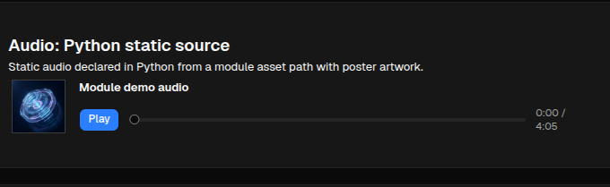
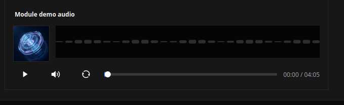

# Audio

[<- Back to Content Components](./index.md)

`Audio` renders an audio player for module assets, runtime media URLs, proxied external URLs, or other client-safe audio sources. Use it when the interface must play short clips, alerts, or longer tracks.

## Python Contract

```python
sdk.ui.Audio(
    id: str,
    source: Any = "",
    title: Any = "",
    autoplay: bool = False,
    muted: bool = False,
    loop: bool = False,
    controls: bool = True,
    poster: Any = "",
    width: int = 640,
    height: int = 180,
)
```

`source`, `title`, and `poster` accept literal values or bindings from the constructor.

## Supported Properties

| Property | Type | Required | Python | YAML | Notes |
|---|---|---|---|---|---|
| `id` | `str` | yes | yes | yes | Stable component id |
| `source` | `str | binding` | no | constructor / `source.set` | yes | Audio source URL or module asset path |
| `title` | `str | binding` | no | constructor / `title.set` | yes | Visible player label |
| `autoplay` | `bool` | no | constructor / `autoplay.set` | yes | Starts playback automatically when allowed by the client |
| `muted` | `bool` | no | constructor / `muted.set` | yes | Starts muted |
| `loop` | `bool` | no | constructor / `loop.set` | yes | Replays after end of track |
| `controls` | `bool` | no | constructor | yes | Hides or shows playback controls |
| `poster` | `str | binding` | no | constructor / `poster.set` | yes | Optional artwork shown in the player |
| `width` | `int` | no | constructor | yes | Default `640` |
| `height` | `int` | no | constructor | yes | Default `180` |
| `show_if` | rule | no | yes | yes | Generic visibility rule |
| `hide_if` | rule | no | yes | yes | Generic visibility rule |
| `required_permissions` | `list[str]` | no | yes | yes | Generic permission gate |

## Static Example

<div class="docs-code-group" data-code-group>
  <div class="docs-code-group__tabs" role="tablist" aria-label="Audio static example">
    <button class="docs-code-group__tab" type="button" role="tab" data-code-group-tab data-target="audio-static-python" data-active="true" aria-selected="true">Python</button>
    <button class="docs-code-group__tab" type="button" role="tab" data-code-group-tab data-target="audio-static-yaml" aria-selected="false">YAML</button>
  </div>
  <div class="docs-code-group__panel" id="audio-static-python" data-code-group-panel data-active="true">
    <div class="language-python highlight"><pre><code>builder.add(
    sdk.ui.Audio(
        "components_test_audio_static",
        source="assets/test.mp3",
        title="T-Rex Roar",
        controls=True,
        width=520,
        height=150,
    )
)</code></pre></div>
  </div>
  <div class="docs-code-group__panel" id="audio-static-yaml" data-code-group-panel hidden>
    <div class="language-yaml highlight"><pre><code>- kind: Audio
  id: components_test_audio_yaml_static
  source: "assets/test.mp3"
  title: "T-Rex Roar"
  controls: true
  width: 520
  height: 150</code></pre></div>
  </div>
</div>

## Store Binding

<div class="docs-code-group" data-code-group>
  <div class="docs-code-group__tabs" role="tablist" aria-label="Audio store binding example">
    <button class="docs-code-group__tab" type="button" role="tab" data-code-group-tab data-target="audio-store-python" data-active="true" aria-selected="true">Python</button>
    <button class="docs-code-group__tab" type="button" role="tab" data-code-group-tab data-target="audio-store-yaml" aria-selected="false">YAML</button>
  </div>
  <div class="docs-code-group__panel" id="audio-store-python" data-code-group-panel data-active="true">
    <div class="language-python highlight"><pre><code>from democrai.sdk.ui import bound

builder.add(
    sdk.ui.Audio(
        "components_test_audio_store",
        source=bound.store("/components_test/audio/source", scope="page", default="assets/test.mp3"),
        title=bound.store("/components_test/audio/title", scope="page", default="T-Rex Roar"),
        controls=True,
        width=520,
        height=150,
    )
)</code></pre></div>
  </div>
  <div class="docs-code-group__panel" id="audio-store-yaml" data-code-group-panel hidden>
    <div class="language-yaml highlight"><pre><code>- kind: Audio
  id: components_test_audio_yaml_store
  source: {type: store, scope: page, path: /components_test/audio/source, default: "assets/test.mp3"}
  title: {type: store, scope: page, path: /components_test/audio/title, default: "T-Rex Roar"}
  controls: true
  width: 520
  height: 150</code></pre></div>
  </div>
</div>

## Data Model Binding

<div class="docs-code-group" data-code-group>
  <div class="docs-code-group__tabs" role="tablist" aria-label="Audio data model binding example">
    <button class="docs-code-group__tab" type="button" role="tab" data-code-group-tab data-target="audio-data-python" data-active="true" aria-selected="true">Python</button>
    <button class="docs-code-group__tab" type="button" role="tab" data-code-group-tab data-target="audio-data-yaml" aria-selected="false">YAML</button>
  </div>
  <div class="docs-code-group__panel" id="audio-data-python" data-code-group-panel data-active="true">
    <div class="language-python highlight"><pre><code>from democrai.sdk.ui import bound

builder.add(
    sdk.ui.Audio(
        "components_test_audio_data",
        source=bound.data("/components_test/audio_model/source", default="assets/test.mp3"),
        title=bound.data("/components_test/audio_model/title", default="T-Rex Roar"),
        controls=True,
        width=520,
        height=150,
    )
)</code></pre></div>
  </div>
  <div class="docs-code-group__panel" id="audio-data-yaml" data-code-group-panel hidden>
    <div class="language-yaml highlight"><pre><code>- kind: Audio
  id: components_test_audio_yaml_data
  source: "@data/components_test/audio_model/source"
  title: "@data/components_test/audio_model/title"
  controls: true
  width: 520
  height: 150</code></pre></div>
  </div>
</div>

## Direct Property Update

Declare `source.set` and `title.set` before an action sends direct updates to the rendered player.

<div class="docs-code-group" data-code-group>
  <div class="docs-code-group__tabs" role="tablist" aria-label="Audio property update example">
    <button class="docs-code-group__tab" type="button" role="tab" data-code-group-tab data-target="audio-update-python" data-active="true" aria-selected="true">Python</button>
    <button class="docs-code-group__tab" type="button" role="tab" data-code-group-tab data-target="audio-update-yaml" aria-selected="false">YAML</button>
  </div>
  <div class="docs-code-group__panel" id="audio-update-python" data-code-group-panel data-active="true">
    <div class="language-python highlight"><pre><code>builder.add(
    sdk.ui.Audio(
        "components_test_audio_live",
        source="assets/test.mp3",
        title="T-Rex Roar",
        controls=True,
        width=520,
        height=150,
    ).allow("source.set", "title.set")
)

builder.add(
    sdk.ui.Button(
        "components_test_audio_set_alt_btn",
        "Set alternate",
        action="components.media_test_set",
        params={"component": "audio", "state_key": "alternate"},
        variant="default",
    )
)</code></pre></div>
  </div>
  <div class="docs-code-group__panel" id="audio-update-yaml" data-code-group-panel hidden>
    <div class="language-yaml highlight"><pre><code>- kind: Audio
  id: components_test_audio_yaml_live
  source: "assets/test.mp3"
  title: "T-Rex Roar"
  controls: true
  width: 520
  height: 150
  capabilities: [source.set, title.set]
- kind: Button
  id: components_test_audio_yaml_set_alt_btn
  label: "Set alternate"
  variant: default
  action: components.media_test_set
  params: {component: audio, state_key: alternate}</code></pre></div>
  </div>
</div>

The action must target the current surface when it builds property updates:

```python
surface_id = str(ctx.get("_surface_id") or "main").strip() or "main"
sdk.effects.ui_property_update(
    "components_test_audio_live",
    "source",
    "assets/test2.mp3",
    surface_id=surface_id,
)
```

## Visibility Rules

<div class="docs-code-group" data-code-group>
  <div class="docs-code-group__tabs" role="tablist" aria-label="Audio visibility example">
    <button class="docs-code-group__tab" type="button" role="tab" data-code-group-tab data-target="audio-visibility-python" data-active="true" aria-selected="true">Python</button>
    <button class="docs-code-group__tab" type="button" role="tab" data-code-group-tab data-target="audio-visibility-yaml" aria-selected="false">YAML</button>
  </div>
  <div class="docs-code-group__panel" id="audio-visibility-python" data-code-group-panel data-active="true">
    <div class="language-python highlight"><pre><code>show_if = sdk.ui.Audio(
    "components_test_audio_show_if",
    source="assets/test.mp3",
    title="show_if visible",
    width=520,
    height=150,
)
show_if.set_show_if({
    "conditions": [{
        "left": bound.store("/components_test/visibility/audio_show", scope="page", default=True),
        "op": "==",
        "right": True,
    }]
})
builder.add(show_if)

hide_if = sdk.ui.Audio(
    "components_test_audio_hide_if",
    source="assets/test.mp3",
    title="hide_if visible",
    width=520,
    height=150,
)
hide_if.set_hide_if({
    "conditions": [{
        "left": bound.store("/components_test/visibility/audio_hide", scope="page", default=False),
        "op": "==",
        "right": True,
    }]
})
builder.add(hide_if)

gated = sdk.ui.Audio(
    "components_test_audio_required_permissions",
    source="assets/test.mp3",
    title="required_permissions gate",
    width=520,
    height=150,
)
gated.set_required_permissions(["components.media.visibility"])
builder.add(gated)</code></pre></div>
  </div>
  <div class="docs-code-group__panel" id="audio-visibility-yaml" data-code-group-panel hidden>
    <div class="language-yaml highlight"><pre><code>- kind: Audio
  id: components_test_audio_yaml_show_if
  source: "assets/test.mp3"
  title: "show_if visible"
  width: 520
  height: 150
  show_if:
    conditions:
      - left: {type: store, scope: page, path: /components_test/visibility/audio_show, default: true}
        op: "=="
        right: true
- kind: Audio
  id: components_test_audio_yaml_hide_if
  source: "assets/test.mp3"
  title: "hide_if visible"
  width: 520
  height: 150
  hide_if:
    conditions:
      - left: {type: store, scope: page, path: /components_test/visibility/audio_hide, default: false}
        op: "=="
        right: true
- kind: Audio
  id: components_test_audio_yaml_required_permissions
  source: "assets/test.mp3"
  title: "required_permissions gate"
  width: 520
  height: 150
  required_permissions: [components.media.visibility]</code></pre></div>
  </div>
</div>

The test page updates the observed store flags with the same action used by Python and YAML declarations:

<div class="docs-code-group" data-code-group>
  <div class="docs-code-group__tabs" role="tablist" aria-label="Audio visibility controls example">
    <button class="docs-code-group__tab" type="button" role="tab" data-code-group-tab data-target="audio-visibility-controls-python" data-active="true" aria-selected="true">Python</button>
    <button class="docs-code-group__tab" type="button" role="tab" data-code-group-tab data-target="audio-visibility-controls-yaml" aria-selected="false">YAML</button>
  </div>
  <div class="docs-code-group__panel" id="audio-visibility-controls-python" data-code-group-panel data-active="true">
    <div class="language-python highlight"><pre><code>builder.add(
    sdk.ui.Button(
        "components_test_audio_show_off_btn",
        "Hide show_if",
        action="components.media_test_visibility_set",
        params={"component": "audio", "flag": "show", "value": False},
        variant="default",
    )
)
builder.add(
    sdk.ui.Button(
        "components_test_audio_hide_on_btn",
        "Hide hide_if",
        action="components.media_test_visibility_set",
        params={"component": "audio", "flag": "hide", "value": True},
        variant="default",
    )
)</code></pre></div>
  </div>
  <div class="docs-code-group__panel" id="audio-visibility-controls-yaml" data-code-group-panel hidden>
    <div class="language-yaml highlight"><pre><code>- kind: Button
  id: components_test_audio_yaml_show_off_btn
  label: "Hide show_if"
  variant: default
  action: components.media_test_visibility_set
  params: {component: audio, flag: show, value: false}
- kind: Button
  id: components_test_audio_yaml_hide_on_btn
  label: "Hide hide_if"
  variant: default
  action: components.media_test_visibility_set
  params: {component: audio, flag: hide, value: true}</code></pre></div>
  </div>
</div>

## Screenshots

### Web



### Desktop



## Path Resolution

- Module asset paths such as `assets/test.mp3` and `assets/test2.mp3` resolve to media routes for the active module.
- `assets/protected/...` resolves to the same module media route but requires an authenticated user before the asset is served.
- `/media/...` is already a client-facing media path and is used as-is by the clients.
- `http://...` and `https://...` are external URLs. On web they are resolved through the media proxy when they are outside the core origin.

## Usage Guidance

- Use module asset paths for packaged audio shipped with the module.
- Use store bindings when source or title must follow page or global client state.
- Use data model bindings when the player follows the surface data model.
- Use runtime property updates for source and title changes without a full rerender.
