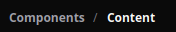

# Breadcrumb

[<- Back to Content Components](./index.md)

## Definition

`Breadcrumb` renders hierarchical route or location context as a sequence of segments.

## Scope

Use `Breadcrumb` when the user needs to understand where the current view sits inside a hierarchy. It is content/navigation context, not a layout container.

Segments with a `path` are clickable unless they are marked as current. Clicking a non-current segment dispatches navigation to that path.



## Properties

| Property | Type | Default | Notes |
|---|---|---|---|
| `segments` | `list[dict]` | `[]` | Ordered breadcrumb segments. Supports binding and direct updates. |
| `separator` | `string` | `"/"` | Text separator between segments. |
| `style` | `string` | client default | Standard style property. |

Each segment can include:

| Field | Type | Notes |
|---|---|---|
| `label` | `string | binding` | Display text. |
| `path` | `string | binding` | Navigation target for non-current segments. |
| `current` | `bool | binding` | Marks the current segment. The last segment is treated as current when omitted. |

## Static Segments

<div class="docs-code-group" data-code-group>
  <div class="docs-code-group__tabs" role="tablist" aria-label="Breadcrumb static example">
    <button class="docs-code-group__tab" type="button" role="tab" data-code-group-tab data-target="breadcrumb-static-python" data-active="true" aria-selected="true">Python</button>
    <button class="docs-code-group__tab" type="button" role="tab" data-code-group-tab data-target="breadcrumb-static-yaml" aria-selected="false">YAML</button>
  </div>
  <div class="docs-code-group__panel" id="breadcrumb-static-python" data-code-group-panel data-active="true">
    <div class="language-python highlight"><pre><code>breadcrumb = sdk.ui.Breadcrumb(
    "page_breadcrumb",
    segments=[
        {"label": "Components", "path": "/components"},
        {"label": "Content", "current": True},
    ],
    separator="/",
)
builder.add(breadcrumb)</code></pre></div>
  </div>
  <div class="docs-code-group__panel" id="breadcrumb-static-yaml" data-code-group-panel hidden>
    <div class="language-yaml highlight"><pre><code>- kind: Breadcrumb
  id: page_breadcrumb
  separator: /
  segments:
    - label: "Components"
      path: "/components"
    - label: "Content"
      current: true</code></pre></div>
  </div>
</div>

## Store Binding

Bind `segments` when the breadcrumb trail is driven by page or global store state.

<div class="docs-code-group" data-code-group>
  <div class="docs-code-group__tabs" role="tablist" aria-label="Breadcrumb store binding example">
    <button class="docs-code-group__tab" type="button" role="tab" data-code-group-tab data-target="breadcrumb-store-python" data-active="true" aria-selected="true">Python</button>
    <button class="docs-code-group__tab" type="button" role="tab" data-code-group-tab data-target="breadcrumb-store-yaml" aria-selected="false">YAML</button>
  </div>
  <div class="docs-code-group__panel" id="breadcrumb-store-python" data-code-group-panel data-active="true">
    <div class="language-python highlight"><pre><code>default_segments = [
    {"label": "Components", "path": "/components"},
    {"label": "Content", "current": True},
]
builder.set_store("/components_test/breadcrumb/segments", default_segments, scope="page")

breadcrumb = sdk.ui.Breadcrumb(
    "page_breadcrumb",
    segments=bound.store(
        "/components_test/breadcrumb/segments",
        scope="page",
        default=default_segments,
    ),
)
builder.add(breadcrumb)</code></pre></div>
  </div>
  <div class="docs-code-group__panel" id="breadcrumb-store-yaml" data-code-group-panel hidden>
    <div class="language-yaml highlight"><pre><code>- kind: Breadcrumb
  id: page_breadcrumb
  segments:
    type: store
    scope: page
    path: /components_test/breadcrumb/segments
    default:
      - label: "Components"
        path: "/components"
      - label: "Content"
        current: true</code></pre></div>
  </div>
</div>

## Data Model Binding

Use data-model binding when the breadcrumb trail belongs to the current surface data.

<div class="docs-code-group" data-code-group>
  <div class="docs-code-group__tabs" role="tablist" aria-label="Breadcrumb data model binding example">
    <button class="docs-code-group__tab" type="button" role="tab" data-code-group-tab data-target="breadcrumb-data-python" data-active="true" aria-selected="true">Python</button>
    <button class="docs-code-group__tab" type="button" role="tab" data-code-group-tab data-target="breadcrumb-data-yaml" aria-selected="false">YAML</button>
  </div>
  <div class="docs-code-group__panel" id="breadcrumb-data-python" data-code-group-panel data-active="true">
    <div class="language-python highlight"><pre><code>default_segments = [
    {"label": "Components", "path": "/components"},
    {"label": "Content", "current": True},
]
builder.set_data("/components_test/breadcrumb_model/segments", default_segments)

breadcrumb = sdk.ui.Breadcrumb(
    "page_breadcrumb",
    segments=bound.data(
        "/components_test/breadcrumb_model/segments",
        default=default_segments,
    ),
)
builder.add(breadcrumb)</code></pre></div>
  </div>
  <div class="docs-code-group__panel" id="breadcrumb-data-yaml" data-code-group-panel hidden>
    <div class="language-yaml highlight"><pre><code>- kind: Breadcrumb
  id: page_breadcrumb
  segments: "@data/components_test/breadcrumb_model/segments"</code></pre></div>
  </div>
</div>

## Property Updates

Declare capabilities before replacing `segments` directly.

<div class="docs-code-group" data-code-group>
  <div class="docs-code-group__tabs" role="tablist" aria-label="Breadcrumb property update example">
    <button class="docs-code-group__tab" type="button" role="tab" data-code-group-tab data-target="breadcrumb-update-python" data-active="true" aria-selected="true">Python</button>
    <button class="docs-code-group__tab" type="button" role="tab" data-code-group-tab data-target="breadcrumb-update-yaml" aria-selected="false">YAML</button>
  </div>
  <div class="docs-code-group__panel" id="breadcrumb-update-python" data-code-group-panel data-active="true">
    <div class="language-python highlight"><pre><code>breadcrumb = sdk.ui.Breadcrumb("page_breadcrumb", segments=[
    {"label": "Components", "path": "/components"},
    {"label": "Content", "current": True},
])
breadcrumb.allow("segments.set")
builder.add(breadcrumb)</code></pre></div>
  </div>
  <div class="docs-code-group__panel" id="breadcrumb-update-yaml" data-code-group-panel hidden>
    <div class="language-yaml highlight"><pre><code>- kind: Breadcrumb
  id: page_breadcrumb
  capabilities: [segments.set]
  segments:
    - label: "Components"
      path: "/components"
    - label: "Content"
      current: true</code></pre></div>
  </div>
</div>

The action can update store, data model, and the live breadcrumb:

```python
surface_id = ctx["_surface_id"]
segments = [
    {"label": "Components", "path": "/components"},
    {"label": "Content", "path": "/components/content"},
    {"label": "Breadcrumb", "current": True},
]

return sdk.effects.respond(
    sdk.effects.ui_messages([
        {"stateUpdate": {"scope": "page", "values": {"/components_test/breadcrumb/segments": segments}}},
        sdk.ui.Builder.build_data_model_update_payload(
            surface_id=surface_id,
            data={"components_test": {"breadcrumb_model": {"segments": segments}}},
        ),
    ]),
    sdk.effects.ui_property_update(
        "page_breadcrumb",
        "segments",
        segments,
        surface_id=surface_id,
    ),
)
```

## Visibility And Permissions

`show_if`, `hide_if`, and `required_permissions` are available on `Breadcrumb`.

<div class="docs-code-group" data-code-group>
  <div class="docs-code-group__tabs" role="tablist" aria-label="Breadcrumb visibility example">
    <button class="docs-code-group__tab" type="button" role="tab" data-code-group-tab data-target="breadcrumb-visibility-python" data-active="true" aria-selected="true">Python</button>
    <button class="docs-code-group__tab" type="button" role="tab" data-code-group-tab data-target="breadcrumb-visibility-yaml" aria-selected="false">YAML</button>
  </div>
  <div class="docs-code-group__panel" id="breadcrumb-visibility-python" data-code-group-panel data-active="true">
    <div class="language-python highlight"><pre><code>breadcrumb.set_show_if({
    "conditions": [
        {"left": bound.store("/components_test/visibility/breadcrumb_show", scope="page", default=True), "op": "==", "right": True}
    ]
})

breadcrumb.set_hide_if({
    "conditions": [
        {"left": bound.store("/components_test/visibility/breadcrumb_hide", scope="page", default=False), "op": "==", "right": True}
    ]
})

breadcrumb.set_required_permissions(["components.content.view"])</code></pre></div>
  </div>
  <div class="docs-code-group__panel" id="breadcrumb-visibility-yaml" data-code-group-panel hidden>
    <div class="language-yaml highlight"><pre><code>- kind: Breadcrumb
  id: breadcrumb_show_if
  show_if:
    conditions:
      - left: {type: store, scope: page, path: /components_test/visibility/breadcrumb_show, default: true}
        op: "=="
        right: true
  segments:
    - label: "Components"
      path: "/components"
    - label: "show_if"
      current: true

- kind: Breadcrumb
  id: breadcrumb_hide_if
  hide_if:
    conditions:
      - left: {type: store, scope: page, path: /components_test/visibility/breadcrumb_hide, default: false}
        op: "=="
        right: true
  segments:
    - label: "Components"
      path: "/components"
    - label: "hide_if"
      current: true

- kind: Breadcrumb
  id: breadcrumb_required_permissions
  required_permissions: [components.content.view]
  segments:
    - label: "Components"
      path: "/components"
    - label: "required_permissions"
      current: true</code></pre></div>
  </div>
</div>

## Notes

- The last segment is rendered as current when no segment has `current: true`.
- Use `path` only on segments that should navigate.
- Segment labels and paths can be literal values or resolved bindings.
