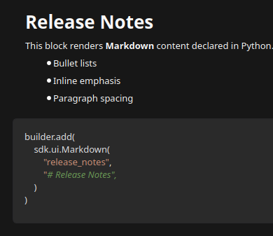
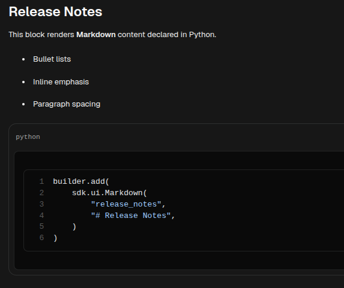

# Markdown

[<- Back to Content Components](./index.md)

`Markdown` renders formatted text blocks from Markdown source. Use it for documentation fragments, release notes, rich helper content, lists, links, and fenced code blocks.

## Python Contract

```python
sdk.ui.Markdown(
    id: str,
    text: Any,
)
```

`text` accepts literal Markdown, store bindings, and data-model bindings from the constructor. When a bound `text` value changes at runtime, desktop and web update the rendered Markdown without requiring a full page render.

## Supported Properties

| Property | Type | Required | Python | YAML | Desktop | Web | Notes |
|---|---|---|---|---|---|---|---|
| `id` | `str` | yes | yes | yes | yes | yes | Stable component id |
| `text` | str or binding | yes | constructor / `text.set` | yes | yes | yes | Markdown source string; supports runtime binding updates |
| `style` | str | no | yes | yes | yes | yes | Inline style string applied to the rendered container |
| `content_style` | str | no | `set_property` | yes | yes | no | Desktop-only style applied to rendered Markdown/code children |
| `show_if` | rule | no | yes | yes | yes | yes | Generic visibility contract |
| `hide_if` | rule | no | yes | yes | yes | yes | Generic visibility contract |
| `required_permissions` | list[str] | no | yes | yes | yes | yes | Generic permission gate |

## Binding Paths

The component test page uses these paths:

- Store: `/components_test/markdown/text`
- Data model: `/components_test/markdown_model/text`
- Visibility store: `/components_test/visibility/markdown_show`, `/components_test/visibility/markdown_hide`

## Static Example

<div class="docs-code-group" data-code-group>
  <div class="docs-code-group__tabs" role="tablist" aria-label="Markdown static example">
    <button class="docs-code-group__tab" type="button" role="tab" data-code-group-tab data-target="markdown-static-python" data-active="true" aria-selected="true">Python</button>
    <button class="docs-code-group__tab" type="button" role="tab" data-code-group-tab data-target="markdown-static-yaml" aria-selected="false">YAML</button>
  </div>
  <div class="docs-code-group__panel" id="markdown-static-python" data-code-group-panel data-active="true">
    <div class="language-python highlight"><pre><code>builder.add(
    sdk.ui.Markdown(
        "components_test_markdown_static",
        "### Static Markdown\n\n- Literal Markdown\n- Rendered rich text",
    )
)</code></pre></div>
  </div>
  <div class="docs-code-group__panel" id="markdown-static-yaml" data-code-group-panel hidden>
    <div class="language-yaml highlight"><pre><code>- kind: Markdown
  id: components_test_markdown_yaml_static
  text: |
    ### Static Markdown

    - Literal Markdown
    - Rendered rich text</code></pre></div>
  </div>
</div>

## Store Binding Example

<div class="docs-code-group" data-code-group>
  <div class="docs-code-group__tabs" role="tablist" aria-label="Markdown store binding example">
    <button class="docs-code-group__tab" type="button" role="tab" data-code-group-tab data-target="markdown-store-python" data-active="true" aria-selected="true">Python</button>
    <button class="docs-code-group__tab" type="button" role="tab" data-code-group-tab data-target="markdown-store-yaml" aria-selected="false">YAML</button>
  </div>
  <div class="docs-code-group__panel" id="markdown-store-python" data-code-group-panel data-active="true">
    <div class="language-python highlight"><pre><code>from democrai.sdk.ui import bound

builder.add(
    sdk.ui.Markdown(
        "components_test_markdown_store",
        bound.store(
            "/components_test/markdown/text",
            scope="page",
            default="### Store Markdown\n\nContent follows page store.",
        ),
    )
)</code></pre></div>
  </div>
  <div class="docs-code-group__panel" id="markdown-store-yaml" data-code-group-panel hidden>
    <div class="language-yaml highlight"><pre><code>- kind: Markdown
  id: components_test_markdown_yaml_store
  text:
    type: store
    scope: page
    path: /components_test/markdown/text
    default: "### Store Markdown\n\nContent follows page store."</code></pre></div>
  </div>
</div>

## Data Model Binding Example

<div class="docs-code-group" data-code-group>
  <div class="docs-code-group__tabs" role="tablist" aria-label="Markdown data model binding example">
    <button class="docs-code-group__tab" type="button" role="tab" data-code-group-tab data-target="markdown-data-python" data-active="true" aria-selected="true">Python</button>
    <button class="docs-code-group__tab" type="button" role="tab" data-code-group-tab data-target="markdown-data-yaml" aria-selected="false">YAML</button>
  </div>
  <div class="docs-code-group__panel" id="markdown-data-python" data-code-group-panel data-active="true">
    <div class="language-python highlight"><pre><code>builder.add(
    sdk.ui.Markdown(
        "components_test_markdown_data",
        bound.data(
            "/components_test/markdown_model/text",
            default="### Data Markdown\n\nContent follows the surface data model.",
        ),
    )
)</code></pre></div>
  </div>
  <div class="docs-code-group__panel" id="markdown-data-yaml" data-code-group-panel hidden>
    <div class="language-yaml highlight"><pre><code>- kind: Markdown
  id: components_test_markdown_yaml_data
  text: "@data/components_test/markdown_model/text"</code></pre></div>
  </div>
</div>

## Runtime Property Update Example

<div class="docs-code-group" data-code-group>
  <div class="docs-code-group__tabs" role="tablist" aria-label="Markdown runtime update example">
    <button class="docs-code-group__tab" type="button" role="tab" data-code-group-tab data-target="markdown-runtime-python" data-active="true" aria-selected="true">Python</button>
    <button class="docs-code-group__tab" type="button" role="tab" data-code-group-tab data-target="markdown-runtime-yaml" aria-selected="false">YAML</button>
  </div>
  <div class="docs-code-group__panel" id="markdown-runtime-python" data-code-group-panel data-active="true">
    <div class="language-python highlight"><pre><code>builder.add(
    sdk.ui.Markdown(
        "components_test_markdown_live",
        "### Runtime Markdown\n\nDefault content.",
    )
)

builder.add(
    sdk.ui.Button(
        "components_test_markdown_set_alt_btn",
        "Set alternate",
        action="components.content_test_set",
        params={"component": "markdown", "state_key": "alternate"},
        variant="default",
    )
)</code></pre></div>
  </div>
  <div class="docs-code-group__panel" id="markdown-runtime-yaml" data-code-group-panel hidden>
    <div class="language-yaml highlight"><pre><code>- kind: Markdown
  id: components_test_markdown_yaml_live
  text: |
    ### Runtime Markdown

    Default content.
  capabilities: [text.set]

- kind: Button
  id: components_test_markdown_yaml_set_alt_btn
  label: "Set alternate"
  variant: default
  action: components.content_test_set
  params: {component: markdown, state_key: alternate}</code></pre></div>
  </div>
</div>

The action sends a plain Markdown string in the `text` property update. Direct property updates require the component to allow `text.set`; store and data-model binding updates do not require a capability declaration.

```python
surface_id = str(ctx.get("_surface_id") or "main").strip() or "main"
return sdk.effects.respond(
    sdk.effects.ui_property_update(
        "components_test_markdown_live",
        "text",
        "### Updated Markdown\n\n- Data changed\n- Property updated",
        surface_id=surface_id,
    )
)
```

## Visibility And Permissions Example

<div class="docs-code-group" data-code-group>
  <div class="docs-code-group__tabs" role="tablist" aria-label="Markdown visibility example">
    <button class="docs-code-group__tab" type="button" role="tab" data-code-group-tab data-target="markdown-visibility-python" data-active="true" aria-selected="true">Python</button>
    <button class="docs-code-group__tab" type="button" role="tab" data-code-group-tab data-target="markdown-visibility-yaml" aria-selected="false">YAML</button>
  </div>
  <div class="docs-code-group__panel" id="markdown-visibility-python" data-code-group-panel data-active="true">
    <div class="language-python highlight"><pre><code>markdown = sdk.ui.Markdown(
    "components_test_markdown_show_if",
    "### show_if visible\n\nVisibility rule target.",
)
markdown.set_show_if({
    "conditions": [
        {
            "left": bound.store(
                "/components_test/visibility/markdown_show",
                scope="page",
                default=True,
            ),
            "op": "==",
            "right": True,
        }
    ]
})
builder.add(markdown)

gated = sdk.ui.Markdown(
    "components_test_markdown_required_permissions",
    "### required_permissions gate",
)
gated.set_required_permissions(["components.content.visibility"])
builder.add(gated)</code></pre></div>
  </div>
  <div class="docs-code-group__panel" id="markdown-visibility-yaml" data-code-group-panel hidden>
    <div class="language-yaml highlight"><pre><code>- kind: Markdown
  id: components_test_markdown_yaml_show_if
  text: "### show_if visible"
  show_if:
    conditions:
      - left:
          type: store
          scope: page
          path: /components_test/visibility/markdown_show
          default: true
        op: "=="
        right: true

- kind: Markdown
  id: components_test_markdown_yaml_hide_if
  text: "### hide_if visible"
  hide_if:
    conditions:
      - left:
          type: store
          scope: page
          path: /components_test/visibility/markdown_hide
          default: false
        op: "=="
        right: true

- kind: Markdown
  id: components_test_markdown_yaml_required_permissions
  text: "### required_permissions gate"
  required_permissions: [components.content.visibility]</code></pre></div>
  </div>
</div>

Use an action to update the store values observed by `show_if` and `hide_if`.

## Rendered Output

### Desktop



### Web



## Usage Guidance

- Use `Markdown` when the content requires formatting that plain `Text` does not provide.
- Bind `text` from the constructor when Markdown content follows store or data-model state; runtime binding updates refresh the rendered Markdown.
- Declare `text.set` in YAML when direct property updates target the component.
- Use `show_if`, `hide_if`, and `required_permissions` for visibility and authorization gates.
