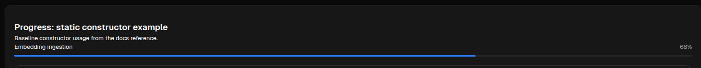

# Progress

[<- Back to Content Components](./index.md)

`Progress` renders a numeric completion state against a maximum. It is the component to use for upload state, ingestion state, task completion, and similar scalar progress bars.

## Python Contract

```python
sdk.ui.Progress(
    id: str,
    value: int = 0,
    maximum: int = 100,
    label: str = "",
    show_label: bool = True,
)
```

SDK-side behavior from the constructor:

- `value` is registered as mutable through `mutable_value("value")`, so the capability contract includes `value.set` and `value.append`.
- `maximum.set` and `label.set` are explicitly enabled.
- `visible.set` and `enabled.set` are enabled through `.interactive()`.
- `show_label.set` is not enabled by the SDK component.
- The constructor serializes the `label` argument as a literal string payload. For a bound label in Python, construct the component first and then call `set_property("label", ...)`.

`value.append` exists because it comes from the generic mutable-scalar helper, but for `Progress` it is not a meaningful operation. Use `value.set`.

## Supported Properties

| Property | Type | Required | Python | YAML | Desktop | Web | Runtime updates | Notes |
|---|---|---|---|---|---|---|---|---|
| `id` | `str` | yes | yes | yes | yes | yes | no | Stable component id |
| `value` | `int` or bound spec | no | yes | yes | yes | yes | yes | Desktop animates value changes |
| `maximum` | `int` or bound spec | no | yes | yes | yes | yes | yes | Web clamps percentage with `max(1, maximum)` |
| `label` | `str` or bound spec | no | yes | yes | yes | yes | yes | In Python, use `set_property("label", bound_spec)` for bound labels |
| `show_label` | `bool` or bound spec | no | yes | yes | yes | yes | partial | Desktop handles it as a surface re-render binding, not as a direct property mutation |
| `style` | `str` | no | yes | yes | yes | yes | yes | Base renderer support on both clients |
| `show_if` | rule | no | yes | yes | yes | yes | store-driven | Generic visibility contract |
| `hide_if` | rule | no | yes | yes | yes | yes | store-driven | Generic visibility contract |
| `required_permissions` | `list[str]` | no | yes | yes | yes | yes | store/auth-driven | Generic visibility contract |
| `capabilities` | `list[str]` | no | yes | yes | yes | yes | n/a | Override only if you need a stricter or broader mutation contract |

## Renderer Notes

Desktop:

- Renders a `QFrame` containing an optional `QLabel` and a `QProgressBar`.
- `value` updates animate the bar from the current value to the target value.
- `maximum` updates call `setRange(0, maximum)`.
- `label` updates change only the text node.
- `show_label` is declared with `SURFACE` binding strategy, so store-bound changes trigger a surface re-render instead of an in-place property patch.

Web:

- Computes `safeMaximum = Math.max(1, Number(maximum) || 100)`.
- Computes `safeValue = clamp(value, 0, safeMaximum)`.
- Shows the label row only when `show_label` is truthy.
- The right-hand percentage label is derived client-side from `value / maximum`.

Cross-client consequence:

- If you change `label`, keep in mind that web also shows the computed percentage next to it.
- If you need to toggle `show_label`, prefer store binding rather than assuming a direct `show_label.set` patch contract.

## Static Example

<div class="docs-code-group" data-code-group>
  <div class="docs-code-group__tabs" role="tablist" aria-label="Progress static example">
    <button class="docs-code-group__tab" type="button" role="tab" data-code-group-tab data-target="progress-static-python" data-active="true" aria-selected="true">Python</button>
    <button class="docs-code-group__tab" type="button" role="tab" data-code-group-tab data-target="progress-static-yaml" aria-selected="false">YAML</button>
  </div>
  <div class="docs-code-group__panel" id="progress-static-python" data-code-group-panel data-active="true">
    <div class="language-python highlight"><pre><code>progress = sdk.ui.Progress(
    "upload_progress",
    value=68,
    maximum=100,
    label="Embedding ingestion",
)</code></pre></div>
  </div>
  <div class="docs-code-group__panel" id="progress-static-yaml" data-code-group-panel hidden>
    <div class="language-yaml highlight"><pre><code>- kind: Progress
  id: upload_progress
  value: 68
  maximum: 100
  label: Embedding ingestion</code></pre></div>
  </div>
</div>

## Rendered Output

Desktop rendering of the static example:


Web rendering of the same static example:



## Store-Bound Example

Use bindings when progress state should be derived from page/global store values rather than patched directly.

<div class="docs-code-group" data-code-group>
  <div class="docs-code-group__tabs" role="tablist" aria-label="Progress store-bound example">
    <button class="docs-code-group__tab" type="button" role="tab" data-code-group-tab data-target="progress-bound-python" data-active="true" aria-selected="true">Python</button>
    <button class="docs-code-group__tab" type="button" role="tab" data-code-group-tab data-target="progress-bound-yaml" aria-selected="false">YAML</button>
  </div>
  <div class="docs-code-group__panel" id="progress-bound-python" data-code-group-panel data-active="true">
    <div class="language-python highlight"><pre><code>from democrai.sdk.ui import bound

builder.set_store("/components_test/progress/value", 25, scope="page")
builder.set_store("/components_test/progress/maximum", 100, scope="page")
builder.set_store("/components_test/progress/label", "Queued", scope="page")
builder.set_store("/components_test/progress/show_label", True, scope="page")

progress = sdk.ui.Progress(
    "bound_progress",
    value=bound.store("/components_test/progress/value", scope="page", default=25),
    maximum=bound.store("/components_test/progress/maximum", scope="page", default=100),
    label="Queued",
    show_label=bound.store("/components_test/progress/show_label", scope="page", default=True),
)
progress.set_property(
    "label",
    bound.store("/components_test/progress/label", scope="page", default="Queued"),
)</code></pre></div>
  </div>
  <div class="docs-code-group__panel" id="progress-bound-yaml" data-code-group-panel hidden>
    <div class="language-yaml highlight"><pre><code>- kind: Progress
  id: bound_progress
  value:
    type: store
    scope: page
    path: /components_test/progress/value
    default: 25
  maximum:
    type: store
    scope: page
    path: /components_test/progress/maximum
    default: 100
  label:
    type: store
    scope: page
    path: /components_test/progress/label
    default: Queued
  show_label:
    type: store
    scope: page
    path: /components_test/progress/show_label
    default: true</code></pre></div>
  </div>
</div>

Action that drives the binding:

```python
@action("components_test_progress_set_store")
async def components_test_progress_set_store(ctx: dict, session: dict, sdk) -> dict:
    del session
    return sdk.effects.respond(
        sdk.effects.ui_messages(
            [
                {
                    "stateUpdate": {
                        "scope": "page",
                        "values": {
                            "/components_test/progress/value": 64,
                            "/components_test/progress/maximum": 100,
                            "/components_test/progress/label": "Embedding ingestion",
                            "/components_test/progress/show_label": True,
                        },
                    }
                }
            ]
        )
    )
```

## Runtime Property Update Example

Use direct property patches when the component instance itself is the source of truth and the mutable properties are enough.

```python
progress = sdk.ui.Progress(
    "components_test_progress_runtime",
    value=10,
    maximum=120,
    label="Runtime patch target",
)

return sdk.effects.respond(
    sdk.effects.ui_property_update("components_test_progress_runtime", "value", 72),
    sdk.effects.ui_property_update("components_test_progress_runtime", "maximum", 120),
    sdk.effects.ui_property_update("components_test_progress_runtime", "label", "Runtime 72/120"),
)
```

Supported direct patches:

- `value.set`
- `maximum.set`
- `label.set`
- `visible.set`
- `enabled.set`

Not part of the direct patch contract:

- `show_label.set`

## Practical Guidance

- Use direct property patches for frequent numeric progress changes.
- Use store binding when the same progress state drives more than one component or when `show_label` must react to state.
- Keep values in the same unit across clients. Both renderers assume `value` and `maximum` are on the same scale.
- Do not rely on values above `maximum` being preserved visually. Web clamps to `maximum`, and desktop constrains the bar range to the current `maximum`.
