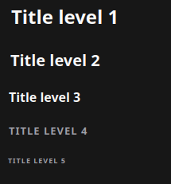
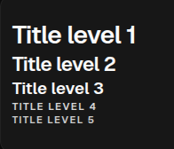

# Title

[<- Back to Content Components](./index.md)

`Title` renders semantic headings for pages, sections, and grouped content. Use it for visible hierarchy, not for paragraph copy.

## Python Contract

```python
sdk.ui.Title(
    id: str,
    text: Any,
    level: Any = 3,
)
```

`text` and `level` accept literal values, store bindings, and data-model bindings from the constructor.

## Supported Properties

| Property | Type | Required | Python | YAML | Desktop | Web | Notes |
|---|---|---|---|---|---|---|---|
| `id` | `str` | yes | yes | yes | yes | yes | Stable component id |
| `text` | scalar or binding | yes | constructor / `text.set` | yes | yes | yes | Heading text |
| `level` | int or binding | no | constructor / `level.set` | yes | yes | yes | Renderers clamp visual output to levels `1..5` |
| `align` | str or binding | no | `set_property` / `align.set` | yes | yes | yes | `left`, `center`, `right` |
| `style` | str | no | yes | yes | yes | yes | Inline style string |
| `show_if` | rule | no | yes | yes | yes | yes | Generic visibility contract |
| `hide_if` | rule | no | yes | yes | yes | yes | Generic visibility contract |
| `required_permissions` | list[str] | no | yes | yes | yes | yes | Generic permission gate |

## Binding Paths

The component test page uses these paths:

- Store: `/components_test/title/text`, `/components_test/title/level`
- Data model: `/components_test/title_model/text`, `/components_test/title_model/level`
- Visibility store: `/components_test/visibility/title_show`, `/components_test/visibility/title_hide`

## Static Example

<div class="docs-code-group" data-code-group>
  <div class="docs-code-group__tabs" role="tablist" aria-label="Title static example">
    <button class="docs-code-group__tab" type="button" role="tab" data-code-group-tab data-target="title-static-python" data-active="true" aria-selected="true">Python</button>
    <button class="docs-code-group__tab" type="button" role="tab" data-code-group-tab data-target="title-static-yaml" aria-selected="false">YAML</button>
  </div>
  <div class="docs-code-group__panel" id="title-static-python" data-code-group-panel data-active="true">
    <div class="language-python highlight"><pre><code>builder.add(
    sdk.ui.Title(
        "components_test_title_static",
        "Static title",
        level=2,
    )
)</code></pre></div>
  </div>
  <div class="docs-code-group__panel" id="title-static-yaml" data-code-group-panel hidden>
    <div class="language-yaml highlight"><pre><code>- kind: Title
  id: components_test_title_yaml_static
  text: "Static title"
  level: 2</code></pre></div>
  </div>
</div>

## Store Binding Example

<div class="docs-code-group" data-code-group>
  <div class="docs-code-group__tabs" role="tablist" aria-label="Title store binding example">
    <button class="docs-code-group__tab" type="button" role="tab" data-code-group-tab data-target="title-store-python" data-active="true" aria-selected="true">Python</button>
    <button class="docs-code-group__tab" type="button" role="tab" data-code-group-tab data-target="title-store-yaml" aria-selected="false">YAML</button>
  </div>
  <div class="docs-code-group__panel" id="title-store-python" data-code-group-panel data-active="true">
    <div class="language-python highlight"><pre><code>from democrai.sdk.ui import bound

builder.add(
    sdk.ui.Title(
        "components_test_title_store",
        bound.store(
            "/components_test/title/text",
            scope="page",
            default="Store-bound title",
        ),
        level=bound.store(
            "/components_test/title/level",
            scope="page",
            default=2,
        ),
    )
)</code></pre></div>
  </div>
  <div class="docs-code-group__panel" id="title-store-yaml" data-code-group-panel hidden>
    <div class="language-yaml highlight"><pre><code>- kind: Title
  id: components_test_title_yaml_store
  text:
    type: store
    scope: page
    path: /components_test/title/text
    default: "Store-bound title"
  level:
    type: store
    scope: page
    path: /components_test/title/level
    default: 2</code></pre></div>
  </div>
</div>

## Data Model Binding Example

<div class="docs-code-group" data-code-group>
  <div class="docs-code-group__tabs" role="tablist" aria-label="Title data model binding example">
    <button class="docs-code-group__tab" type="button" role="tab" data-code-group-tab data-target="title-data-python" data-active="true" aria-selected="true">Python</button>
    <button class="docs-code-group__tab" type="button" role="tab" data-code-group-tab data-target="title-data-yaml" aria-selected="false">YAML</button>
  </div>
  <div class="docs-code-group__panel" id="title-data-python" data-code-group-panel data-active="true">
    <div class="language-python highlight"><pre><code>builder.add(
    sdk.ui.Title(
        "components_test_title_data",
        bound.data(
            "/components_test/title_model/text",
            default="Data-model title",
        ),
        level=bound.data(
            "/components_test/title_model/level",
            default=3,
        ),
    )
)</code></pre></div>
  </div>
  <div class="docs-code-group__panel" id="title-data-yaml" data-code-group-panel hidden>
    <div class="language-yaml highlight"><pre><code>- kind: Title
  id: components_test_title_yaml_data
  text: "@data/components_test/title_model/text"
  level: "@data/components_test/title_model/level"</code></pre></div>
  </div>
</div>

## Runtime Property Update Example

<div class="docs-code-group" data-code-group>
  <div class="docs-code-group__tabs" role="tablist" aria-label="Title runtime update example">
    <button class="docs-code-group__tab" type="button" role="tab" data-code-group-tab data-target="title-runtime-python" data-active="true" aria-selected="true">Python</button>
    <button class="docs-code-group__tab" type="button" role="tab" data-code-group-tab data-target="title-runtime-yaml" aria-selected="false">YAML</button>
  </div>
  <div class="docs-code-group__panel" id="title-runtime-python" data-code-group-panel data-active="true">
    <div class="language-python highlight"><pre><code>builder.add(
    sdk.ui.Title(
        "components_test_title_live",
        "Runtime title",
        level=3,
    ).allow("text.set", "level.set")
)

builder.add(
    sdk.ui.Button(
        "components_test_title_set_alt_btn",
        "Set alternate",
        action="components.content_test_set",
        params={"component": "title", "state_key": "alternate"},
        variant="default",
    )
)</code></pre></div>
  </div>
  <div class="docs-code-group__panel" id="title-runtime-yaml" data-code-group-panel hidden>
    <div class="language-yaml highlight"><pre><code>- kind: Title
  id: components_test_title_yaml_live
  text: "Runtime title"
  level: 3
  capabilities: [text.set, level.set]

- kind: Button
  id: components_test_title_yaml_set_alt_btn
  label: "Set alternate"
  variant: default
  action: components.content_test_set
  params: {component: title, state_key: alternate}</code></pre></div>
  </div>
</div>

The action updates store-bound values, data-model values, and direct properties on the live Python and YAML components:

```python
surface_id = str(ctx.get("_surface_id") or "main").strip() or "main"
return sdk.effects.respond(
    sdk.effects.ui_property_update(
        "components_test_title_live",
        "text",
        "Updated runtime title",
        surface_id=surface_id,
    ),
    sdk.effects.ui_property_update(
        "components_test_title_live",
        "level",
        2,
        surface_id=surface_id,
    ),
)
```

## Visibility And Permissions Example

<div class="docs-code-group" data-code-group>
  <div class="docs-code-group__tabs" role="tablist" aria-label="Title visibility example">
    <button class="docs-code-group__tab" type="button" role="tab" data-code-group-tab data-target="title-visibility-python" data-active="true" aria-selected="true">Python</button>
    <button class="docs-code-group__tab" type="button" role="tab" data-code-group-tab data-target="title-visibility-yaml" aria-selected="false">YAML</button>
  </div>
  <div class="docs-code-group__panel" id="title-visibility-python" data-code-group-panel data-active="true">
    <div class="language-python highlight"><pre><code>title = sdk.ui.Title(
    "components_test_title_show_if",
    "show_if visible",
    level=4,
)
title.set_show_if({
    "conditions": [
        {
            "left": bound.store(
                "/components_test/visibility/title_show",
                scope="page",
                default=True,
            ),
            "op": "==",
            "right": True,
        }
    ]
})
builder.add(title)

gated = sdk.ui.Title(
    "components_test_title_required_permissions",
    "required_permissions gate",
    level=4,
)
gated.set_required_permissions(["components.content.visibility"])
builder.add(gated)</code></pre></div>
  </div>
  <div class="docs-code-group__panel" id="title-visibility-yaml" data-code-group-panel hidden>
    <div class="language-yaml highlight"><pre><code>- kind: Title
  id: components_test_title_yaml_show_if
  text: "show_if visible"
  level: 4
  show_if:
    conditions:
      - left:
          type: store
          scope: page
          path: /components_test/visibility/title_show
          default: true
        op: "=="
        right: true

- kind: Title
  id: components_test_title_yaml_hide_if
  text: "hide_if visible"
  level: 4
  hide_if:
    conditions:
      - left:
          type: store
          scope: page
          path: /components_test/visibility/title_hide
          default: false
        op: "=="
        right: true

- kind: Title
  id: components_test_title_yaml_required_permissions
  text: "required_permissions gate"
  level: 4
  required_permissions: [components.content.visibility]</code></pre></div>
  </div>
</div>

Use an action to change the store flags observed by `show_if` and `hide_if`:

```python
return sdk.effects.respond(
    sdk.effects.ui_messages([
        {
            "stateUpdate": {
                "scope": "page",
                "values": {
                    "/components_test/visibility/title_show": False,
                },
            }
        }
    ])
)
```

## Rendered Output

### Desktop



### Web



## Usage Guidance

- Use `Title` for page and section headings.
- Bind `text` and `level` from the constructor when the heading follows store or data-model state.
- Declare `text.set` and `level.set` capabilities when direct property updates target the component.
- Use `show_if`, `hide_if`, and `required_permissions` for visibility and authorization gates.
