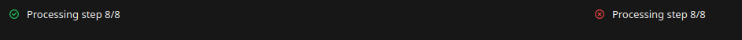
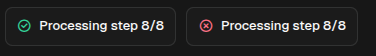

# BackgroundTask

[<- Back to Effects](./index.md)

`BackgroundTask` renders the current state of asynchronous work launched through `sdk.tasks`. It is a status card for an existing task id: it does not start the work by itself.

Use it when a user starts work that continues after the action response returns, such as imports, indexing, extraction, synchronization, model downloads, report generation, or long AI runs. The card keeps the interface connected to the task lifecycle: started, running, completed, failed, interrupted, or waiting for confirmation.

## Runtime Flow

1. A button or another trigger calls a module action.
2. The action starts the async job with `sdk.tasks.run_background(...)`.
3. The runtime returns a `task_id` immediately.
4. The action renders or appends `sdk.ui.BackgroundTask(..., task_id=task_id)`.
5. The background coroutine reports progress with `sdk.tasks.update_progress(...)`.
6. Clients store task state under global `background_tasks/<task_id>` and rerender the card as task events arrive.

If a card is mounted before the task state is present in the client store, the client asks the backend for the current snapshot with `background_task.get`.

## Python Contract

```python
sdk.ui.BackgroundTask(
    id: str,
    task_id: str,
    on_finish: Any = None,
    on_started: Any = None,
    on_progress: Any = None,
    on_completed: Any = None,
    on_error: Any = None,
    on_confirmation: Any = None,
    on_update: Any = None,
    on_event_notification: Any = None,
)
```

## Supported Properties

| Property | Type | Required | Python | YAML | Notes |
|---|---|---|---|---|---|
| `id` | `str` | yes | constructor | `id` | Stable component id. |
| `task_id` | `str` | yes | constructor | `task_id` | Runtime task id observed by the card. |
| `on_started` | action spec | no | constructor | `on_started` | Triggered by `backgroundTaskStarted`. |
| `on_progress` | action spec | no | constructor | `on_progress` | Triggered by `backgroundTaskProgress`. |
| `on_completed` | action spec | no | constructor | `on_completed` | Triggered by `backgroundTaskCompleted`. |
| `on_finish` | action spec | no | constructor | `on_finish` | Completion callback alias supported by clients. |
| `on_error` | action spec | no | constructor | `on_error` | Triggered by `backgroundTaskError`. |
| `on_confirmation` | action spec | no | constructor | `on_confirmation` | Triggered when the task enters confirmation state. |
| `on_update` | action spec | no | constructor | `on_update` | Triggered by generic `backgroundTaskUpdate`. |
| `on_event_notification` | action spec | no | constructor | `on_event_notification` | Triggered by task event notifications. |
| `show_if` | rule | no | yes | yes | Generic visibility rule. |
| `hide_if` | rule | no | yes | yes | Generic visibility rule. |
| `required_permissions` | `list[str]` | no | yes | yes | Generic permission gate. |

## Existing Task State

The card renders from global task state. A page can therefore show a known task immediately when the store already contains the snapshot.

<div class="docs-code-group" data-code-group>
  <div class="docs-code-group__tabs" role="tablist" aria-label="BackgroundTask existing state example">
    <button class="docs-code-group__tab" type="button" role="tab" data-code-group-tab data-target="background-task-existing-python" data-active="true" aria-selected="true">Python</button>
    <button class="docs-code-group__tab" type="button" role="tab" data-code-group-tab data-target="background-task-existing-yaml" aria-selected="false">YAML</button>
  </div>
  <div class="docs-code-group__panel" id="background-task-existing-python" data-code-group-panel data-active="true">
    <div class="language-python highlight"><pre><code>builder.set_store(
    "/background_tasks/components_demo_completed",
    {
        "taskId": "components_demo_completed",
        "label": "Completed import",
        "status": "completed",
        "progress": 1,
        "result": {"rows": 120},
    },
    scope="global",
)

builder.add(
    sdk.ui.BackgroundTask(
        "completed_task_card",
        "components_demo_completed",
    )
)</code></pre></div>
  </div>
  <div class="docs-code-group__panel" id="background-task-existing-yaml" data-code-group-panel hidden>
    <div class="language-yaml highlight"><pre><code>- kind: BackgroundTask
  id: completed_task_card
  task_id: components_demo_completed</code></pre></div>
  </div>
</div>

The task state fields used by the clients include:

| Field | Meaning |
|---|---|
| `taskId` | Runtime task id. |
| `label` | Visible task label. |
| `status` | Lifecycle status. |
| `progress` | Float from `0.0` to `1.0`. |
| `result` | Optional completion payload. |
| `error` | Optional failure message. |

## Starting A Live Task

The common pattern is to start the task in an action and append a `BackgroundTask` card to a container. The card appears immediately, then updates as the runtime pushes task events.

<div class="docs-code-group" data-code-group>
  <div class="docs-code-group__tabs" role="tablist" aria-label="BackgroundTask live task trigger example">
    <button class="docs-code-group__tab" type="button" role="tab" data-code-group-tab data-target="background-task-live-python" data-active="true" aria-selected="true">Python</button>
    <button class="docs-code-group__tab" type="button" role="tab" data-code-group-tab data-target="background-task-live-yaml" aria-selected="false">YAML</button>
  </div>
  <div class="docs-code-group__panel" id="background-task-live-python" data-code-group-panel data-active="true">
    <div class="language-python highlight"><pre><code>builder.add(
    sdk.ui.Button(
        "start_task",
        "Start progress task",
        action="components.test_background_task_start",
        params={
            "container_id": "task_cards",
            "prefix": "task_card",
        },
    )
)

container = sdk.ui.Row("task_cards", [])
container.allow("children.append")
builder.add(container)</code></pre></div>
  </div>
  <div class="docs-code-group__panel" id="background-task-live-yaml" data-code-group-panel hidden>
    <div class="language-yaml highlight"><pre><code>- kind: Button
  id: start_task
  label: Start progress task
  action: components.test_background_task_start
  params:
    container_id: task_cards
    prefix: task_card
- kind: Row
  id: task_cards
  capabilities: [children.append]
  children: []</code></pre></div>
  </div>
</div>

The action starts the coroutine and appends the card to the current surface:

```python
@action("test_background_task_start")
async def test_background_task_start(ctx: dict, session: dict, sdk) -> dict:
    container_id = str(ctx.get("container_id") or "task_cards")
    prefix = str(ctx.get("prefix") or "task_card")
    task_ref = {"task_id": ""}

    task_id = await sdk.tasks.run_background(
        _demo_background_task(sdk, task_ref),
        label="Demo background task",
        task_key=f"components_background_task_demo_{prefix}",
    )
    task_ref["task_id"] = task_id

    card = sdk.ui.BackgroundTask(
        f"{prefix}_{task_id}",
        task_id=task_id,
        on_completed={
            "name": "components.test_background_task_event",
            "context": {"source": prefix, "event": "completed"},
        },
        on_error={
            "name": "components.test_background_task_event",
            "context": {"source": prefix, "event": "error"},
        },
    )

    return sdk.effects.respond(
        sdk.effects.ui_collection_append(
            container_id,
            "children",
            card.to_dict(),
            surface_id=str(ctx.get("_surface_id") or "main").strip() or "main",
        )
    )
```

The background coroutine reports progress:

```python
async def _demo_background_task(module_sdk, task_ref: dict) -> dict:
    steps = 8
    for index in range(1, steps + 1):
        await asyncio.sleep(0.8)
        task_id = str(task_ref.get("task_id") or "")
        if task_id:
            await module_sdk.tasks.update_progress(
                task_id,
                index / steps,
                checkpoint={"step": index, "steps": steps},
                label=f"Processing step {index}/{steps}",
            )
    return {"processed": steps}
```

`label` changes the visible card text. `checkpoint` is stored with the task and can be used by backend logic that needs resumable state.

## Callback Actions

Callback properties use the normal action spec shape. The client merges the callback context with the task event payload before calling the action.

<div class="docs-code-group" data-code-group>
  <div class="docs-code-group__tabs" role="tablist" aria-label="BackgroundTask callback example">
    <button class="docs-code-group__tab" type="button" role="tab" data-code-group-tab data-target="background-task-callback-python" data-active="true" aria-selected="true">Python</button>
    <button class="docs-code-group__tab" type="button" role="tab" data-code-group-tab data-target="background-task-callback-yaml" aria-selected="false">YAML</button>
  </div>
  <div class="docs-code-group__panel" id="background-task-callback-python" data-code-group-panel data-active="true">
    <div class="language-python highlight"><pre><code>sdk.ui.BackgroundTask(
    "task_card",
    task_id=task_id,
    on_completed={
        "name": "components.test_background_task_event",
        "context": {"source": "task_card", "event": "completed"},
    },
    on_error={
        "name": "components.test_background_task_event",
        "context": {"source": "task_card", "event": "error"},
    },
)</code></pre></div>
  </div>
  <div class="docs-code-group__panel" id="background-task-callback-yaml" data-code-group-panel hidden>
    <div class="language-yaml highlight"><pre><code>- kind: BackgroundTask
  id: task_card
  task_id: components_demo_running
  on_completed:
    name: components.test_background_task_event
    context: {source: task_card, event: completed}
  on_error:
    name: components.test_background_task_event
    context: {source: task_card, event: error}</code></pre></div>
  </div>
</div>

The receiving action can read fields such as `task_id`, `taskId`, `event_name`, `label`, `progress`, `result`, or `error`, depending on the event type.

| Callback | Event |
|---|---|
| `on_started` | Task was registered and announced. |
| `on_progress` | Task progress or label changed. |
| `on_completed` | Task completed successfully. |
| `on_finish` | Completion callback alias supported by clients. |
| `on_error` | Task failed. |
| `on_confirmation` | Task entered `waiting_confirmation`. |
| `on_update` | Generic task update was pushed. |
| `on_event_notification` | Generic event notification was associated with the task. |

## Action Confirmation

Callback properties accept ActionSpec objects with `confirm`. The confirmation is handled by the client when the task event is received. If the user cancels the dialog, the callback action is not dispatched.

<div class="docs-code-group" data-code-group>
  <div class="docs-code-group__tabs" role="tablist" aria-label="BackgroundTask confirm example">
    <button class="docs-code-group__tab" type="button" role="tab" data-code-group-tab data-target="background-task-confirm-python" data-active="true" aria-selected="true">Python</button>
    <button class="docs-code-group__tab" type="button" role="tab" data-code-group-tab data-target="background-task-confirm-yaml" aria-selected="false">YAML</button>
  </div>
  <div class="docs-code-group__panel" id="background-task-confirm-python" data-code-group-panel data-active="true">
    <div class="language-python highlight"><pre><code>card = sdk.ui.BackgroundTask(
    "task_card",
    task_id=task_id,
    on_finish={
        "name": "components.backgroundtask_confirm_action",
        "context": {"source": "python_backgroundtask"},
        "confirm": {
            "text": sdk.i18n.t("components.backgroundtask.confirm.prompt"),
            "confirm_text": sdk.i18n.t("components.backgroundtask.confirm.accept"),
            "cancel_text": sdk.i18n.t("components.backgroundtask.confirm.cancel"),
        },
    },
)</code></pre></div>
  </div>
  <div class="docs-code-group__panel" id="background-task-confirm-yaml" data-code-group-panel hidden>
    <div class="language-yaml highlight"><pre><code>- kind: BackgroundTask
  id: task_card
  task_id: components_demo_running
  on_finish:
    name: components.backgroundtask_confirm_action
    context:
      source: yaml_backgroundtask
    confirm:
      text: "@t/components.backgroundtask.confirm.prompt"
      confirm_text: "@t/components.backgroundtask.confirm.accept"
      cancel_text: "@t/components.backgroundtask.confirm.cancel"</code></pre></div>
  </div>
</div>

## Visibility And Permissions

`BackgroundTask` supports the generic `show_if`, `hide_if`, and `required_permissions` gates.

<div class="docs-code-group" data-code-group>
  <div class="docs-code-group__tabs" role="tablist" aria-label="BackgroundTask visibility example">
    <button class="docs-code-group__tab" type="button" role="tab" data-code-group-tab data-target="background-task-visibility-python" data-active="true" aria-selected="true">Python</button>
    <button class="docs-code-group__tab" type="button" role="tab" data-code-group-tab data-target="background-task-visibility-yaml" aria-selected="false">YAML</button>
  </div>
  <div class="docs-code-group__panel" id="background-task-visibility-python" data-code-group-panel data-active="true">
    <div class="language-python highlight"><pre><code>show_task = sdk.ui.BackgroundTask("show_task", "components_demo_completed")
show_task.set_show_if({
    "conditions": [{
        "left": bound.store(
            "/components_test/background_task/show_card",
            scope="page",
            default=True,
        ),
        "op": "==",
        "right": True,
    }]
})

hide_task = sdk.ui.BackgroundTask("hide_task", "components_demo_running")
hide_task.set_hide_if({
    "conditions": [{
        "left": bound.store(
            "/components_test/background_task/hide_card",
            scope="page",
            default=False,
        ),
        "op": "==",
        "right": True,
    }]
})

permission_task = sdk.ui.BackgroundTask("permission_task", "components_demo_completed")
permission_task.set_required_permissions(["components.background_task.view"])</code></pre></div>
  </div>
  <div class="docs-code-group__panel" id="background-task-visibility-yaml" data-code-group-panel hidden>
    <div class="language-yaml highlight"><pre><code>- kind: BackgroundTask
  id: show_task
  task_id: components_demo_completed
  show_if:
    conditions:
      - left: {type: store, scope: page, path: /components_test/background_task/show_card, default: true}
        op: "=="
        right: true
- kind: BackgroundTask
  id: hide_task
  task_id: components_demo_running
  hide_if:
    conditions:
      - left: {type: store, scope: page, path: /components_test/background_task/hide_card, default: false}
        op: "=="
        right: true
- kind: BackgroundTask
  id: permission_task
  task_id: components_demo_completed
  required_permissions: [components.background_task.view]</code></pre></div>
  </div>
</div>

## Confirmation State

Background tasks can request confirmation through `sdk.tasks.request_confirmation(task_id, builder)`. The task enters `waiting_confirmation`; clients receive `backgroundTaskConfirmation`, render the confirmation surface, and the card changes to confirmation status. Use `on_confirmation` when the surrounding page must react to that transition.

## Screenshots

Desktop preview:



Web preview:


