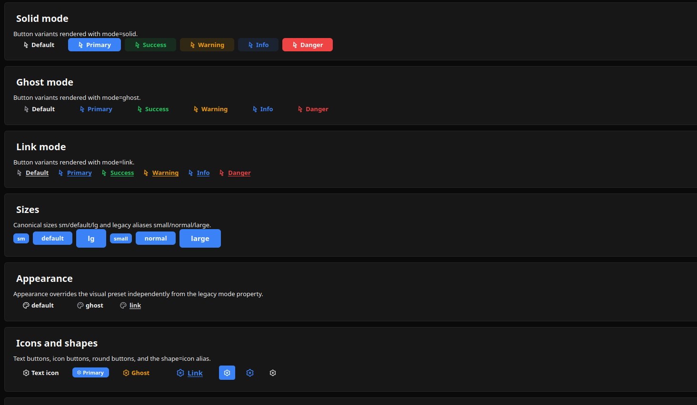
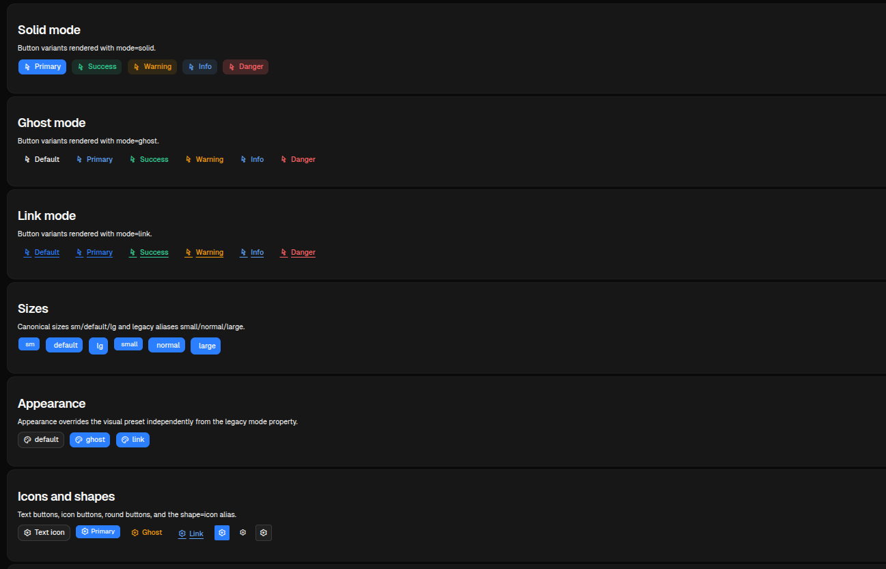

# Button

[<- Back to Forms Components](./index.md)

## Purpose

`Button` renders an explicit user action trigger. It can dispatch an action, pass static or bound context, collect mounted input values, show a loading state while an action is pending, and receive runtime property updates.

## Constructor

```python
Button(
    id: str,
    label: str,
    action: str | None = None,
    params: dict | None = None,
    icon: str | None = None,
    variant: str = "default",
    mode: str = "solid",
    appearance: str | None = None,
    btnsize: str = "normal",
    shape: str = "default",
)
```

## Properties

| Property | Type | Default | Description |
|---|---|---:|---|
| `label` | `str` or literal/bound payload | required | Visible text. Python constructor wraps plain labels as `literalString`. |
| `action` | `str` or action object | none | Action dispatched on click. Action objects can include `confirm`. |
| `params` | `dict` | `{}` | Extra click context merged with the action context. |
| `icon` | `str` | none | Icon name. Remix icon names can use `ric.*`, `ri.*`, or `ri-*` forms. |
| `variant` | `str` | `default` | Visual intent. Documented values are `default`, `primary`, `success`, `warning`, `info`, and `danger`. |
| `mode` | `str` | `solid` | Legacy appearance mode: `solid`, `ghost`, or `link`. |
| `appearance` | `str` | none | Optional appearance override such as `default`, `ghost`, or `link`. |
| `btnsize` | `str` | `normal` | Size. Supports `sm`, `default`, `lg` and legacy `small`, `normal`, `large`. |
| `shape` | `str` | `default` | `default`, `round`, or `icon`. `icon` is normalized as a round icon button by the web client. |
| `active` | `bool` or condition/binding | `false` | Active visual state. |
| `collect_input_ids` | `list[str]` | `[]` | Input ids collected and included in click context. |
| `track_loading` | `str | list[str]` | none | Action names that put the button in loading state while pending. |
| `show_if` / `hide_if` | condition | none | Shared visibility rules. |
| `required_permissions` | `list[str]` | `[]` | Required permissions before rendering. |
| `capabilities` | `list[str]` | default interactive capabilities | Required for direct runtime updates such as `label.set`, `active.set`, `action.set`, and `params.set`. |

## Variants, Modes And Icons

The test page renders variant matrices for solid, ghost and link modes, plus icon and icon-only combinations.

<div class="docs-code-group" data-code-group>
  <div class="docs-code-group__tabs" role="tablist" aria-label="button example 1">
    <button class="docs-code-group__tab" type="button" role="tab" data-code-group-tab data-target="button-1-python" data-active="true" aria-selected="true">Python</button>
    <button class="docs-code-group__tab" type="button" role="tab" data-code-group-tab data-target="button-1-yaml" aria-selected="false">YAML</button>
  </div>
  <div class="docs-code-group__panel" id="button-1-python" data-code-group-panel data-active="true">
    <div class="language-python highlight"><pre><code>sdk.ui.Button(&quot;save&quot;, &quot;Save&quot;, variant=&quot;primary&quot;, icon=&quot;ric.save-line&quot;)
sdk.ui.Button(&quot;delete&quot;, &quot;Delete&quot;, variant=&quot;danger&quot;, icon=&quot;ric.delete-bin-line&quot;)
sdk.ui.Button(&quot;ghost&quot;, &quot;Ghost&quot;, variant=&quot;warning&quot;, mode=&quot;ghost&quot;, icon=&quot;ric.alert-line&quot;)
sdk.ui.Button(&quot;link&quot;, &quot;Open&quot;, variant=&quot;info&quot;, mode=&quot;link&quot;, icon=&quot;ric.external-link-line&quot;)
sdk.ui.Button(&quot;icon_only&quot;, &quot;&quot;, variant=&quot;primary&quot;, shape=&quot;round&quot;, icon=&quot;ric.settings-3-line&quot;)
sdk.ui.Button(&quot;icon_alias&quot;, &quot;&quot;, variant=&quot;default&quot;, shape=&quot;icon&quot;, icon=&quot;ric.settings-3-line&quot;)</code></pre></div>
  </div>
  <div class="docs-code-group__panel" id="button-1-yaml" data-code-group-panel hidden>
    <div class="language-yaml highlight"><pre><code>- kind: Button
  id: save
  label: Save
  variant: primary
  icon: ric.save-line

- kind: Button
  id: ghost
  label: Ghost
  variant: warning
  mode: ghost
  icon: ric.alert-line

- kind: Button
  id: icon_only
  label: &quot;&quot;
  variant: primary
  shape: round
  icon: ric.settings-3-line</code></pre></div>
  </div>
</div>

## Action Context

In Python, pass `action` as the action name and `params` as extra context. In YAML, either use the same `action` plus `params` shape or the action object form.

Module actions used by UI components must be fully qualified, for example `components.test_button_echo`. The Python decorator keeps the local action name, while the component dispatch uses `module.action`. See [Action Dispatch](../action-dispatch.md).

<div class="docs-code-group" data-code-group>
  <div class="docs-code-group__tabs" role="tablist" aria-label="button example 2">
    <button class="docs-code-group__tab" type="button" role="tab" data-code-group-tab data-target="button-2-python" data-active="true" aria-selected="true">Python</button>
    <button class="docs-code-group__tab" type="button" role="tab" data-code-group-tab data-target="button-2-yaml" aria-selected="false">YAML</button>
  </div>
  <div class="docs-code-group__panel" id="button-2-python" data-code-group-panel data-active="true">
    <div class="language-python highlight"><pre><code>button = sdk.ui.Button(
    &quot;run_import&quot;,
    &quot;Run import&quot;,
    action=&quot;components.test_button_echo&quot;,
    params={&quot;source&quot;: &quot;toolbar&quot;},
    variant=&quot;primary&quot;,
    icon=&quot;ric.play-circle-line&quot;,
)</code></pre></div>
  </div>
  <div class="docs-code-group__panel" id="button-2-yaml" data-code-group-panel hidden>
    <div class="language-yaml highlight"><pre><code>- kind: Button
  id: run_import
  label: Run import
  action: components.test_button_echo
  params:
    source: toolbar
  variant: primary
  icon: ric.play-circle-line</code></pre></div>
  </div>
</div>

The action receives the merged context. If `collect_input_ids` is present, the clients also collect the current values of those mounted inputs.

<div class="docs-code-group" data-code-group>
  <div class="docs-code-group__tabs" role="tablist" aria-label="button example 3">
    <button class="docs-code-group__tab" type="button" role="tab" data-code-group-tab data-target="button-3-python" data-active="true" aria-selected="true">Python</button>
    <button class="docs-code-group__tab" type="button" role="tab" data-code-group-tab data-target="button-3-yaml" aria-selected="false">YAML</button>
  </div>
  <div class="docs-code-group__panel" id="button-3-python" data-code-group-panel data-active="true">
    <div class="language-python highlight"><pre><code>field = sdk.ui.TextField(&quot;title_input&quot;, &quot;Title&quot;, &quot;Initial value&quot;)
button = sdk.ui.Button(
    &quot;collect_title&quot;,
    &quot;Collect input&quot;,
    action=&quot;components.test_button_collect&quot;,
    params={&quot;input_id&quot;: &quot;title_input&quot;},
    variant=&quot;primary&quot;,
)
button.collect_input_ids(&quot;title_input&quot;)</code></pre></div>
  </div>
  <div class="docs-code-group__panel" id="button-3-yaml" data-code-group-panel hidden>
    <div class="language-yaml highlight"><pre><code>- kind: TextField
  id: title_input
  label: Title
  value: Initial value

- kind: Button
  id: collect_title
  label: Collect input
  action: components.test_button_collect
  params: {input_id: title_input}
  collect_input_ids: [title_input]
  variant: primary</code></pre></div>
  </div>
</div>

## Action Confirmation

Use an action object with `confirm` to require confirmation before the click action is dispatched. If the user cancels the dialog, no backend action is sent.
The component test page exposes a trigger counter and the last received payload so the dispatch can be checked directly after confirming.

<div class="docs-code-group" data-code-group>
  <div class="docs-code-group__tabs" role="tablist" aria-label="button confirm example">
    <button class="docs-code-group__tab" type="button" role="tab" data-code-group-tab data-target="button-confirm-python" data-active="true" aria-selected="true">Python</button>
    <button class="docs-code-group__tab" type="button" role="tab" data-code-group-tab data-target="button-confirm-yaml" aria-selected="false">YAML</button>
  </div>
  <div class="docs-code-group__panel" id="button-confirm-python" data-code-group-panel data-active="true">
    <div class="language-python highlight"><pre><code>button = sdk.ui.Button(
    &quot;confirm_python&quot;,
    sdk.i18n.t(&quot;components.button.confirm.python_primary&quot;),
    variant=&quot;primary&quot;,
)
button.set_prop(
    &quot;action&quot;,
    {
        &quot;name&quot;: &quot;components.button_confirm_action&quot;,
        &quot;context&quot;: {&quot;source&quot;: &quot;python_primary&quot;},
        &quot;confirm&quot;: {
            &quot;text&quot;: sdk.i18n.t(&quot;components.button.confirm.prompt&quot;),
            &quot;confirm_text&quot;: sdk.i18n.t(&quot;components.button.confirm.accept&quot;),
            &quot;cancel_text&quot;: sdk.i18n.t(&quot;components.button.confirm.cancel&quot;),
        },
    },
)</code></pre></div>
  </div>
  <div class="docs-code-group__panel" id="button-confirm-yaml" data-code-group-panel hidden>
    <div class="language-yaml highlight"><pre><code>- kind: Button
  id: confirm_yaml
  label: &quot;@t/components.button.confirm.yaml_primary&quot;
  variant: primary
  action:
    name: components.button_confirm_action
    context:
      source: yaml_primary
    confirm:
      text: &quot;@t/components.button.confirm.prompt&quot;
      confirm_text: &quot;@t/components.button.confirm.accept&quot;
      cancel_text: &quot;@t/components.button.confirm.cancel&quot;</code></pre></div>
  </div>
</div>

## Bindings And Direct Updates

`label` and `active` can be bound to page store or the surface data model in Python. In YAML, `label` is a constructor argument and is serialized as a literal label by the loader, so the YAML binding example uses `active`. Direct property updates can still target `label` in both Python and YAML when the button declares `label.set`.

<div class="docs-code-group" data-code-group>
  <div class="docs-code-group__tabs" role="tablist" aria-label="button example 4">
    <button class="docs-code-group__tab" type="button" role="tab" data-code-group-tab data-target="button-4-python" data-active="true" aria-selected="true">Python</button>
    <button class="docs-code-group__tab" type="button" role="tab" data-code-group-tab data-target="button-4-yaml" aria-selected="false">YAML</button>
  </div>
  <div class="docs-code-group__panel" id="button-4-python" data-code-group-panel data-active="true">
    <div class="language-python highlight"><pre><code>from democrai.sdk.ui import bound

store_button = sdk.ui.Button(&quot;store_button&quot;, &quot;Store label&quot;, variant=&quot;primary&quot;)
store_button.set_property(
    &quot;label&quot;,
    bound.store(
        &quot;/components_test/button/store_label&quot;,
        scope=&quot;page&quot;,
        default={&quot;literalString&quot;: &quot;Store label&quot;},
    ),
)

data_button = sdk.ui.Button(&quot;data_button&quot;, &quot;Data label&quot;, variant=&quot;default&quot;)
data_button.set_property(
    &quot;label&quot;,
    bound.data(
        &quot;/components_test/button_model/label&quot;,
        default={&quot;literalString&quot;: &quot;Data label&quot;},
    ),
)

active_button = sdk.ui.Button(&quot;active_button&quot;, &quot;Active&quot;, mode=&quot;ghost&quot;)
active_button.set_property(
    &quot;active&quot;,
    bound.store(&quot;/components_test/button/active&quot;, scope=&quot;page&quot;, default=False),
)

live_button = sdk.ui.Button(&quot;live_button&quot;, &quot;Direct label&quot;, variant=&quot;primary&quot;)
live_button.allow(&quot;label.set&quot;, &quot;active.set&quot;, &quot;action.set&quot;, &quot;params.set&quot;)</code></pre></div>
  </div>
  <div class="docs-code-group__panel" id="button-4-yaml" data-code-group-panel hidden>
    <div class="language-yaml highlight"><pre><code>- kind: Button
  id: store_active_button
  label: Store active
  active: {type: store, scope: page, path: /components_test/button/active, default: false}
  variant: primary
  capabilities: [label.set, active.set, action.set, params.set]

- kind: Button
  id: data_active_button
  label: Data active
  active: &quot;@data/components_test/button_model/yaml_active&quot;
  variant: default
  capabilities: [label.set, active.set, action.set, params.set]</code></pre></div>
  </div>
</div>

A direct label update uses the current surface id:

```python
return sdk.effects.respond(
    sdk.effects.ui_property_update(
        "live_button",
        "label",
        {"literalString": "Direct label updated"},
        action="set",
        surface_id=ctx["_surface_id"],
    )
)
```

## Visibility And Permissions

Buttons support the shared `show_if`, `hide_if`, and `required_permissions` contract.

<div class="docs-code-group" data-code-group>
  <div class="docs-code-group__tabs" role="tablist" aria-label="button example 5">
    <button class="docs-code-group__tab" type="button" role="tab" data-code-group-tab data-target="button-5-python" data-active="true" aria-selected="true">Python</button>
    <button class="docs-code-group__tab" type="button" role="tab" data-code-group-tab data-target="button-5-yaml" aria-selected="false">YAML</button>
  </div>
  <div class="docs-code-group__panel" id="button-5-python" data-code-group-panel data-active="true">
    <div class="language-python highlight"><pre><code>button = sdk.ui.Button(&quot;guarded_button&quot;, &quot;Guarded&quot;, variant=&quot;primary&quot;)
button.set_show_if({
    &quot;conditions&quot;: [
        {&quot;left&quot;: bound.store(&quot;/components_test/button/show&quot;, scope=&quot;page&quot;, default=True), &quot;op&quot;: &quot;==&quot;, &quot;right&quot;: True}
    ]
})
button.set_hide_if({
    &quot;conditions&quot;: [
        {&quot;left&quot;: bound.store(&quot;/components_test/button/hide&quot;, scope=&quot;page&quot;, default=False), &quot;op&quot;: &quot;==&quot;, &quot;right&quot;: True}
    ]
})
button.set_required_permissions([&quot;components.button.use&quot;])</code></pre></div>
  </div>
  <div class="docs-code-group__panel" id="button-5-yaml" data-code-group-panel hidden>
    <div class="language-yaml highlight"><pre><code>- kind: Button
  id: guarded_button
  label: Guarded
  variant: primary
  show_if:
    conditions:
      - left: {type: store, scope: page, path: /components_test/button/show, default: true}
        op: &quot;==&quot;
        right: true
  hide_if:
    conditions:
      - left: {type: store, scope: page, path: /components_test/button/hide, default: false}
        op: &quot;==&quot;
        right: true
  required_permissions: [components.button.use]</code></pre></div>
  </div>
</div>

## Behavior

- Desktop normalizes `small`/`normal`/`large` to `sm`/`default`/`lg`.
- Web maps `shape: icon` to a round icon button.
- `mode: ghost` and `mode: link` override the base visual style.
- `track_loading` disables the button and swaps the icon to a loading indicator while a tracked action is pending.

## Screenshots

Desktop preview:



Web preview:


