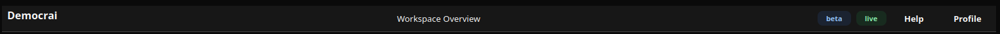

# Header

[<- Back to Layout Components](./index.md)

## Definition

`Header` is a structural layout container with three named slots: `left`, `center`, and `right`.

## Scope

Use `Header` for top bars, section headers, and toolbars where slot position matters. Use `Row` when the content only needs generic horizontal flow.

The component accepts `children` for compatibility; when named slots are empty, clients can render `children` in the center area. Prefer `left`, `center`, and `right` for new code.



## Properties

| Property | Type | Default | Notes |
|---|---|---|---|
| `children` | `list[str | Component]` | `[]` | Compatibility content. Prefer named slots. |
| `left` | `list[str | Component]` | `[]` | Left slot collection. |
| `center` | `list[str | Component]` | `[]` | Center slot collection. |
| `right` | `list[str | Component]` | `[]` | Right slot collection. |
| `style` | `string` | client default | Standard style property. |
| `padding` | `list[int]` | client default | Supported by the web renderer. Desktop uses its header layout defaults. |
| `spacing` | `int` | client default | Supported by the web renderer. Desktop uses fixed slot spacing. |
| `stretch` | `bool` | `true` | Supported by the web renderer. Desktop uses an expanding horizontal size policy. |

## Static Slots

<div class="docs-code-group" data-code-group>
  <div class="docs-code-group__tabs" role="tablist" aria-label="Header static example">
    <button class="docs-code-group__tab" type="button" role="tab" data-code-group-tab data-target="header-static-python" data-active="true" aria-selected="true">Python</button>
    <button class="docs-code-group__tab" type="button" role="tab" data-code-group-tab data-target="header-static-yaml" aria-selected="false">YAML</button>
  </div>
  <div class="docs-code-group__panel" id="header-static-python" data-code-group-panel data-active="true">
    <div class="language-python highlight"><pre><code>builder.add(sdk.ui.Text("header_brand", "Workspace"))
builder.add(sdk.ui.Text("header_title", "Header title"))
builder.add(sdk.ui.Badge("header_status", "Idle", variant="info"))

header = sdk.ui.Header(
    "page_header",
    left=["header_brand"],
    center=["header_title"],
    right=["header_status"],
)
builder.add(header)</code></pre></div>
  </div>
  <div class="docs-code-group__panel" id="header-static-yaml" data-code-group-panel hidden>
    <div class="language-yaml highlight"><pre><code>- kind: Header
  id: page_header
  left:
    - kind: Text
      id: header_brand
      text: "Workspace"
  center:
    - kind: Text
      id: header_title
      text: "Header title"
  right:
    - kind: Badge
      id: header_status
      text: "Idle"
      variant: info</code></pre></div>
  </div>
</div>

## Store Binding

Bind a slot when its content is driven by page or global store state. The bound value must resolve to a list of component definitions or component ids.

<div class="docs-code-group" data-code-group>
  <div class="docs-code-group__tabs" role="tablist" aria-label="Header store binding example">
    <button class="docs-code-group__tab" type="button" role="tab" data-code-group-tab data-target="header-store-python" data-active="true" aria-selected="true">Python</button>
    <button class="docs-code-group__tab" type="button" role="tab" data-code-group-tab data-target="header-store-yaml" aria-selected="false">YAML</button>
  </div>
  <div class="docs-code-group__panel" id="header-store-python" data-code-group-panel data-active="true">
    <div class="language-python highlight"><pre><code>builder.set_store(
    "/components_test/header/right",
    [sdk.ui.Badge("header_status", "Idle", variant="info").to_dict()],
    scope="page",
)

header = sdk.ui.Header(
    "page_header",
    left=["header_brand"],
    center=["header_title"],
    right=bound.store(
        "/components_test/header/right",
        scope="page",
        default=[sdk.ui.Badge("header_status", "Idle", variant="info").to_dict()],
    ),
)
builder.add(header)</code></pre></div>
  </div>
  <div class="docs-code-group__panel" id="header-store-yaml" data-code-group-panel hidden>
    <div class="language-yaml highlight"><pre><code>- kind: Header
  id: page_header
  left:
    - header_brand
  center:
    - header_title
  right:
    type: store
    scope: page
    path: /components_test/header/right
    default:
      - id: header_status
        component:
          Badge:
            text:
              literalString: "Idle"
            variant: info
        children:
          explicitList: []</code></pre></div>
  </div>
</div>

## Data Model Binding

Use data-model binding when the slot content belongs to the current surface data.

<div class="docs-code-group" data-code-group>
  <div class="docs-code-group__tabs" role="tablist" aria-label="Header data binding example">
    <button class="docs-code-group__tab" type="button" role="tab" data-code-group-tab data-target="header-data-python" data-active="true" aria-selected="true">Python</button>
    <button class="docs-code-group__tab" type="button" role="tab" data-code-group-tab data-target="header-data-yaml" aria-selected="false">YAML</button>
  </div>
  <div class="docs-code-group__panel" id="header-data-python" data-code-group-panel data-active="true">
    <div class="language-python highlight"><pre><code>builder.set_data(
    "/components_test/header_model/right",
    [sdk.ui.Badge("header_status", "Idle", variant="info").to_dict()],
)

header = sdk.ui.Header(
    "page_header",
    left=["header_brand"],
    center=["header_title"],
    right=bound.data(
        "/components_test/header_model/right",
        default=[sdk.ui.Badge("header_status", "Idle", variant="info").to_dict()],
    ),
)
builder.add(header)</code></pre></div>
  </div>
  <div class="docs-code-group__panel" id="header-data-yaml" data-code-group-panel hidden>
    <div class="language-yaml highlight"><pre><code>- kind: Header
  id: page_header
  left:
    - header_brand
  center:
    - header_title
  right: "@data/components_test/header_model/right"</code></pre></div>
  </div>
</div>

## Property Updates

Declare capabilities before replacing a slot directly. Use `left.set`, `center.set`, or `right.set` for full slot replacement.

<div class="docs-code-group" data-code-group>
  <div class="docs-code-group__tabs" role="tablist" aria-label="Header property update example">
    <button class="docs-code-group__tab" type="button" role="tab" data-code-group-tab data-target="header-update-python" data-active="true" aria-selected="true">Python</button>
    <button class="docs-code-group__tab" type="button" role="tab" data-code-group-tab data-target="header-update-yaml" aria-selected="false">YAML</button>
  </div>
  <div class="docs-code-group__panel" id="header-update-python" data-code-group-panel data-active="true">
    <div class="language-python highlight"><pre><code>header = sdk.ui.Header(
    "page_header",
    left=["header_brand"],
    center=["header_title"],
    right=["header_status"],
)
header.allow("right.set")
builder.add(header)</code></pre></div>
  </div>
  <div class="docs-code-group__panel" id="header-update-yaml" data-code-group-panel hidden>
    <div class="language-yaml highlight"><pre><code>- kind: Header
  id: page_header
  capabilities: [right.set]
  left:
    - header_brand
  center:
    - header_title
  right:
    - header_status</code></pre></div>
  </div>
</div>

The action can replace the slot with a component list:

```python
surface_id = ctx["_surface_id"]
right = [
    sdk.ui.Badge("header_status", "Ready", variant="info").to_dict(),
    sdk.ui.Button("header_action", "Run", variant="default").to_dict(),
]

return sdk.effects.respond(
    sdk.effects.ui_property_update(
        "page_header",
        "right",
        right,
        action="set",
        surface_id=surface_id,
    )
)
```

## Dynamic Slots

Use collection patches when adding or removing items from one slot. Declare the slot-specific capabilities used by the action.

The example below targets `right`, but the same pattern applies to all named slots: use `left.append` and `left.remove` for the left slot, `center.append` and `center.remove` for the center slot, or `right.append` and `right.remove` for the right slot.

<div class="docs-code-group" data-code-group>
  <div class="docs-code-group__tabs" role="tablist" aria-label="Header dynamic slot example">
    <button class="docs-code-group__tab" type="button" role="tab" data-code-group-tab data-target="header-dynamic-python" data-active="true" aria-selected="true">Python</button>
    <button class="docs-code-group__tab" type="button" role="tab" data-code-group-tab data-target="header-dynamic-yaml" aria-selected="false">YAML</button>
  </div>
  <div class="docs-code-group__panel" id="header-dynamic-python" data-code-group-panel data-active="true">
    <div class="language-python highlight"><pre><code>header = sdk.ui.Header(
    "page_header",
    left=["header_brand"],
    center=["header_title"],
    right=["header_action_1", "header_action_2"],
)
header.allow("right.append", "right.remove")
builder.add(header)</code></pre></div>
  </div>
  <div class="docs-code-group__panel" id="header-dynamic-yaml" data-code-group-panel hidden>
    <div class="language-yaml highlight"><pre><code>- kind: Header
  id: page_header
  capabilities: [right.append, right.remove]
  left:
    - header_brand
  center:
    - header_title
  right:
    - header_action_1
    - header_action_2</code></pre></div>
  </div>
</div>

Append and remove actions target the slot name:

```python
return sdk.effects.respond(
    sdk.effects.ui_collection_append(
        "page_header",
        "right",
        sdk.ui.Button("header_action_3", "Action 3", variant="default").to_dict(),
        surface_id=ctx["_surface_id"],
    ),
    sdk.effects.ui_collection_remove(
        "page_header",
        "right",
        {"id": "header_action_3"},
        surface_id=ctx["_surface_id"],
    ),
)
```

To target another slot, change both the property name and the declared capability. For example, appending to the center slot uses `center.append` and `sdk.effects.ui_collection_append("page_header", "center", item, ...)`.

## Visibility And Permissions

`show_if`, `hide_if`, and `required_permissions` are available on `Header`.

<div class="docs-code-group" data-code-group>
  <div class="docs-code-group__tabs" role="tablist" aria-label="Header visibility example">
    <button class="docs-code-group__tab" type="button" role="tab" data-code-group-tab data-target="header-visibility-python" data-active="true" aria-selected="true">Python</button>
    <button class="docs-code-group__tab" type="button" role="tab" data-code-group-tab data-target="header-visibility-yaml" aria-selected="false">YAML</button>
  </div>
  <div class="docs-code-group__panel" id="header-visibility-python" data-code-group-panel data-active="true">
    <div class="language-python highlight"><pre><code>header.set_show_if({
    "conditions": [
        {"left": bound.store("/components_test/visibility/header_show", scope="page", default=True), "op": "==", "right": True}
    ]
})

header.set_hide_if({
    "conditions": [
        {"left": bound.store("/components_test/visibility/header_hide", scope="page", default=False), "op": "==", "right": True}
    ]
})

header.set_required_permissions(["components.layout.view"])</code></pre></div>
  </div>
  <div class="docs-code-group__panel" id="header-visibility-yaml" data-code-group-panel hidden>
    <div class="language-yaml highlight"><pre><code>- kind: Header
  id: header_show_if
  show_if:
    conditions:
      - left: {type: store, scope: page, path: /components_test/visibility/header_show, default: true}
        op: "=="
        right: true
  left:
    - header_brand

- kind: Header
  id: header_hide_if
  hide_if:
    conditions:
      - left: {type: store, scope: page, path: /components_test/visibility/header_hide, default: false}
        op: "=="
        right: true
  left:
    - header_brand

- kind: Header
  id: header_required_permissions
  required_permissions: [components.layout.view]
  left:
    - header_brand</code></pre></div>
  </div>
</div>

## Notes

- Use named slots for predictable placement.
- Bind or update a slot with a list of component ids or serialized component definitions.
- Use collection patches for incremental changes to one slot.
- `padding`, `spacing`, and `stretch` are web-renderer layout props; desktop keeps fixed internal spacing for the header slots.
