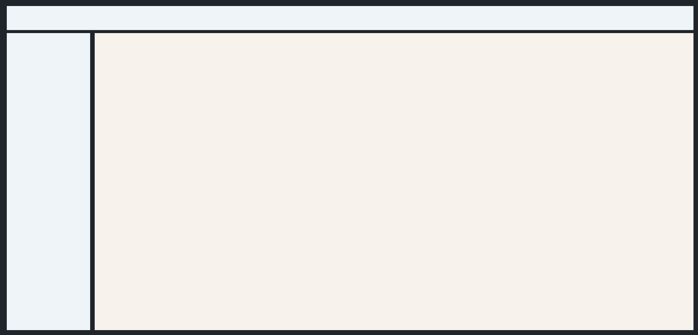

# Header + Sidebar + Content

[<- Back to Ready Layouts](./index.md)

This ready layout combines a top header with a lower body split into sidebar and content areas.

Use this structure when a page needs a persistent top bar plus left navigation or tools beside the main workspace. The root owns the viewport height; the body below the header stretches with `min-height: 0` so the sidebar and content scroll areas can receive bounded height.

## Structure

- The root `Column` owns the page background and viewport height.
- The `Header` keeps natural height and does not receive `100vh`.
- The shell `Column` stacks header and body.
- The body `Row` uses `stretch: true`, `align: fill`, and `min-height: 0`.
- `Sidebar` and `ContentArea` each contain their own `ScrollArea`.

## Example

  

    <button class="docs-code-group__tab" type="button" role="tab" data-code-group-tab data-target="header-sidebar-content-python" data-active="true" aria-selected="true">Python</button>
    <button class="docs-code-group__tab" type="button" role="tab" data-code-group-tab data-target="header-sidebar-content-yaml" aria-selected="false">YAML</button>
  

  

    
<pre><code>prefix = "components_full_test_header_sidebar_content"

header = sdk.ui.Header(f"{prefix}_header", left=[], center=[], right=[])
header.set_property("style", "min-height: 64px;")
builder.add(header)

nav_stack = sdk.ui.Column(f"{prefix}_nav_stack", [])
builder.add(nav_stack)

nav_scroll = sdk.ui.ScrollArea(f"{prefix}_nav_scroll", [nav_stack.id])
nav_scroll.set_property("scroll_x", False)
nav_scroll.set_property("transparent", True)
nav_scroll.set_property("stretch", True)
builder.add(nav_scroll)

sidebar = sdk.ui.Sidebar(f"{prefix}_sidebar", [nav_scroll.id])
sidebar.set_property("width", 220)
builder.add(sidebar)

content_stack = sdk.ui.Column(f"{prefix}_content_stack", [])
builder.add(content_stack)

content_scroll = sdk.ui.ScrollArea(f"{prefix}_content_scroll", [content_stack.id])
content_scroll.set_property("scroll_x", False)
content_scroll.set_property("transparent", True)
content_scroll.set_property("stretch", True)
builder.add(content_scroll)

content = sdk.ui.ContentArea(f"{prefix}_content", [content_scroll.id])
content.set_property("stretch", True)
builder.add(content)

body = sdk.ui.Row(f"{prefix}_body", [sidebar.id, content.id])
body.set_property("align", "fill")
body.set_property("spacing", 12)
body.set_property("stretch", True)
body.set_property("style", "min-height: 0;")
builder.add(body)

shell = sdk.ui.Column(f"{prefix}_shell", [header.id, body.id])
shell.set_property("align", "fill")
shell.set_property("spacing", 12)
shell.set_property("stretch", True)
shell.set_property("style", "height: 100%; min-height: 0;")
builder.add(shell)

root = sdk.ui.Column(f"{prefix}_root", [shell.id])
root.set_property("align", "fill")
root.set_property("style", "height: 100vh; min-height: 100vh;")
builder.add(root)</code></pre>

  

  

    
<pre><code>- kind: Column
  id: components_full_test_header_sidebar_content_yaml_root
  align: fill
  style: "height: 100vh; min-height: 100vh;"
  children:
    - kind: Column
      id: components_full_test_header_sidebar_content_yaml_shell
      align: fill
      spacing: 12
      stretch: true
      style: "height: 100%; min-height: 0;"
      children:
        - kind: Header
          id: components_full_test_header_sidebar_content_yaml_header
          style: "min-height: 64px;"
          left: []
          center: []
          right: []
        - kind: Row
          id: components_full_test_header_sidebar_content_yaml_body
          align: fill
          spacing: 12
          stretch: true
          style: "min-height: 0;"
          children:
            - kind: Sidebar
              id: components_full_test_header_sidebar_content_yaml_sidebar
              width: 220
              children:
                - kind: ScrollArea
                  id: components_full_test_header_sidebar_content_yaml_nav_scroll
                  scroll_x: false
                  transparent: true
                  stretch: true
                  children:
                    - kind: Column
                      id: components_full_test_header_sidebar_content_yaml_nav_stack
                      children: []
            - kind: ContentArea
              id: components_full_test_header_sidebar_content_yaml_content
              stretch: true
              children:
                - kind: ScrollArea
                  id: components_full_test_header_sidebar_content_yaml_content_scroll
                  scroll_x: false
                  transparent: true
                  stretch: true
                  children:
                    - kind: Column
                      id: components_full_test_header_sidebar_content_yaml_content_stack
                      children: []</code></pre>

  

## Notes

- Use `100vh` on the root only.
- Do not put `100vh` on the body below the header.
- Keep the body and shell at `min-height: 0` so the sidebar and content scroll areas can shrink and scroll instead of forcing page overflow.
