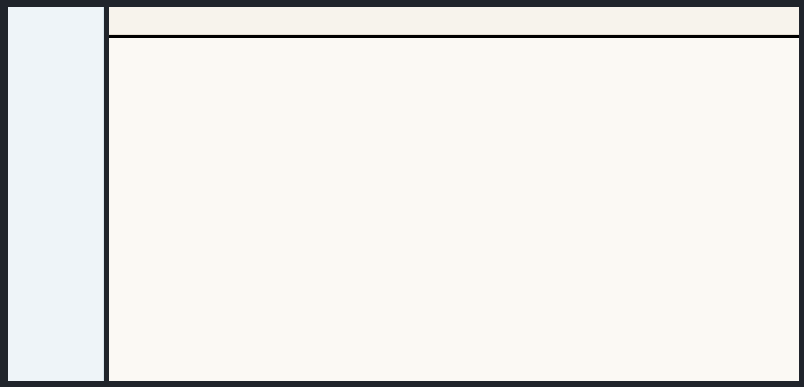

# Sidebar + Content Header

[<- Back to Ready Layouts](./index.md)

This ready layout splits the page into a left sidebar and a main content area. The content area owns an internal header above its scrollable body.

Use this structure when navigation or tools must remain beside a workspace, while the workspace itself needs a local toolbar, title bar, or actions row. The root owns the viewport height; the content shell and body use `min-height: 0` so the internal scroll area receives bounded height.

## Structure

- The root `Column` owns the viewport height.
- The outer `Row` splits `Sidebar` and `ContentArea`.
- The `ContentArea` contains a `Column` with an internal `Header` and a scrollable body.
- The internal `Header` keeps natural height and does not receive `100vh`.
- Sidebar and content body use their own `ScrollArea` components.

## Example

  

    <button class="docs-code-group__tab" type="button" role="tab" data-code-group-tab data-target="sidebar-content-header-python" data-active="true" aria-selected="true">Python</button>
    <button class="docs-code-group__tab" type="button" role="tab" data-code-group-tab data-target="sidebar-content-header-yaml" aria-selected="false">YAML</button>
  

  

    
<pre><code>prefix = "components_full_test_sidebar_content_header"

nav_stack = sdk.ui.Column(f"{prefix}_nav_stack", [])
builder.add(nav_stack)

nav_scroll = sdk.ui.ScrollArea(f"{prefix}_nav_scroll", [nav_stack.id])
nav_scroll.set_property("scroll_x", False)
nav_scroll.set_property("transparent", True)
nav_scroll.set_property("stretch", True)
builder.add(nav_scroll)

sidebar = sdk.ui.Sidebar(f"{prefix}_sidebar", [nav_scroll.id])
sidebar.set_property("width", 220)
builder.add(sidebar)

content_header = sdk.ui.Header(f"{prefix}_content_header", left=[], center=[], right=[])
content_header.set_property("style", "min-height: 64px;")
builder.add(content_header)

content_stack = sdk.ui.Column(f"{prefix}_content_stack", [])
builder.add(content_stack)

content_scroll = sdk.ui.ScrollArea(f"{prefix}_content_scroll", [content_stack.id])
content_scroll.set_property("scroll_x", False)
content_scroll.set_property("transparent", True)
content_scroll.set_property("stretch", True)
builder.add(content_scroll)

content_body = sdk.ui.Column(f"{prefix}_content_body", [content_scroll.id])
content_body.set_property("align", "fill")
content_body.set_property("stretch", True)
content_body.set_property("style", "min-height: 0;")
builder.add(content_body)

content_shell = sdk.ui.Column(f"{prefix}_content_shell", [content_header.id, content_body.id])
content_shell.set_property("align", "fill")
content_shell.set_property("stretch", True)
content_shell.set_property("style", "min-height: 0;")
builder.add(content_shell)

content = sdk.ui.ContentArea(f"{prefix}_content", [content_shell.id])
content.set_property("stretch", True)
builder.add(content)

shell = sdk.ui.Row(f"{prefix}_shell", [sidebar.id, content.id])
shell.set_property("align", "fill")
shell.set_property("spacing", 12)
shell.set_property("stretch", True)
shell.set_property("style", "height: 100%; min-height: 0;")
builder.add(shell)

root = sdk.ui.Column(f"{prefix}_root", [shell.id])
root.set_property("align", "fill")
root.set_property("style", "height: 100vh; min-height: 100vh;")
builder.add(root)</code></pre>

  

  

    
<pre><code>- kind: Column
  id: components_full_test_sidebar_content_header_yaml_root
  align: fill
  style: "height: 100vh; min-height: 100vh;"
  children:
    - kind: Row
      id: components_full_test_sidebar_content_header_yaml_shell
      align: fill
      spacing: 12
      stretch: true
      style: "height: 100%; min-height: 0;"
      children:
        - kind: Sidebar
          id: components_full_test_sidebar_content_header_yaml_sidebar
          width: 220
          children:
            - kind: ScrollArea
              id: components_full_test_sidebar_content_header_yaml_nav_scroll
              scroll_x: false
              transparent: true
              stretch: true
              children:
                - kind: Column
                  id: components_full_test_sidebar_content_header_yaml_nav_stack
                  children: []
        - kind: ContentArea
          id: components_full_test_sidebar_content_header_yaml_content
          stretch: true
          children:
            - kind: Column
              id: components_full_test_sidebar_content_header_yaml_content_shell
              align: fill
              stretch: true
              style: "min-height: 0;"
              children:
                - kind: Header
                  id: components_full_test_sidebar_content_header_yaml_content_header
                  style: "min-height: 64px;"
                  left: []
                  center: []
                  right: []
                - kind: Column
                  id: components_full_test_sidebar_content_header_yaml_content_body
                  align: fill
                  stretch: true
                  style: "min-height: 0;"
                  children:
                    - kind: ScrollArea
                      id: components_full_test_sidebar_content_header_yaml_content_scroll
                      scroll_x: false
                      transparent: true
                      stretch: true
                      children:
                        - kind: Column
                          id: components_full_test_sidebar_content_header_yaml_content_stack
                          children: []</code></pre>

  

## Notes

- Use `100vh` on the root only.
- Do not put `100vh` on the internal header or on the content body.
- Keep the shell, content shell, and content body at `min-height: 0` so the content body can scroll instead of expanding the page.
