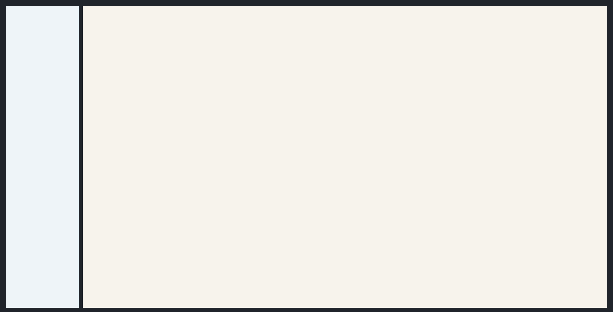

# Sidebar + Content

[<- Back to Ready Layouts](./index.md)

This page shows an empty standalone layout that fills the available window height. The root owns the viewport height; the sidebar and content areas scroll independently when content is added.

Use this structure when the page shell must stay stable while sidebar and content can later receive independent scrollable content.

## Structure

- The root `Column` owns the page background and viewport height.
- The inner `Row` uses `align: fill`, `stretch: true`, and `height: 100%`.
- The `Sidebar` has a fixed width and its own `ScrollArea`.
- The `ContentArea` stretches to fill the remaining width and contains a separate `ScrollArea`.
- Each `ScrollArea` disables horizontal scrolling with `scroll_x: false`.

## Example

  

    <button class="docs-code-group__tab" type="button" role="tab" data-code-group-tab data-target="sidebar-content-python" data-active="true" aria-selected="true">Python</button>
    <button class="docs-code-group__tab" type="button" role="tab" data-code-group-tab data-target="sidebar-content-yaml" aria-selected="false">YAML</button>
  

  

    
<pre><code>prefix = "components_full_test_sidebar_content"

nav_stack = sdk.ui.Column(f"{prefix}_nav_stack", [])
builder.add(nav_stack)

nav_scroll = sdk.ui.ScrollArea(f"{prefix}_nav_scroll", [nav_stack.id])
nav_scroll.set_property("scroll_x", False)
nav_scroll.set_property("transparent", True)
nav_scroll.set_property("stretch", True)
builder.add(nav_scroll)

sidebar = sdk.ui.Sidebar(f"{prefix}_sidebar", [nav_scroll.id])
sidebar.set_property("width", 220)
builder.add(sidebar)

content_stack = sdk.ui.Column(f"{prefix}_content_stack", [])
builder.add(content_stack)

content_scroll = sdk.ui.ScrollArea(f"{prefix}_content_scroll", [content_stack.id])
content_scroll.set_property("scroll_x", False)
content_scroll.set_property("transparent", True)
content_scroll.set_property("stretch", True)
builder.add(content_scroll)

content = sdk.ui.ContentArea(f"{prefix}_content", [content_scroll.id])
content.set_property("stretch", True)
builder.add(content)

shell = sdk.ui.Row(f"{prefix}_shell", [sidebar.id, content.id])
shell.set_property("align", "fill")
shell.set_property("spacing", 12)
shell.set_property("stretch", True)
shell.set_property("style", "height: 100%; min-height: 100%;")
builder.add(shell)

root = sdk.ui.Column(f"{prefix}_root", [shell.id])
root.set_property("align", "fill")
root.set_property("style", "height: 100vh; min-height: 100vh;")
builder.add(root)</code></pre>

  

  

    
<pre><code>- kind: Column
  id: components_full_test_sidebar_content_yaml_root
  align: fill
  style: "height: 100vh; min-height: 100vh;"
  children:
    - kind: Row
      id: components_full_test_sidebar_content_yaml_shell
      align: fill
      spacing: 12
      stretch: true
      style: "height: 100%; min-height: 100%;"
      children:
        - kind: Sidebar
          id: components_full_test_sidebar_content_yaml_sidebar
          width: 220
          children:
            - kind: ScrollArea
              id: components_full_test_sidebar_content_yaml_nav_scroll
              scroll_x: false
              transparent: true
              stretch: true
              children:
                - kind: Column
                  id: components_full_test_sidebar_content_yaml_nav_stack
                  children: []
        - kind: ContentArea
          id: components_full_test_sidebar_content_yaml_content
          stretch: true
          children:
            - kind: ScrollArea
              id: components_full_test_sidebar_content_yaml_content_scroll
              scroll_x: false
              transparent: true
              stretch: true
              children:
                - kind: Column
                  id: components_full_test_sidebar_content_yaml_content_stack
                  children: []</code></pre>

  

## Notes

- Put scroll containers inside the sidebar and content areas, not on the page root.
- Keep the root and shell stretched so the scroll areas receive a bounded height from the window.
