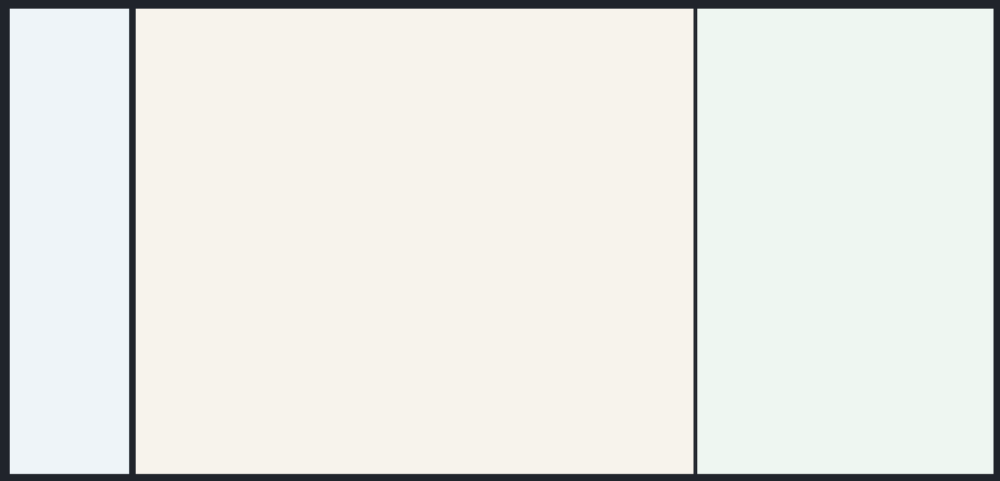

# Sidebar + Splitted Content

[<- Back to Ready Layouts](./index.md)

This ready layout combines a left sidebar with a main content area split into two resizable panes.

Use this structure for list-detail views, editor-preview pages, comparison workflows, and workspaces where the secondary pane must stay visible while the primary pane scrolls. The root owns the viewport height; each split pane contains its own `ScrollArea` so pane content scrolls independently.



## Structure

- The root `Column` owns the viewport height.
- The outer `Row` splits `Sidebar` and `ContentArea`.
- The `ContentArea` contains a `Splitter` with two pane containers.
- `Splitter.sizes` defines the initial pane ratio.
- Sidebar, primary pane, and secondary pane each contain their own `ScrollArea`.

## Example

<div class="docs-code-group" data-code-group>
  <div class="docs-code-group__tabs" role="tablist" aria-label="Sidebar + Splitted Content layout example">
    <button class="docs-code-group__tab" type="button" role="tab" data-code-group-tab data-target="sidebar-splitted-content-python" data-active="true" aria-selected="true">Python</button>
    <button class="docs-code-group__tab" type="button" role="tab" data-code-group-tab data-target="sidebar-splitted-content-yaml" aria-selected="false">YAML</button>
  </div>
  <div class="docs-code-group__panel" id="sidebar-splitted-content-python" data-code-group-panel data-active="true">
    <div class="language-python highlight"><pre><code>prefix = "components_full_test_sidebar_splitted_content"

nav_stack = sdk.ui.Column(f"{prefix}_nav_stack", [])
builder.add(nav_stack)

nav_scroll = sdk.ui.ScrollArea(f"{prefix}_nav_scroll", [nav_stack.id])
nav_scroll.set_property("scroll_x", False)
nav_scroll.set_property("transparent", True)
nav_scroll.set_property("stretch", True)
builder.add(nav_scroll)

sidebar = sdk.ui.Sidebar(f"{prefix}_sidebar", [nav_scroll.id])
sidebar.set_property("width", 220)
builder.add(sidebar)

primary_stack = sdk.ui.Column(f"{prefix}_primary_stack", [])
builder.add(primary_stack)

primary_scroll = sdk.ui.ScrollArea(f"{prefix}_primary_scroll", [primary_stack.id])
primary_scroll.set_property("scroll_x", False)
primary_scroll.set_property("transparent", True)
primary_scroll.set_property("stretch", True)
builder.add(primary_scroll)

primary_pane = sdk.ui.Column(f"{prefix}_primary_pane", [primary_scroll.id])
primary_pane.set_property("align", "fill")
primary_pane.set_property("stretch", True)
primary_pane.set_property("style", "min-height: 0;")
builder.add(primary_pane)

secondary_stack = sdk.ui.Column(f"{prefix}_secondary_stack", [])
builder.add(secondary_stack)

secondary_scroll = sdk.ui.ScrollArea(f"{prefix}_secondary_scroll", [secondary_stack.id])
secondary_scroll.set_property("scroll_x", False)
secondary_scroll.set_property("transparent", True)
secondary_scroll.set_property("stretch", True)
builder.add(secondary_scroll)

secondary_pane = sdk.ui.Column(f"{prefix}_secondary_pane", [secondary_scroll.id])
secondary_pane.set_property("align", "fill")
secondary_pane.set_property("stretch", True)
secondary_pane.set_property("style", "min-height: 0;")
builder.add(secondary_pane)

splitter = sdk.ui.Splitter(f"{prefix}_splitter", [primary_pane.id, secondary_pane.id])
splitter.set_property("stretch", True)
splitter.set_property("sizes", [650, 350])
builder.add(splitter)

content = sdk.ui.ContentArea(f"{prefix}_content", [splitter.id])
content.set_property("stretch", True)
builder.add(content)

shell = sdk.ui.Row(f"{prefix}_shell", [sidebar.id, content.id])
shell.set_property("align", "fill")
shell.set_property("spacing", 12)
shell.set_property("stretch", True)
shell.set_property("style", "height: 100%; min-height: 0;")
builder.add(shell)

root = sdk.ui.Column(f"{prefix}_root", [shell.id])
root.set_property("align", "fill")
root.set_property("style", "height: 100vh; min-height: 100vh;")
builder.add(root)</code></pre></div>
  </div>
  <div class="docs-code-group__panel" id="sidebar-splitted-content-yaml" data-code-group-panel hidden>
    <div class="language-yaml highlight"><pre><code>- kind: Column
  id: components_full_test_sidebar_splitted_content_yaml_root
  align: fill
  style: "height: 100vh; min-height: 100vh;"
  children:
    - kind: Row
      id: components_full_test_sidebar_splitted_content_yaml_shell
      align: fill
      spacing: 12
      stretch: true
      style: "height: 100%; min-height: 0;"
      children:
        - kind: Sidebar
          id: components_full_test_sidebar_splitted_content_yaml_sidebar
          width: 220
          children:
            - kind: ScrollArea
              id: components_full_test_sidebar_splitted_content_yaml_nav_scroll
              scroll_x: false
              transparent: true
              stretch: true
              children:
                - kind: Column
                  id: components_full_test_sidebar_splitted_content_yaml_nav_stack
                  children: []
        - kind: ContentArea
          id: components_full_test_sidebar_splitted_content_yaml_content
          stretch: true
          children:
            - kind: Splitter
              id: components_full_test_sidebar_splitted_content_yaml_splitter
              stretch: true
              sizes: [650, 350]
              children:
                - kind: Column
                  id: components_full_test_sidebar_splitted_content_yaml_primary_pane
                  align: fill
                  stretch: true
                  style: "min-height: 0;"
                  children:
                    - kind: ScrollArea
                      id: components_full_test_sidebar_splitted_content_yaml_primary_scroll
                      scroll_x: false
                      transparent: true
                      stretch: true
                      children:
                        - kind: Column
                          id: components_full_test_sidebar_splitted_content_yaml_primary_stack
                          children: []
                - kind: Column
                  id: components_full_test_sidebar_splitted_content_yaml_secondary_pane
                  align: fill
                  stretch: true
                  style: "min-height: 0;"
                  children:
                    - kind: ScrollArea
                      id: components_full_test_sidebar_splitted_content_yaml_secondary_scroll
                      scroll_x: false
                      transparent: true
                      stretch: true
                      children:
                        - kind: Column
                          id: components_full_test_sidebar_splitted_content_yaml_secondary_stack
                          children: []</code></pre></div>
  </div>
</div>

## Notes

- Use `100vh` on the root only.
- Keep the outer shell and split panes at `min-height: 0`.
- Put scroll areas inside each pane when both sides need independent scrolling.
- Use `sizes` for the initial split and `max_sizes` only when a pane must have a hard maximum width.

## Dynamic Splits

`Splitter.children` can be updated at runtime with collection effects. When adding or removing panes, update `sizes` in the same action so the renderer receives a size entry for each pane.

<div class="docs-code-group" data-code-group>
  <div class="docs-code-group__tabs" role="tablist" aria-label="Sidebar + Splitted Content dynamic split example">
    <button class="docs-code-group__tab" type="button" role="tab" data-code-group-tab data-target="sidebar-splitted-dynamic-python" data-active="true" aria-selected="true">Python</button>
    <button class="docs-code-group__tab" type="button" role="tab" data-code-group-tab data-target="sidebar-splitted-dynamic-yaml" aria-selected="false">YAML</button>
  </div>
  <div class="docs-code-group__panel" id="sidebar-splitted-dynamic-python" data-code-group-panel data-active="true">
    <div class="language-python highlight"><pre><code>prefix = "components_test_sidebar_splitted_content_dynamic"
splitter_id = f"{prefix}_splitter"

builder.add(
    sdk.ui.Button(
        f"{prefix}_add_btn",
        "Add split",
        action="components.ready_layout_split_add",
        params={"prefix": prefix, "splitter_id": splitter_id},
        variant="default",
    )
)
builder.add(
    sdk.ui.Button(
        f"{prefix}_remove_btn",
        "Remove split",
        action="components.ready_layout_split_remove",
        params={"prefix": prefix, "splitter_id": splitter_id},
        variant="default",
    )
)

splitter = sdk.ui.Splitter(splitter_id, [f"{prefix}_pane_1", f"{prefix}_pane_2"])
splitter.set_property("stretch", True)
splitter.set_property("sizes", [500, 300])
splitter.allow("children.append", "children.remove", "sizes.set")
builder.add(splitter)</code></pre></div>
  </div>
  <div class="docs-code-group__panel" id="sidebar-splitted-dynamic-yaml" data-code-group-panel hidden>
    <div class="language-yaml highlight"><pre><code>- kind: Row
  id: components_test_sidebar_splitted_content_yaml_dynamic_actions
  spacing: 8
  children:
    - kind: Button
      id: components_test_sidebar_splitted_content_yaml_dynamic_add_btn
      label: "Add split"
      variant: default
      action: components.ready_layout_split_add
      params:
        prefix: components_test_sidebar_splitted_content_yaml_dynamic
        splitter_id: components_test_sidebar_splitted_content_yaml_dynamic_splitter
    - kind: Button
      id: components_test_sidebar_splitted_content_yaml_dynamic_remove_btn
      label: "Remove split"
      variant: default
      action: components.ready_layout_split_remove
      params:
        prefix: components_test_sidebar_splitted_content_yaml_dynamic
        splitter_id: components_test_sidebar_splitted_content_yaml_dynamic_splitter

- kind: Splitter
  id: components_test_sidebar_splitted_content_yaml_dynamic_splitter
  stretch: true
  sizes: [500, 300]
  capabilities: [children.append, children.remove, sizes.set]
  children:
    - kind: Column
      id: components_test_sidebar_splitted_content_yaml_dynamic_pane_1
      align: fill
      stretch: true
      style: "min-height: 0;"
      children: []
    - kind: Column
      id: components_test_sidebar_splitted_content_yaml_dynamic_pane_2
      align: fill
      stretch: true
      style: "min-height: 0;"
      children: []</code></pre></div>
  </div>
</div>

The action appends or removes a pane component from `children` and then sets the new `sizes` list:

```python
return sdk.effects.respond(
    sdk.effects.ui_collection_append(
        splitter_id,
        "children",
        pane_component_dict,
        surface_id=surface_id,
    ),
    sdk.effects.ui_property_update(
        splitter_id,
        "sizes",
        [500, 300, 250],
        surface_id=surface_id,
    ),
)
```
